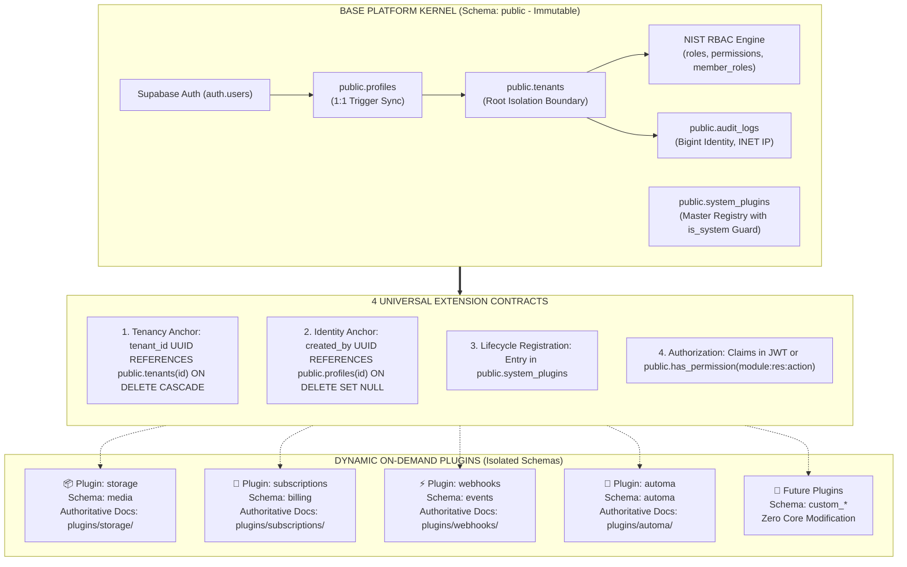

# ☁️ Tuquet Cloud

<div align="center">

### Enterprise Multi-Tenant SaaS Engine & Modular Schema Plugin Framework for Supabase

[](https://supabase.com)
[](https://www.postgresql.org/)
[](#-2-modular-schema-plugin-catalog-authoritative-router)
[_JWT_Claims-success?style=for-the-badge)](#-why-tuquet-cloud)
[](#-solid-documentation-architecture-zero-doc-rot)
[](LICENSE)

<p align="center">
  <b>Production-ready, scale-to-millions Multi-Tenant Backend Engine built on Supabase & PostgreSQL 15+.</b><br/>
  Featuring O(1) JWT Custom Claims authorization (zero RLS recursion), an extensible Micro-Kernel with isolated PostgreSQL Schema Plugins, and an ACID Transactional Event Outbox.
</p>

</div>

---

## ⚡ Why Tuquet Cloud?

Most developers building multi-tenant SaaS applications on Supabase hit 4 critical architectural bottlenecks as their data grows. Tuquet Cloud was architected from day one to eliminate them:

| Common Pitfalls in Other Boilerplates | The Tuquet Cloud Architectural Solution |
| :--- | :--- |
| **❌ Slow Queries & RLS Infinite Recursion**: Evaluating `tenant_members` and `role_permissions` directly inside RLS policies triggers circular subqueries and pegs CPU to 100% under high concurrency. | **✅ $O(1)$ JWT Claims Hook**: `public.custom_access_token_hook` pre-aggregates `tenant_id`, `roles`, and `permissions` (capped at 25 items) into JWT `app_metadata`. RLS policy evaluation takes **$\sim 1\mu s$** via direct JSON path extraction. |
| **❌ Monolithic Schema Pollution in `public`**: Dumping dozens of domain tables into `public` makes migrations fragile, privileges convoluted, and maintenance an unmanageable nightmare. | **✅ Pluggable Isolated Schemas**: The `public` schema contains ONLY the Base Core IAM kernel. All business domains are packaged as drop-in PostgreSQL Schema Plugins: `media`, `billing`, `events`, `automa`. |
| **❌ CWE-426 Security Vulnerabilities**: Unsanitized search paths in functions and triggers allow privilege escalation if malicious actors inject shadowed functions. | **✅ Hardened Against CWE-426**: 100% of SQL functions, procedures, and triggers enforce `SET search_path = ''` with fully-qualified schema object identifiers (`public.profiles`, `auth.users`). |
| **❌ Frozen Transactions on Webhook Calls**: Firing outbound HTTP webhooks directly within database triggers risks rollbacks and delays when target servers timeout. | **✅ Transactional Outbox Pattern**: Events are written atomically (ACID) to `events.outbox` in **1ms**. Dedicated background workers handle asynchronous delivery with retries and HMAC signatures. |

---

## 🏛️ Micro-Kernel Architecture

Tuquet Cloud decouples the **Immutable Kernel** from **Dynamic Plugins**:



---

## 📚 SOLID Documentation Architecture (Zero Doc Rot)

To ensure long-term maintainability and prevent documentation rot when underlying components evolve, this repository strictly adheres to **SOLID Documentation Principles & Single Source of Truth (SSOT)**:

* **Single Responsibility Principle (SRP)**: Each document has one distinct owner and purpose. Root `README.md` acts strictly as an architectural facade, quickstart guide, and central routing index. It does not duplicate low-level schema definitions.
* **Single Source of Truth (SSOT / DRY)**: Detailed table definitions, column types, RLS policies, permissions, and lifecycle scripts are documented **exclusively** within their authoritative source files. Cross-document copy-pasting is strictly avoided; all references point directly to the canonical source.
* **Open/Closed Principle (OCP)**: Adding a new plugin extends the platform by adding a router reference in the catalog table without altering existing core architectural documentation.

| Document Scope | Authoritative Responsibility | Single Source of Truth |
| :--- | :--- | :--- |
| **Architectural Facade & Router** | High-level overview, architectural value, quickstart commands, and documentation routing hub. | [**`README.md`**](README.md) |
| **System Architecture & Contracts** | Core Kernel ERD, the 4 universal attachment contracts, $O(1)$ RLS engine, and PostgREST multi-schema API gateway. | [**`docs/architecture.md`**](docs/architecture.md) |
| **Domain Lexicon & Anti-Hallucination** | Canonical naming invariants, database entity classifications, and forbidden ambiguous terminology. | [**`docs/terminology_dictionary.md`**](docs/terminology_dictionary.md) |
| **Backend Roadmap** | PostgreSQL & Supabase evolution milestones, testing suites (pgTAP), and SDK generation pipeline. | [**`ROADMAP.md`**](ROADMAP.md) |
| **Domain Plugins** | Complete internal schemas, tables, indexes, RLS policies, permissions dictionary, and lifecycle scripts. | [**`supabase/plugins/*/README.md`**](supabase/plugins/) |

---

## 1. Base Platform Core IAM (10 Foundational Tables)

The `public` schema forms the immutable Base Platform Kernel. It establishes tenant isolation boundaries, user profile synchronization, NIST RBAC authorization, tamper-evident audit logging, and the master plugin registry.

The Kernel consists of exactly 10 immutable tables:
`public.profiles` • `public.tenants` • `public.roles` • `public.permissions` • `public.role_permissions` • `public.tenant_members` • `public.member_roles` • `public.tenant_invitations` • `public.audit_logs` • `public.system_plugins`

> 📖 **Authoritative Specification**: For complete table schemas, column types, cryptographic constraints, and RLS policies, refer directly to the canonical [**Core Kernel Entity Directory in docs/architecture.md**](docs/architecture.md#2-core-kernel-entity-directory-10-foundational-tables) and the [**Core IAM Module Specification**](supabase/plugins/core-iam/README.md).

---

## 2. Modular Schema Plugin Catalog (Authoritative Router)

All business domain capabilities are decoupled into independent PostgreSQL Schema Plugins under [supabase/plugins/](supabase/plugins/). Each plugin maintains its own schema, tables, and permissions without polluting `public`:

| Plugin ID | Target Schema | Domain Responsibility | Authoritative Single Source of Truth |
| :--- | :--- | :--- | :--- |
| **`core-iam`** | `public` | Multi-Tenant Identity, NIST RBAC Engine, $O(1)$ Claims Hook, Master Plugin Registry (`is_system = true`). | 🛡️ [**Core IAM Specification**](supabase/plugins/core-iam/README.md) |
| **`storage`** | `media` | Multi-tenant media metadata catalog and isolated private storage bucket security (`tenant-assets`). | 📁 [**Storage Specification**](supabase/plugins/storage/README.md) |
| **`subscriptions`** | `billing` | SaaS subscription lifecycle, billing tiers (Free, Pro, Enterprise), and atomic usage metering. | 💎 [**Subscriptions Specification**](supabase/plugins/subscriptions/README.md) |
| **`webhooks`** | `events` | Transactional Outbox pattern, HMAC-SHA256 signing, and asynchronous webhook delivery log tracking. | ⚡ [**Webhooks Specification**](supabase/plugins/webhooks/README.md) |
| **`automa`** | `automa` | Visual workflow ASTs, distributed runner fleet management, batch campaign runs, and telemetry streams. | 🤖 [**Automa Specification**](supabase/plugins/automa/README.md) |

> 💡 **Maintainability Invariant**: Detailed table definitions, column types, indexes, RLS policies, and lifecycle scripts (`install.sql`, `seed.sql`, `uninstall.sql`) are maintained **exclusively** inside each plugin's dedicated README. Root documentation links directly to these sources to prevent documentation drift.

---

## 3. Quickstart & Operational Pipeline

### Step 1: Initialize Base Platform Core
Reset the local database or apply baseline migrations:
```bash
supabase db reset
```
*Result:* The Base Platform Kernel and `system_plugins` registry are cleanly initialized with baseline seed data from `supabase/seed.sql`.

### Step 2: Install Plugins via Pipeline Runner

```powershell
# Install all 4 first-party plugins in canonical topological order:
.\scripts\plugins\apply_plugins.ps1 -Target local

# Or install an individual plugin:
.\scripts\plugins\apply_plugins.ps1 -Plugin storage -Target local
```

---

## 4. Enabling Custom Access Token (JWT) Hook on Supabase Cloud
1. Navigate to your project on [supabase.com](https://supabase.com).
2. Go to **Authentication > Hooks**.
3. Locate **Custom Access Token (JWT)**.
4. Select `public.custom_access_token_hook` and save.

---

## 📄 License

Released under the [MIT License](LICENSE). Open-source and production-ready for commercial and community use.
