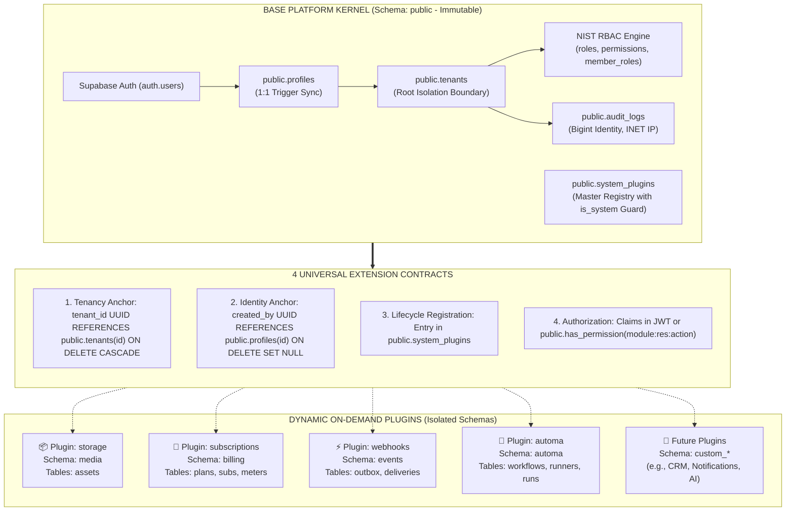

# ☁️ Tuquet Cloud

<div align="center">

### Enterprise Multi-Tenant SaaS Engine & Modular Schema Plugin Framework for Supabase

[](https://supabase.com)
[](https://www.postgresql.org/)
[](#-3-modular-schema-plugin-catalog)
[_JWT_Claims-success?style=for-the-badge)](#-why-tuquet-cloud)
[](LICENSE)

<p align="center">
  <b>Production-ready, scale-to-millions Multi-Tenant Backend Engine built on Supabase & PostgreSQL 15+.</b><br/>
  Featuring O(1) JWT Custom Claims authorization (zero RLS recursion), an extensible Micro-Kernel with isolated PostgreSQL Schema Plugins, and an ACID Transactional Event Outbox.
</p>

</div>

---

## ⚡ Why Tuquet Cloud?

Most developers building multi-tenant SaaS applications on Supabase hit 4 critical architectural bottlenecks as their data grows. Tuquet Cloud was architected from day one to eliminate them:

| Common Pitfalls in Other Boilerplates | The Tuquet Cloud Architectural Solution |
| :--- | :--- |
| **❌ Slow Queries & RLS Infinite Recursion**: Evaluating `tenant_members` and `role_permissions` directly inside RLS policies triggers circular subqueries and pegs CPU to 100% under high concurrency. | **✅ $O(1)$ JWT Claims Hook**: `public.custom_access_token_hook` pre-aggregates `tenant_id`, `roles`, and `permissions` (capped at 25 items) into JWT `app_metadata`. RLS policy evaluation takes **$\sim 1\mu s$** via direct JSON path extraction. |
| **❌ Monolithic Schema Pollution in `public`**: Dumping dozens of domain tables into `public` makes migrations fragile, privileges convoluted, and maintenance an unmanageable nightmare. | **✅ Pluggable Isolated Schemas**: The `public` schema contains ONLY the Base Core IAM kernel. All business domains are packaged as drop-in PostgreSQL Schema Plugins: `media`, `billing`, `events`, `automa`. |
| **❌ CWE-426 Security Vulnerabilities**: Unsanitized search paths in functions and triggers allow privilege escalation if malicious actors inject shadowed functions. | **✅ Hardened Against CWE-426**: 100% of SQL functions, procedures, and triggers enforce `SET search_path = ''` with fully-qualified schema object identifiers (`public.profiles`, `auth.users`). |
| **❌ Frozen Transactions on Webhook Calls**: Firing outbound HTTP webhooks directly within database triggers risks rollbacks and delays when target servers timeout. | **✅ Transactional Outbox Pattern**: Events are written atomically (ACID) to `events.outbox` in **1ms**. Dedicated background workers handle asynchronous delivery with retries and HMAC signatures. |

---

## 🏛️ Micro-Kernel Architecture

Tuquet Cloud decouples the **Immutable Kernel** from **Dynamic Plugins**:



---

## 📑 Documentation Sitemap

- 📖 **[Terminology Dictionary & Anti-Hallucination Lexicon (docs/terminology_dictionary.md)](docs/terminology_dictionary.md)**: Authoritative lexicon defining naming invariants, database entities, and forbidden ambiguous terms.
- 🏛️ **[Technical Architecture & Extension Contract (docs/architecture.md)](docs/architecture.md)**: In-depth technical specifications, Kernel ERD, universal plugin attachment contracts, and PostgREST OpenAPI guide.
- 🤖 **[Project Agent Behavioral Rules (AGENTS.md)](AGENTS.md)**: Coding standards, database invariants, and anti-hallucination rules for AI agents and contributors.
- 💾 **[Base Platform Core Migration (supabase/migrations/)](supabase/migrations/)**: Single baseline forward migration (`20260920000001_base_platform_core.sql`) setting up IAM, RBAC, JWT hook, audit trail, and plugin registry.
- 🔌 **[Modular Plugin Catalog (supabase/plugins/)](supabase/plugins/)**: Self-contained domain plugins (`plugin.json`, `install.sql`, `uninstall.sql`, `README.md`):
  - 🛡️ **[System Core: Multi-Tenant IAM & RBAC Engine](supabase/plugins/core-iam/README.md)**: Immutable kernel (`is_system = true`, schema `public`).
  - 📁 **[Plugin 1: Media Storage Assets](supabase/plugins/storage/README.md)**: File metadata catalog & Storage bucket RLS (schema `media`).
  - 💎 **[Plugin 2: Subscriptions & Quota](supabase/plugins/subscriptions/README.md)**: SaaS tiers, tenant subscriptions, and usage metering (schema `billing`).
  - ⚡ **[Plugin 3: Transactional Outbox & Webhooks](supabase/plugins/webhooks/README.md)**: Reliable event queue & HTTP webhook dispatcher (schema `events`).
  - 🤖 **[Plugin 4: Automa Cloud Bridge](supabase/plugins/automa/README.md)**: Browser automation workflows, runner fleet, and telemetry logs (schema `automa`).
- 🛠️ **[Automated Plugin Pipeline Runner (scripts/plugins/apply_plugins.ps1)](scripts/plugins/apply_plugins.ps1)**: CLI utility automating atomic plugin installations in canonical topological order.

---

## 1. Base Core IAM Data Dictionary (10 Core Tables)

The `public` schema contains exactly 10 immutable kernel tables:

| Core Table | Schema | Primary Purpose | Security & RLS Policy |
| :--- | :--- | :--- | :--- |
| **`profiles`** | `public` | Extended user profiles synchronized 1:1 from `auth.users`. | Users can only modify their own profile (`id = auth.uid()`). |
| **`tenants`** | `public` | Root multi-tenancy isolation boundary for organizations. | Members can only read tenants they belong to via `tenant_members`. |
| **`roles`** | `public` | System roles (`is_system = true`) and Custom Tenant roles. | Scoped by `tenant_id` or public read for global system roles. |
| **`permissions`** | `public` | Atomic capability registry (`module:resource:action`). | Read-only for all authenticated users. |
| **`role_permissions`** | `public` | Many-to-many bridge mapping permissions to roles. | Restricted; only Tenant Admins can configure role mappings. |
| **`tenant_members`** | `public` | Active membership links connecting Users to Tenants. | Scoped to active tenant members; prevents cross-tenant enumeration. |
| **`member_roles`** | `public` | Role assignments granting one or more roles to a member. | Tenant Administrators have grant/revoke management privileges. |
| **`tenant_invitations`**| `public` | Email invitations protected by cryptographic `token_hash`. | Secured by hashed tokens with automatic expiration timestamps. |
| **`audit_logs`** | `public` | Immutable security audit trail with `BIGINT IDENTITY` & `INET`. | Append-only; mutation and deletion are blocked at the database level. |
| **`system_plugins`** | `public` | Master Plugin Registry coordinating installed database modules. | Privileged access only; immutable flag `is_system` protects the kernel. |

---

## 2. Modular Schema Plugin Catalog

Each business domain is packaged as an independent module under [supabase/plugins/](supabase/plugins/):

| Plugin ID | Module & Schema | Detailed Documentation | Domain Responsibilities |
| :--- | :--- | :--- | :--- |
| **`core-iam`** | System Core (`public`) | [**Core IAM Docs**](supabase/plugins/core-iam/README.md) | Identity sync, tenant boundary, RBAC, Claims Hook, Master Plugin Registry (`is_system = true`). |
| **`storage`** | Media Storage (`media`) | [**Storage Docs**](supabase/plugins/storage/README.md) | File metadata (`media.assets`), private `tenant-assets` bucket (50MB), dual-layer path RLS `{tenant_id}/*`. |
| **`subscriptions`** | SaaS Billing (`billing`) | [**Subscriptions Docs**](supabase/plugins/subscriptions/README.md) | SaaS tiers (Free, Pro, Enterprise), subscription state, and atomic usage meters (`billing.usage_meters`). |
| **`webhooks`** | Events Outbox (`events`) | [**Webhooks Docs**](supabase/plugins/webhooks/README.md) | Transactional Outbox pattern (`events.outbox`), webhook targets, HMAC-SHA256 signing, delivery logs. |
| **`automa`** | Automa Bridge (`automa`) | [**Automa Docs**](supabase/plugins/automa/README.md) | Visual node graph ASTs (`automa.workflows`), runner fleet registry, batch campaign runs, telemetry logs. |

---

## 3. Quickstart & Operational Pipeline

### Step 1: Initialize Base Platform Core
Reset the local database or apply baseline migrations:
```bash
supabase db reset
```
*Result:* The Base Platform Kernel and `system_plugins` registry are cleanly initialized with baseline seed data from `supabase/seed.sql`.

### Step 2: Install Plugins via Pipeline Runner

```powershell
# Install all 4 first-party plugins in canonical topological order:
.\scripts\plugins\apply_plugins.ps1 -Target local

# Or install an individual plugin:
.\scripts\plugins\apply_plugins.ps1 -Plugin storage -Target local
```

---

## 4. Enabling Custom Access Token (JWT) Hook on Supabase Cloud
1. Navigate to your project on [supabase.com](https://supabase.com).
2. Go to **Authentication > Hooks**.
3. Locate **Custom Access Token (JWT)**.
4. Select `public.custom_access_token_hook` and save.

---

## 📄 License

Released under the [MIT License](LICENSE). Open-source and production-ready for commercial and community use.
