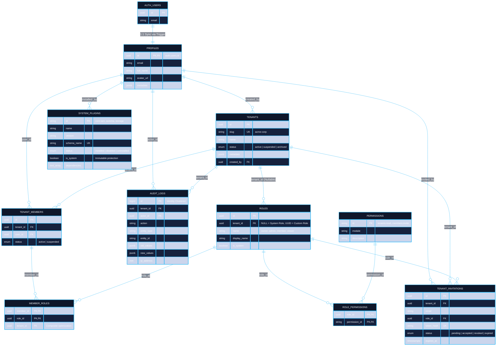

# ☁️ Tuquet Cloud

> **Omniverse Central Cloud BaaS & Multi-Tenant RBAC Hub**  
> Nền tảng Backend-as-a-Service (BaaS) trung tâm cho toàn bộ hệ sinh thái Tuquet trên nền tảng **Supabase (PostgreSQL 15+)**, cung cấp dịch vụ Định danh tập trung (IAM), Phân quyền đa tổ chức (Multi-Tenant RBAC), Quản lý gói cước & hạn ngạch (Subscriptions & Quota), Lưu trữ tệp (Media Storage), và Hàng đợi sự kiện (Transactional Outbox & Webhooks).

---

## 📑 Mục Lục Tài Liệu (Documentation Sitemap)

- 📖 **[Từ Điển Thuật Ngữ & Chống Ảo Giác (docs/terminology_dictionary.md)](docs/terminology_dictionary.md)**: Hiến pháp thuật ngữ duy nhất (Canonical Lexicon) quy định ranh giới định danh, thực thể DB và danh sách từ ngữ cấm kỵ (Zero Forbidden Terms).
- 🏛️ **[Kiến Trúc Kỹ Thuật & Sơ Đồ ERD (docs/architecture.md)](docs/architecture.md)**: Sơ đồ Mermaid đầy đủ 5 phân vùng, từ điển trường, ma trận ràng buộc khóa ngoại, cơ chế bảo mật O(1) RLS và hướng dẫn PostgREST OpenAPI.
- 🤖 **[Quy tắc ứng xử cho AI Agents (AGENTS.md)](AGENTS.md)**: Chuẩn kiến trúc cơ sở dữ liệu, danh pháp thuật ngữ chống ảo giác và an toàn script.
- 💾 **[Base Core SQL Migration (supabase/migrations/)](supabase/migrations/)**: Schema nền tảng cốt lõi (`20260920000001_base_platform_core.sql`) thiết lập IAM, Profiles, Multi-tenant RBAC, Custom JWT Token Hook, Audit Trail và Master Plugin Registry.
- 🔌 **[Thư Viện Phân Hệ & Plugins Độc Lập (supabase/plugins/)](supabase/plugins/)**: Toàn bộ tính năng được đóng gói dạng Module chuẩn mực (`plugin.json`, `install.sql`, `uninstall.sql`, `README.md`):
  - 🛡️ **[System Core: Multi-Tenant IAM & RBAC Engine](supabase/plugins/core-iam/README.md)**: Thành phần cốt lõi bất biến (`is_system = true`, schema `public`).
  - 📁 **[Plugin 1: Media Storage Assets](supabase/plugins/storage/README.md)**: Quản lý metadata tập tin & Storage Bucket RLS (schema `media`).
  - 💎 **[Plugin 2: Subscriptions & Quota](supabase/plugins/subscriptions/README.md)**: Gói cước SaaS & Kiểm soát định mức tài nguyên (schema `billing`).
  - ⚡ **[Plugin 3: Asynchronous Outbox & Webhooks](supabase/plugins/webhooks/README.md)**: Hàng đợi sự kiện Transactional Outbox & Bắn Webhook HTTP (schema `events`).
  - 🤖 **[Plugin 4: Automa Cloud Bridge](supabase/plugins/automa/README.md)**: Điều phối hạm đội tự động hóa phân tán (schema `automa`).
- 🛠️ **[Script Cài Đặt Plugin Tự Động (scripts/plugins/apply_plugins.ps1)](scripts/plugins/apply_plugins.ps1)**: Tiện ích PowerShell cài đặt toàn bộ Plugin theo thứ tự chuẩn kiến trúc.

---

## 1. Sơ Đồ ERD Nền Tảng Cốt Lõi (Base Core IAM ERD)



---

## 2. Từ Điển Bảng Dữ Liệu Cốt Lõi (Core Data Dictionary)

Base Core IAM bao gồm 10 bảng nền tảng trong schema `public`:

| Bảng | Vai Trò Kiến Trúc & Bảo Mật | Đặc Điểm Kỹ Thuật (Scalability Specs) |
| :--- | :--- | :--- |
| **`profiles`** | Hồ sơ người dùng mở rộng | Đồng bộ 1:1 từ `auth.users` qua trigger an ninh `handle_new_user`. |
| **`tenants`** | Ranh giới cô lập tổ chức / workspace | Khóa ngoại gốc (`tenant_id`) cho mọi bảng dữ liệu; vanity slug duy nhất. |
| **`roles`** | Danh mục vai trò đa cấp | **Tối ưu B-tree**: Tách 2 Partial Unique Indexes (`tenant_id IS NULL` vs `tenant_id IS NOT NULL`), loại bỏ hack COALESCE. |
| **`permissions`** | Từ điển quyền hạn nguyên tử | Khóa chính dạng chuỗi có ngữ nghĩa (`module:action`), dễ tra cứu và kiểm tra $O(1)$. |
| **`role_permissions`** | Bản đồ phân quyền nhiều - nhiều | Cấp quyền chi tiết cho từng vai trò trong hệ thống. |
| **`tenant_members`** | Quản lý thành viên trong tổ chức | Ràng buộc Unique `(tenant_id, user_id)`, kiểm soát trạng thái `active/suspended`. |
| **`member_roles`** | Gán vai trò cho thành viên | Cho phép 1 thành viên sở hữu nhiều vai trò đồng thời (Multi-role support). |
| **`tenant_invitations`** | Quản lý lời mời tham gia | Lưu mã băm `token_hash` an toàn, tự động hết hạn (`expires_at`). |
| **`audit_logs`** | Nhật ký an ninh & kiểm toán | **Chuẩn DBA**: Sử dụng `BIGINT GENERATED ALWAYS AS IDENTITY` và kiểu mạng `INET`, triệt tiêu vỡ trang B-Tree. |
| **`system_plugins`** | Bảng đăng ký mẹ (Master Registry) | Quản lý thông tin phiên bản, trạng thái và ngăn chặn gỡ bỏ nhầm phân hệ cốt lõi (`is_system = true`). |

---

## 3. Các Trụ Cột Kỹ Thuật Đạt Chuẩn Enterprise (Architecture Highlights)

### 3.1. Miễn Nhiễm Với RLS Infinite Recursion & CWE-426
Toàn bộ logic kiểm tra quyền trong mệnh đề `USING(...)` của RLS được ủy thác cho các hàm trợ năng `SECURITY DEFINER`:
- `public.get_user_tenant_ids()`
- `public.is_tenant_member(_tenant_id)`
- `public.has_tenant_permission(_tenant_id, _permission_id)`
- `public.is_tenant_admin(_tenant_id)`

**Đặc tính kỹ thuật**:
- `SET search_path = ''`: Khắc chế 100% tấn công Search Path Hijacking (CWE-426).
- `STABLE`: PostgreSQL Query Planner tự động cache kết quả trong suốt câu lệnh SQL, tránh tính toán lặp từng dòng.

### 3.2. Caching Quyền Qua Custom Access Token (JWT) Hook & Chống Tràn Header
Định nghĩa sẵn hàm `public.custom_access_token_hook(event)`:
- Nhúng danh sách `tenant_id` và các `roles` vào Claims của Access Token JWT.
- **Phòng vệ tràn Header (`LIMIT 25`)**: Giới hạn tối đa 25 tenant cho mỗi người dùng, đảm bảo kích thước JWT luôn <8KB, loại bỏ triệt để lỗi `431 Request Header Fields Too Large` ở tầng Gateway (Nginx/Cloudflare).

### 3.3. Tối Ưu B-Tree Index & Sẵn Sàng Cho Partitioning
Mọi bảng nghiệp vụ đều được đánh chỉ mục hỗn hợp bắt đầu bằng `tenant_id` (ví dụ `(tenant_id, created_at DESC)`). Quá trình tìm kiếm luôn là **Index Scan / Index Only Scan**, triệt tiêu nguy cơ rò rỉ chéo dữ liệu và sẵn sàng cho **Table Partitioning** khi đạt hàng trăm triệu bản ghi.

---

## 4. Thư Viện Plugin Chuyên Biệt (Enterprise Plugin Catalog)

Toàn bộ các phân hệ mở rộng của `tuquet-cloud` được đóng gói độc lập theo cấu trúc Plugin chuẩn mực tại thư mục [supabase/plugins/](supabase/plugins/), với schema chuyên biệt và vòng đời cài đặt/gỡ bỏ nguyên tử:

| Plugin ID | Tên Module & Schema | Tài Liệu Chi Tiết | Trách Nhiệm Nghiệp Vụ Chính |
| :--- | :--- | :--- | :--- |
| **`core-iam`** | System Core (`public`) | [**Tài liệu Core IAM**](supabase/plugins/core-iam/README.md) | Định danh, ranh giới đa tổ chức, RBAC, Claims Hook, Master Plugin Registry (`is_system = true`). |
| **`automa`** | Automa Cloud Bridge (`automa`) | [**Tài liệu Automa**](supabase/plugins/automa/README.md) | Lưu trữ đồ thị AST Workflow, quản lý hạm đội máy trạm (Runners), chiến dịch chạy hàng loạt, và log vi mô. |
| **`storage`** | Media Storage Assets (`media`) | [**Tài liệu Storage**](supabase/plugins/storage/README.md) | Metadata tệp (`media.assets`), cấu hình bucket `tenant-assets` (50MB), bảo mật Storage RLS 2 lớp theo path `{tenant_id}/*`. |
| **`subscriptions`** | Subscriptions & Quota (`billing`) | [**Tài liệu Subscriptions**](supabase/plugins/subscriptions/README.md) | Quản lý gói cước SaaS (Free, Pro, Enterprise), theo dõi thuê bao, và đo lường hạn ngạch động (`billing.usage_meters`). |
| **`webhooks`** | Outbox & Webhooks (`events`) | [**Tài liệu Webhooks**](supabase/plugins/webhooks/README.md) | Hàng đợi sự kiện Transactional Outbox, quản lý URL đích nhận, ký chữ ký HMAC-SHA256, và nhật ký đối soát lượt gọi. |

---

## 5. Hướng Dẫn Vận Hành & Khởi Động Môi Trường

### Bước 1: Khởi Động Base Core (Mỗi Khi Reset Database)
Mỗi khi chạy `supabase db reset`, Supabase CLI sẽ **tự động** áp dụng migration nền tảng duy nhất:
```bash
supabase db reset
```
*Kết quả:* Base Core IAM và bảng `system_plugins` được khởi tạo sạch sẽ 100% kèm dữ liệu quản trị viên ban đầu từ `supabase/seed.sql`.

### Bước 2: Cài Đặt Các Plugin Nghiệp Vụ (Theo Thứ Tự Chuẩn Kiến Trúc)

#### Cách A: Chạy 1 Lệnh Tự Động Hóa Duy Nhất (Khuyên Dùng)
Sử dụng công cụ runner tự động hóa được tích hợp sẵn:
```powershell
# Cài đặt toàn bộ 4 Plugin theo đúng thứ tự (storage -> subscriptions -> webhooks -> automa + seed):
.\scripts\plugins\apply_plugins.ps1 -Target local

# Hoặc cài đặt từng Plugin cụ thể:
.\scripts\plugins\apply_plugins.ps1 -Plugin storage -Target local
```

#### Cách B: Chạy Từng Lệnh Qua Supabase CLI
```powershell
# 1. Hạ tầng lưu trữ Media
supabase db query --local -f supabase/plugins/storage/install.sql

# 2. Quản lý hạn ngạch Subscriptions & Quota
supabase db query --local -f supabase/plugins/subscriptions/install.sql

# 3. Hạ tầng sự kiện Outbox & Webhooks
supabase db query --local -f supabase/plugins/webhooks/install.sql

# 4. Nghiệp vụ tự động hóa Automa & Dữ liệu mẫu
supabase db query --local -f supabase/plugins/automa/install.sql
supabase db query --local -f supabase/plugins/automa/seed.sql
```

---

## 6. Kích Hoạt Custom Access Token (JWT) Hook Trên Supabase Cloud
1. Truy cập vào dự án tại [supabase.com](https://supabase.com).
2. Chuyển tới mục **Authentication > Hooks**.
3. Tìm mục **Custom Access Token (JWT)**.
4. Chọn hàm `public.custom_access_token_hook` và lưu lại.
