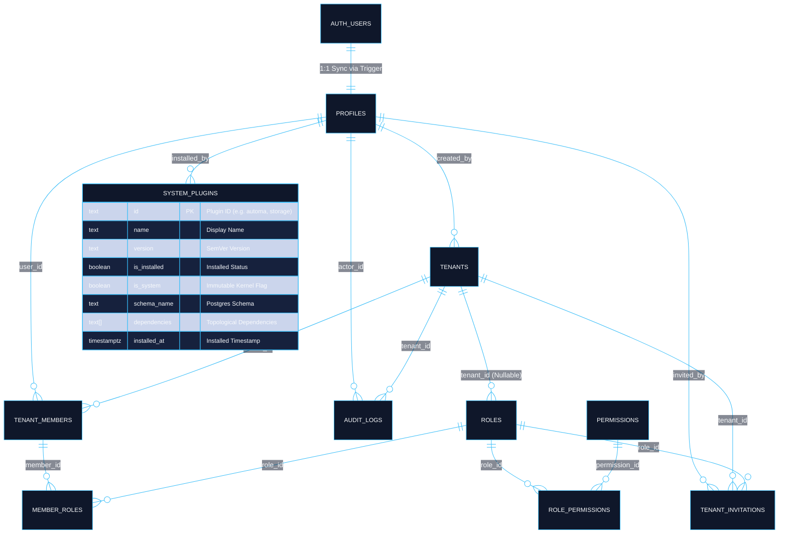

# ☁️ Tuquet Cloud

<div align="center">

### Enterprise Multi-Tenant SaaS Engine & Modular Schema Plugin Framework for Supabase

[](https://supabase.com)
[](https://www.postgresql.org/)
[](#-3-thư-viện-plugin-chuyên-biệt-enterprise-plugin-catalog)
[_JWT_Claims-success?style=for-the-badge)](#-tại-sao-tuquet-cloud-vượt-trội-why-tuquet-cloud)
[](LICENSE)

<p align="center">
  <b>Nền tảng kiến trúc Backend-as-a-Service (BaaS) chuẩn Enterprise trên nền tảng Supabase & PostgreSQL 15+.</b><br/>
  Cung cấp cơ chế Multi-Tenant RBAC mở rộng hàng triệu tổ chức, Custom JWT Token Hook tra cứu $O(1)$ triệt tiêu đệ quy RLS, hệ thống Plugin cô lập theo từng Schema chuyên biệt, và hàng đợi sự kiện Transactional Outbox.
</p>

</div>

---

## ⚡ Tại Sao Tuquet Cloud Vượt Trội? (Why Tuquet Cloud?)

Hầu hết các dự án Multi-Tenant trên Supabase đều gặp phải 3 "cơn ác mộng" khi quy mô dữ liệu lớn dần. Tuquet Cloud được thiết kế chuẩn mực từ ngày đầu để giải quyết triệt để:

| Vấn Đề Thường Gặp Ở Các Boilerplate Khác | Giải Pháp Đột Phá Của Tuquet Cloud |
| :--- | :--- |
| **❌ Lỗi RLS Infinite Recursion & Chậm CPU**: Viết RLS kiểm tra `tenant_members` và `role_permissions` trực tiếp trên từng câu query gây quét lặp vòng tròn, CPU 100% khi có hàng triệu bản ghi. | **✅ $O(1)$ JWT Claims Hook**: Hàm `public.custom_access_token_hook` gom trước `tenant_id`, `roles` và `permissions` (giới hạn 25 quyền) tiêm thẳng vào JWT token `app_metadata`. Tra cứu RLS chỉ mất **$\sim 1\mu s$** bằng phép so sánh JSON trực tiếp. |
| **❌ Ô Nhiễm Schema `public`**: Nhồi nhét hàng chục bảng nghiệp vụ vào một schema `public` duy nhất, khiến việc quản trị migration và cấp quyền trở thành thảm họa. | **✅ Kiến Trúc Modular Schema Plugins**: Giữ `public` tinh gọn tối đa (chỉ chứa Base Core IAM). Toàn bộ tính năng nghiệp vụ được đóng gói độc lập theo Schema chuyên biệt: `media`, `billing`, `events`, `automa`. |
| **❌ Lỗ Hổng Bảo Mật CWE-426 (Search Path Hijacking)**: Các function/trigger viết không cẩn thận dễ bị chiếm quyền khi attacker tạo hàm giả trong schema cá nhân. | **✅ Phòng Vệ An Ninh Tuyệt Đối**: 100% các hàm và trigger đều khóa cứng `SET search_path = ''` và gọi tên đối tượng tường minh (`public.profiles`, `auth.users`). |
| **❌ Đóng Băng Giao Dịch Khi Bắn Webhook**: Gọi HTTP API trực tiếp trong DB trigger làm đứng cả transaction khi server đối tác timeout. | **✅ Transactional Outbox Pattern**: Mọi sự kiện được ghi nguyên tử (ACID) vào `events.outbox` trong **1ms**, worker ngầm chịu trách nhiệm phát sóng bất đồng bộ kèm cơ chế tự thử lại (Retry). |

---

## 📑 Mục Lục Tài Liệu (Documentation Sitemap)

- 📖 **[Từ Điển Thuật Ngữ & Chống Ảo Giác (docs/terminology_dictionary.md)](docs/terminology_dictionary.md)**: Hiến pháp thuật ngữ chuẩn hóa (Canonical Lexicon) quy định ranh giới định danh, thực thể DB và danh sách từ ngữ cấm kỵ (Zero Forbidden Terms).
- 🏛️ **[Kiến Trúc Kỹ Thuật & Sơ Đồ ERD Toàn Diện (docs/architecture.md)](docs/architecture.md)**: Sơ đồ Mermaid đầy đủ 5 phân vùng, từ điển trường, ma trận ràng buộc khóa ngoại, cơ chế bảo mật O(1) RLS và hướng dẫn PostgREST OpenAPI.
- 🤖 **[Quy Tắc Ứng Xử Cho AI Agents (AGENTS.md)](AGENTS.md)**: Chuẩn kiến trúc cơ sở dữ liệu, danh pháp thuật ngữ chống ảo giác và an toàn mã lệnh.
- 💾 **[Base Core SQL Migration (supabase/migrations/)](supabase/migrations/)**: Migration nền tảng duy nhất (`20260920000001_base_platform_core.sql`) thiết lập IAM, Profiles, Multi-tenant RBAC, Custom JWT Token Hook, Audit Trail và Master Plugin Registry.
- 🔌 **[Thư Viện Phân Hệ Plugins Độc Lập (supabase/plugins/)](supabase/plugins/)**: Toàn bộ tính năng được đóng gói dạng Module chuẩn mực (`plugin.json`, `install.sql`, `uninstall.sql`, `README.md`):
  - 🛡️ **[System Core: Multi-Tenant IAM & RBAC Engine](supabase/plugins/core-iam/README.md)**: Thành phần cốt lõi bất biến (`is_system = true`, schema `public`).
  - 📁 **[Plugin 1: Media Storage Assets](supabase/plugins/storage/README.md)**: Quản lý metadata tập tin & Storage Bucket RLS (schema `media`).
  - 💎 **[Plugin 2: Subscriptions & Quota](supabase/plugins/subscriptions/README.md)**: Gói cước SaaS & Kiểm soát định mức tài nguyên (schema `billing`).
  - ⚡ **[Plugin 3: Asynchronous Outbox & Webhooks](supabase/plugins/webhooks/README.md)**: Hàng đợi sự kiện Transactional Outbox & Bắn Webhook HTTP (schema `events`).
  - 🤖 **[Plugin 4: Automa Cloud Bridge](supabase/plugins/automa/README.md)**: Điều phối hạm đội tự động hóa phân tán (schema `automa`).
- 🛠️ **[Script Cài Đặt Plugin Tự Động (scripts/plugins/apply_plugins.ps1)](scripts/plugins/apply_plugins.ps1)**: Tiện ích PowerShell cài đặt toàn bộ Plugin theo đúng thứ tự topo chuẩn kiến trúc.

---

## 1. Sơ Đồ ERD Nền Tảng Cốt Lõi (Base Core IAM ERD)



---

## 2. Từ Điển Bảng Dữ Liệu Lõi (Core Data Dictionary)

| Bảng Cơ Sở | Schema | Mục Đích Nghiệp Vụ | Cơ Chế Bảo Mật & RLS |
| :--- | :--- | :--- | :--- |
| **`profiles`** | `public` | Hồ sơ người dùng mở rộng đồng bộ 1:1 từ `auth.users`. | Người dùng chỉ được sửa hồ sơ của chính mình (`id = auth.uid()`). |
| **`tenants`** | `public` | Ranh giới cô lập tổ chức / workspace (Root boundary). | Thành viên chỉ thấy Tenant mình tham gia qua `tenant_members`. |
| **`roles`** | `public` | Danh mục vai trò: Hệ thống (`is_system = true`) & Tùy chỉnh (Custom Roles). | RLS cô lập theo `tenant_id` hoặc cho phép đọc công khai role hệ thống. |
| **`permissions`** | `public` | Từ điển quyền hạn nguyên tử dạng `<module>:<resource>:<action>`. | Cho phép đọc toàn cục (Read-only for authenticated). |
| **`role_permissions`** | `public` | Ma trận liên kết Nhiều-Nhiều giữa Vai trò và Quyền hạn. | Được bảo vệ nghiêm ngặt, chỉ Quản trị viên Tenant mới được phân quyền. |
| **`tenant_members`** | `public` | Danh sách thành viên tham gia từng Tenant và trạng thái. | RLS cô lập theo Tenant, ngăn chặn thành viên tự ý xem danh sách tổ chức khác. |
| **`member_roles`** | `public` | Gán nhiều vai trò cho một thành viên trong Tenant. | Quản trị viên (`owner`/`admin`) có quyền gán/hủy vai trò thành viên. |
| **`tenant_invitations`**| `public` | Lời mời tham gia tổ chức qua email và mã bảo mật `token_hash`.| Lời mời được bảo vệ bằng token hash, tự động hết hạn (`expires_at`). |
| **`audit_logs`** | `public` | Nhật ký an ninh tuần tự `BIGINT IDENTITY` & địa chỉ IP `INET`. | Bất biến (Append-only), cấm sửa/xóa nhật ký an ninh. |
| **`system_plugins`** | `public` | Bảng điều phối trung tâm (Master Plugin Registry). | Chỉ tài khoản quyền cấp cao mới được thao tác; cờ `is_system` bảo vệ hạt nhân. |

---

## 3. Thư Viện Plugin Chuyên Biệt (Enterprise Plugin Catalog)

Toàn bộ các phân hệ mở rộng của `tuquet-cloud` được đóng gói độc lập theo chuẩn Plugin tại thư mục [supabase/plugins/](supabase/plugins/), với schema chuyên biệt và vòng đời cài đặt/gỡ bỏ nguyên tử:

| Plugin ID | Tên Phân Hệ & Schema | Tài Liệu Chi Tiết | Trách Nhiệm Nghiệp Vụ Chính |
| :--- | :--- | :--- | :--- |
| **`core-iam`** | System Core (`public`) | [**Tài liệu Core IAM**](supabase/plugins/core-iam/README.md) | Định danh, ranh giới đa tổ chức, RBAC, Claims Hook, Master Plugin Registry (`is_system = true`). |
| **`storage`** | Media Storage Assets (`media`) | [**Tài liệu Storage**](supabase/plugins/storage/README.md) | Metadata tệp (`media.assets`), cấu hình bucket `tenant-assets` (50MB), bảo mật Storage RLS 2 lớp theo path `{tenant_id}/*`. |
| **`subscriptions`** | Subscriptions & Quota (`billing`) | [**Tài liệu Subscriptions**](supabase/plugins/subscriptions/README.md) | Quản lý gói cước SaaS (Free, Pro, Enterprise), theo dõi thuê bao, và đo lường hạn ngạch động (`billing.usage_meters`). |
| **`webhooks`** | Outbox & Webhooks (`events`) | [**Tài liệu Webhooks**](supabase/plugins/webhooks/README.md) | Hàng đợi sự kiện Transactional Outbox, quản lý URL đích nhận, ký chữ ký HMAC-SHA256, và nhật ký đối soát lượt gọi HTTP. |
| **`automa`** | Automa Cloud Bridge (`automa`) | [**Tài liệu Automa**](supabase/plugins/automa/README.md) | Lưu trữ đồ thị AST Workflow, quản lý hạm đội máy trạm (Runners), chiến dịch chạy hàng loạt, và log vi mô. |

---

## 4. Hướng Dẫn Vận Hành Nhanh (Quickstart & Plugin Pipeline)

### Bước 1: Khởi Tạo Nền Tảng Base Core
Mỗi khi chạy `supabase db reset`, Supabase CLI sẽ **tự động** áp dụng migration nền tảng duy nhất:
```bash
supabase db reset
```
*Kết quả:* Base Core IAM và bảng `system_plugins` được khởi tạo sạch sẽ 100% kèm dữ liệu mẫu ban đầu từ `supabase/seed.sql`.

### Bước 2: Cài Đặt Toàn Bộ Plugins Chỉ Với 1 Lệnh Duy Nhất

```powershell
# Cài đặt tự động toàn bộ 4 Plugin theo đúng thứ tự topo (storage -> subscriptions -> webhooks -> automa + seed):
.\scripts\plugins\apply_plugins.ps1 -Target local

# Hoặc cài đặt từng Plugin cụ thể theo nhu cầu:
.\scripts\plugins\apply_plugins.ps1 -Plugin storage -Target local
```

---

## 5. Kích Hoạt Custom Access Token (JWT) Hook Trên Supabase Cloud
1. Truy cập vào dự án tại [supabase.com](https://supabase.com).
2. Chuyển tới mục **Authentication > Hooks**.
3. Tìm mục **Custom Access Token (JWT)**.
4. Chọn hàm `public.custom_access_token_hook` và lưu lại.

---

## 📄 License

Phát hành dưới giấy phép [MIT License](LICENSE). Hoàn toàn mở và sẵn sàng tích hợp vào các dự án thương mại hoặc mã nguồn mở.
