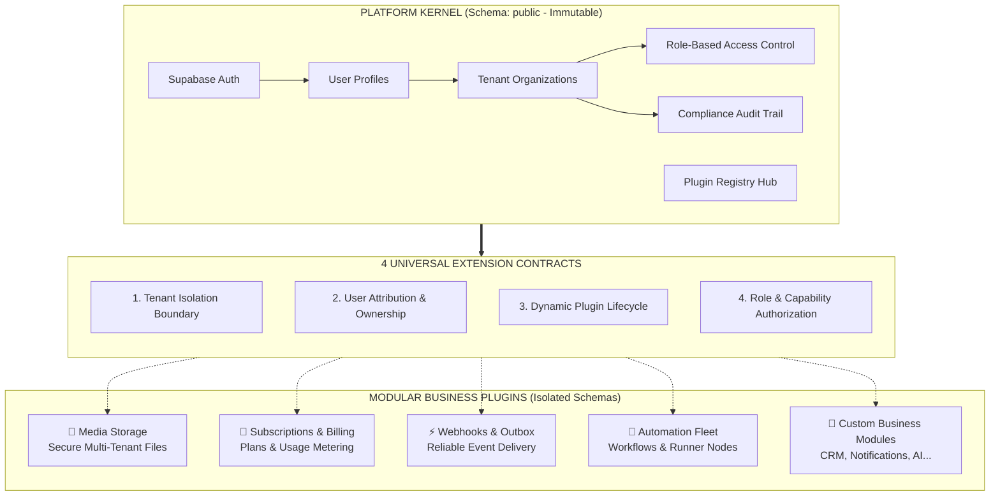

# ☁️ Tuquet Cloud

<div align="center">

### The Enterprise Multi-Tenant Foundation for Supabase

[](https://supabase.com)
[](https://www.postgresql.org/)
[](#-modular-business-plugin-catalog)
[](#-business-value--architectural-advantages)
[](#-solid-documentation-architecture)
[](LICENSE)

<p align="center">
  <b>Launch secure, scalable multi-tenant SaaS applications in days, not months.</b><br/>
  Turnkey organization hierarchy, enterprise role-based access control, sub-millisecond authorization, and an extensible modular plugin ecosystem built on Supabase & PostgreSQL 15+.
</p>

</div>

---

## 🚀 Business Value & Architectural Advantages

Building multi-tenant SaaS backends from scratch often leads to costly architectural rewrites, database bottlenecks, and security vulnerabilities as customer traffic grows. Tuquet Cloud eliminates these risks from day one:

| SaaS Growth Challenge | The Tuquet Cloud Business Solution | Strategic Impact |
| :--- | :--- | :--- |
| **Escalating Cloud Costs & Slow Queries**<br/>Evaluating permissions on every row query causes CPU spikes and slows response times under heavy traffic. | **Sub-Millisecond Token Authorization**<br/>Pre-aggregates tenant permissions directly into the user's security token, bypassing expensive repetitive database checks. | **10x Traffic Capacity**<br/>Lower database compute costs and instant response times for end users. |
| **Monolithic Codebase & Slow Feature Delivery**<br/>Dumping every new business feature into a single shared database schema creates risky migrations and slows delivery. | **Modular Pluggable Schemas**<br/>Keeps the core platform immutable. Activate domain plugins (file storage, billing, webhooks, automation) on demand. | **Faster Time to Market**<br/>Build and deploy new capabilities independently with zero risk to core stability. |
| **Compliance & Data Isolation Risks**<br/>Accidental data leaks between customer organizations pose existential security and regulatory threats. | **Enterprise Tenant Isolation by Default**<br/>Strict organization boundaries enforced at the database layer with tamper-evident audit trails. | **SOC2 & GDPR Readiness**<br/>Win enterprise clients with verifiable tenant isolation and complete auditability. |
| **Disrupted Customer Experience**<br/>External API delays and third-party webhook failures freeze customer transactions in the browser. | **Guaranteed Asynchronous Event Outbox**<br/>Customer actions complete in 1ms while background events, notifications, and webhooks deliver reliably. | **99.99% App Reliability**<br/>Zero UI freezes or rolled-back transactions when external services experience downtime. |

---

## 🏛️ Micro-Kernel Architecture

Tuquet Cloud decouples the **Immutable Platform Core** from **Dynamic Business Plugins**:



---

## 📚 SOLID Documentation Architecture

To prevent documentation rot and ensure specifications stay synchronized with code, this repository strictly applies **SOLID Documentation Principles & Single Source of Truth (SSOT)**:

* **Single Responsibility Principle (SRP)**: This root README acts as the executive facade, value overview, quickstart guide, and navigation hub. Deep database tables, column types, and implementation mechanics belong to dedicated documents.
* **Single Source of Truth (SSOT)**: Detailed schema definitions, RLS security policies, and permission dictionaries are maintained exclusively in their authoritative source files.
* **Open/Closed Principle (OCP)**: New business plugins extend the ecosystem by registering into the catalog without requiring changes to core architectural documentation.

| Document Scope | Strategic Focus | Single Source of Truth |
| :--- | :--- | :--- |
| **Executive Facade & Router** | High-level value, architectural highlights, quickstart commands, and navigation index. | [**`README.md`**](README.md) |
| **System Architecture & Contracts** | In-depth technical specifications, Core Kernel ERD, the 4 extension contracts, and API gateway routing. | [**`docs/architecture.md`**](docs/architecture.md) |
| **Standardized Lexicon** | Authoritative domain definitions, database entity standards, and anti-hallucination dictionary. | [**`docs/terminology_dictionary.md`**](docs/terminology_dictionary.md) |
| **Backend Evolution Roadmap** | Release milestones, automated test suites (pgTAP), and client SDK generation pipelines. | [**`ROADMAP.md`**](ROADMAP.md) |
| **Domain Plugins** | Complete internal schemas, tables, indexes, security policies, permissions, and lifecycle scripts. | [**`supabase/plugins/*/README.md`**](supabase/plugins/) |

---

## 1. Enterprise Multi-Tenant Foundation (Core Kernel)

The immutable platform kernel establishes the essential infrastructure required by any modern multi-tenant SaaS:

* **Organization & Tenant Hierarchy**: Manage multiple client organizations, user memberships, and administrative structures with strict data isolation.
* **Granular Role-Based Access Control (RBAC)**: Assign pre-configured or custom tenant roles with atomic capability permissions (`module:resource:action`).
* **Audit-Ready Security Logging**: Automatic, append-only security logs recording authentication events, permission modifications, and administrative actions.
* **Plug-and-Play Extensibility**: Master plugin registry coordinating installed business modules with zero downtime.

> 📖 **Technical Architecture Deep Dive**: For complete table schemas, foreign key constraints, and RLS security policies, see the canonical [**Core Kernel Entity Directory in docs/architecture.md**](docs/architecture.md#2-core-kernel-entity-directory-10-foundational-tables) and the [**Core IAM Module Specification**](supabase/plugins/core-iam/README.md).

---

## 2. Modular Business Plugin Catalog

Monetization, storage, event integration, and workflow capabilities are decoupled into independent plugins. Activate only what your business needs:

| Business Solution | Domain Scope | Schema | Authoritative Specification |
| :--- | :--- | :--- | :--- |
| **Multi-Tenant IAM** | Organization management, member invitations, custom roles, and sub-millisecond authorization. | `public` | 🛡️ [**Core IAM Documentation**](supabase/plugins/core-iam/README.md) |
| **Media & File Storage** | Multi-tenant file catalog, private storage bucket security (`tenant-assets`), and upload quotas. | `media` | 📁 [**Storage Documentation**](supabase/plugins/storage/README.md) |
| **Subscriptions & Billing** | SaaS pricing tiers (Free, Pro, Enterprise), recurring subscription states, and atomic usage meters. | `billing` | 💎 [**Subscriptions Documentation**](supabase/plugins/subscriptions/README.md) |
| **Webhooks & Events** | Transactional outbox with guaranteed delivery, retries, and HMAC-signed webhook dispatches. | `events` | ⚡ [**Webhooks Documentation**](supabase/plugins/webhooks/README.md) |
| **Automation Fleet** | Visual workflow ASTs, distributed runner fleet management, batch campaign runs, and telemetry streams. | `automa` | 🤖 [**Automa Documentation**](supabase/plugins/automa/README.md) |

> 💡 **Maintainability Invariant**: Detailed table definitions, column types, indexes, RLS policies, and lifecycle scripts (`install.sql`, `seed.sql`, `uninstall.sql`) are maintained **exclusively** inside each plugin's dedicated README.

---

## 3. Quickstart: Launch in Minutes

### Step 1: Initialize the Base Platform
Reset your local Supabase instance to provision the immutable platform kernel:
```bash
supabase db reset
```

### Step 2: Install Business Plugins
Install all first-party plugins or pick individual modules for your product needs:

```powershell
# Install all first-party plugins in canonical topological order:
.\scripts\plugins\apply_plugins.ps1 -Target local

# Or install an individual business plugin (e.g. storage):
.\scripts\plugins\apply_plugins.ps1 -Plugin storage -Target local
```

---

## 4. Production Deployment & Token Hook
To enable sub-millisecond authorization on Supabase Cloud:
1. Open your project dashboard at [supabase.com](https://supabase.com).
2. Navigate to **Authentication > Hooks**.
3. Select **Custom Access Token (JWT)**.
4. Choose `public.custom_access_token_hook` and save.

---

## 📄 License

Released under the [MIT License](LICENSE). Open-source and production-ready for commercial and community use.
