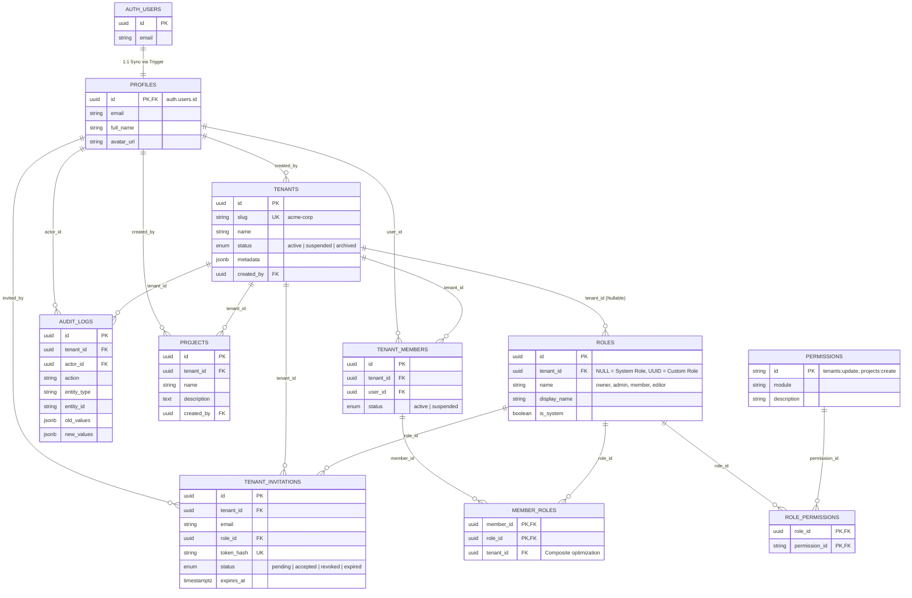

# Kiến Trúc Multi-Tenant RBAC Chuẩn Hóa Trên Supabase (PostgreSQL)

Hệ thống thiết kế cơ sở dữ liệu mẫu phục vụ kiến trúc **Đa người thuê (Multi-tenancy)** kết hợp **Kiểm soát truy cập dựa trên vai trò (Role-Based Access Control - RBAC)** có khả năng mở rộng cao (Scale-ready) trên nền tảng **Supabase**.

---

## 📑 Mục Lục Tài Liệu

- 📊 **[Sơ đồ thực thể liên kết (ERD chi tiết)](docs/erd_diagram.md)**: Sơ đồ Mermaid đầy đủ, từ điển trường, ma trận quan hệ và ràng buộc khóa ngoại.
- 🔬 **[Tài liệu nghiên cứu kiến trúc chuyên sâu](docs/supabase_multitenant_rbac_research.md)**: Phân tích so sánh các mô hình Multi-tenancy, giải quyết lỗi đệ quy RLS, kỹ thuật tối ưu hóa chỉ mục và Custom JWT Token Hook.
- 📐 **[Tài liệu phân tích OpenAPI Specification](docs/openapi_export_analysis.md)**: Đánh giá RAM hệ thống, cơ chế tự động sinh OpenAPI Specs và sinh Client SDK.
- 📄 **[File OpenAPI Specification v3 JSON](docs/openapi_spec_rbac.json)**: File OpenAPI 3.0.3 spec chuẩn mã hóa cho toàn bộ các endpoint Multi-tenant RBAC.
- 🌐 **[Kế hoạch xử lý mạng bị chặn port (Supabase & Git Push)](docs/network_and_git_proxy_plan.md)**: Giải pháp đường hầm Cloudflare Tunnel + SOCKS5 Proxy qua VPS để vượt tường lửa.
- 🤖 **[Quy tắc ứng xử cho AI Agents (AGENTS.md)](AGENTS.md)**: Bộ quy tắc tự động định tuyến mạng, SOCKS5 Proxy và chuẩn mã lệnh cho workspace.
- 💾 **[File SQL Migration Cấu Trúc RBAC & RLS](supabase/migrations/20260922000001_multitenant_rbac_schema.sql)**: Định nghĩa toàn bộ Enum, Bảng, Chỉ mục, Hàm `SECURITY DEFINER`, Triggers, Chính sách RLS và Dữ liệu Seed mẫu.

---

## 1. Sơ Đồ ERD Trực Quan (Entity-Relationship Diagram)



---

## 2. Tổng Quan Các Bảng Dữ Liệu (Data Dictionary Summary)

| Bảng | Vai Trò Kiến Trúc | Đặc Điểm Mở Rộng (Scalability) |
| :--- | :--- | :--- |
| `profiles` | Hồ sơ người dùng ứng dụng | Tự động đồng bộ 1:1 từ `auth.users` qua database trigger. |
| `tenants` | Ranh giới cô lập tổ chức / workspace | Hỗ trợ vanity `slug`, cấu hình mềm bằng `metadata (jsonb)`. |
| `tenant_members` | Quản lý thành viên trong tổ chức | Ràng buộc Unique `(tenant_id, user_id)`, kiểm soát trạng thái `active/suspended`. |
| `roles` | Danh mục vai trò | **Đột phá**: `tenant_id IS NULL` là vai trò hệ thống, `tenant_id = UUID` là vai trò tùy chỉnh riêng của từng Tenant (Enterprise feature). |
| `permissions` | Quyền hạn nguyên tử | Khóa chính dạng chuỗi có ngữ nghĩa (`module:action`), dễ dàng tra cứu và kiểm tra. |
| `role_permissions` | Bản đồ phân quyền nhiều - nhiều | Cấp quyền chi tiết cho từng vai trò. |
| `member_roles` | Gán vai trò cho thành viên | Cho phép 1 thành viên có nhiều vai trò đồng thời (Multi-role). |
| `tenant_invitations` | Quản lý lời mời tham gia | Lưu mã băm `token_hash` an toàn, có thời hạn tự động hết hạn (`expires_at`). |
| `audit_logs` | Nhật ký an ninh & kiểm toán | Thiết kế sẵn sàng cho **PostgreSQL Declarative Partitioning** theo `tenant_id`. |
| `projects` | Tài nguyên mẫu của Tenant | Minh họa áp dụng Row Level Security (RLS) triệt để theo `tenant_id`. |

---

## 3. Các Điểm Sáng Về Hiệu Năng & Khả Năng Scale (Scalability Highlights)

### 3.1. Chống lỗi RLS Infinite Recursion bằng `SECURITY DEFINER`
Không viết truy vấn đệ quy trực tiếp trong mệnh đề `USING(...)` của RLS. Toàn bộ logic kiểm tra thành viên và quyền hạn được trừu tượng hóa qua các hàm:
- `public.is_tenant_member(_tenant_id)`
- `public.has_tenant_permission(_tenant_id, _permission_id)`
- `public.is_tenant_admin(_tenant_id)`

Các hàm này có thuộc tính:
- `SECURITY DEFINER`: Chạy dưới quyền hệ thống, không bị kích hoạt đệ quy RLS trên các bảng tra cứu.
- `SET search_path = ''`: Miễn nhiễm hoàn toàn với tấn công chiếm quyền thực thi SQL.
- `STABLE`: PostgreSQL Query Planner tự động cache kết quả trong suốt câu lệnh SQL, tránh tính toán lặp từng dòng.

### 3.2. Caching quyền qua Supabase Custom Access Token (JWT) Hook
Đã định nghĩa sẵn hàm `public.custom_access_token_hook(event)`. Khi kích hoạt trong Dashboard của Supabase:
- Thông tin `tenant_id` và các `roles` tương ứng sẽ được nhúng thẳng vào Claims của Access Token JWT.
- Các chính sách RLS có thể truy xuất tức thì qua `(auth.jwt() ->> 'tenant_id')::uuid` với độ phức tạp $O(1)$, loại bỏ hoàn toàn các câu lệnh JOIN bảng khi tải cao.

### 3.3. Đánh chỉ mục hỗn hợp (Composite Indexes)
Mọi bảng nghiệp vụ đều được đánh chỉ mục bắt đầu bằng `tenant_id` (ví dụ `(tenant_id, created_at DESC)`). Điều này đảm bảo:
- Quá trình tìm kiếm luôn là **Index Scan / Index Only Scan**.
- Triệt tiêu hoàn toàn rủi ro rò rỉ dữ liệu giữa các tenant (Cross-tenant leak).
- Sẵn sàng chuyển đổi sang cấu trúc phân vùng bảng (**Table Partitioning**) khi dữ liệu đạt hàng chục đến hàng trăm triệu dòng.

---

## 4. Hướng Dẫn Triển Khai Lên Supabase

### Cách 1: Sử dụng Supabase Dashboard (Nhanh nhất)
1. Truy cập vào dự án Supabase của bạn tại [supabase.com](https://supabase.com).
2. Vào mục **SQL Editor** ở thanh menu bên trái.
3. Tạo truy vấn mới và dán toàn bộ nội dung trong file [supabase/migrations/20260922000001_multitenant_rbac_schema.sql](supabase/migrations/20260922000001_multitenant_rbac_schema.sql).
4. Nhấn **Run** (Chạy). Toàn bộ bảng, index, trigger, hàm helper, chính sách RLS và dữ liệu seed sẽ được tạo tự động.

### Cách 2: Sử dụng Supabase CLI (Dành cho quy trình CI/CD)
```bash
# Đăng nhập Supabase CLI
supabase login

# Liên kết với project của bạn
supabase link --project-ref <your-project-id>

# Đẩy migration lên database
supabase db push
```

### Cách 3: Kích hoạt Custom Access Token Hook (Tùy chọn tăng tốc)
1. Trong Supabase Dashboard, chuyển tới **Authentication > Hooks**.
2. Tìm mục **Custom Access Token (JWT)**.
3. Chọn hàm `public.custom_access_token_hook` và lưu lại.
