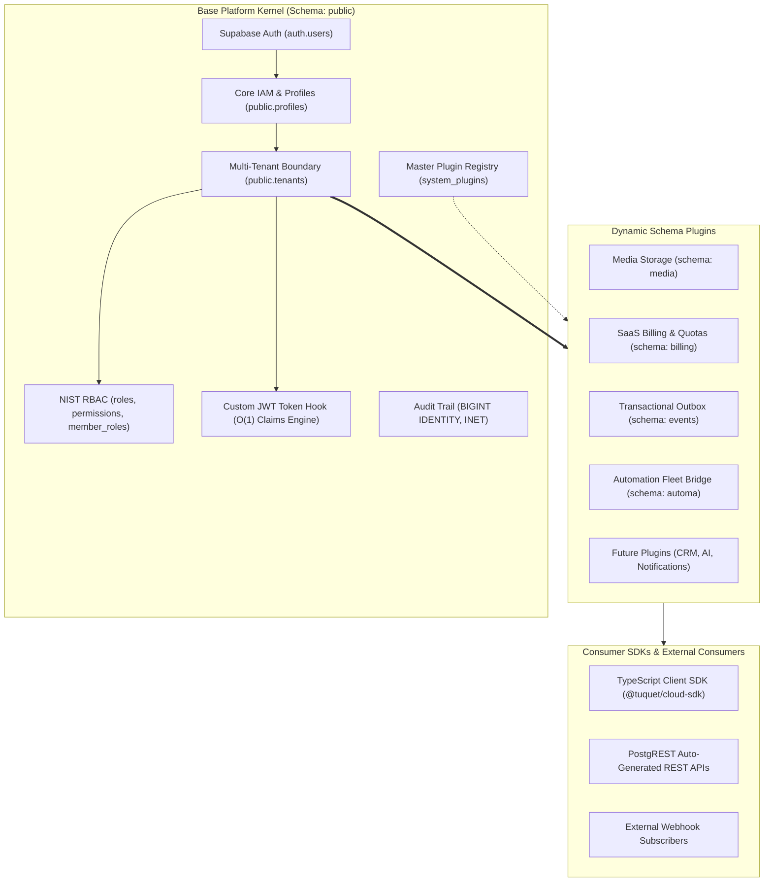

# 🗺️ Tuquet Cloud Roadmap

> **Product**: Tuquet Cloud — Enterprise Multi-Tenant SaaS Engine & Modular Schema Plugin Framework for Supabase (PostgreSQL 15+)  
> **Mission**: Build the world's most robust, developer-friendly, production-ready multi-tenant backend architecture for Supabase, featuring $O(1)$ JWT authorization, modular schema isolation, and automated database plugin lifecycle.

---

## 🏛️ 1. Architecture Overview

---

## 📅 2. Roadmap Phases Summary

| Phase | Phase Name | Strategic Focus | Status |
| :--- | :--- | :--- | :---: |
| **Phase 1** | **Base Kernel & Plugin Engine Core** | Base Platform Core IAM, $O(1)$ JWT Claims Hook, Master Plugin Registry, 4 Enterprise Plugins, Canonical Terminology. | ✅ **COMPLETED (100%)** |
| **Phase 2** | **Testing Suite, Outbox Worker & SDK Pipeline** | Automated pgTAP / Docker RLS test suite, Outbox Worker Edge Function, Plugin Scaffolding CLI, Auto-generated TypeScript SDK. | 🔥 **CURRENT FOCUS** |
| **Phase 3** | **Enterprise Scale & High Availability** | Declarative Table Partitioning by `tenant_id`, Supavisor pooler tuning, Supabase Branching CI/CD, PITR backup automation. | 🔮 **PLANNED** |

---

## 🎯 3. Phase 1: Base Kernel & Plugin Engine Core (Completed)

> **Objective**: Establish an unshakeable, production-ready PostgreSQL foundation with zero RLS recursion, hardened security, and a drop-in modular plugin architecture.

- [x] **Base Platform Core Migration (`20260920000001_base_platform_core.sql`):**
  - [x] 10 core tables in `public` schema (`profiles`, `tenants`, `roles`, `permissions`, `role_permissions`, `tenant_members`, `member_roles`, `tenant_invitations`, `audit_logs`, `system_plugins`).
  - [x] System Roles (`is_system = true`, `tenant_id IS NULL`) vs Custom Tenant Roles (`tenant_id = UUID`).
  - [x] Composite indexes starting with `tenant_id` for multi-tenant query optimization.
- [x] **$O(1)$ JWT Access Token Hook & Zero-Recursion RLS:**
  - [x] `public.custom_access_token_hook` bakes active `tenant_id`, `roles`, and atomic `permissions` (`LIMIT 25`) into JWT `app_metadata`.
  - [x] Authorization helpers (`has_permission`, `is_tenant_member`, `is_tenant_admin`) marked `SECURITY DEFINER` and `STABLE`.
- [x] **CWE-426 Protection (Search Path Hijacking):**
  - [x] 100% of functions, procedures, and triggers enforce `SET search_path = ''` with fully-qualified schema names.
- [x] **Master Plugin Registry & Lifecycle Pipeline:**
  - [x] `public.system_plugins` tracks active plugins with `is_system` protection.
  - [x] `scripts/plugins/apply_plugins.ps1` automates topological installations (`storage` $\rightarrow$ `subscriptions` $\rightarrow$ `webhooks` $\rightarrow$ `automa`).
- [x] **4 First-Party Enterprise Plugins:**
  - [x] `storage` (Schema: `media`): Metadata catalog & dual-layer Supabase Storage RLS.
  - [x] `subscriptions` (Schema: `billing`): SaaS plans, subscriptions, and usage meters.
  - [x] `webhooks` (Schema: `events`): Transactional Outbox pattern & delivery audit logs.
  - [x] `automa` (Schema: `automa`): Workflows, runner fleet, campaign runs, and telemetry logs.
- [x] **Documentation & Anti-Hallucination Standards:**
  - [x] Canonical Terminology Dictionary (`docs/terminology_dictionary.md`).
  - [x] Technical Architecture & Extension Contract (`docs/architecture.md`).
  - [x] Project Agent Behavioral Rules (`AGENTS.md`).

---

## 🚀 4. Phase 2: Testing Suite, Outbox Worker & SDK Pipeline (Up Next)

> **Objective**: Implement automated database test runners, background event delivery edge functions, developer scaffolding tools, and typed client SDK pipelines.

1. **Automated Database Integration Testing (Local Supabase / Docker):**
   - Implement automated pgTAP and SQL verification test suites (`tests/db/`).
   - Validate 100% of RLS policies across multi-tenant personas (Owner, Admin, Member, Suspended, Cross-Tenant Intruder).
   - Test plugin installation and uninstallation idempotency.
2. **Background Outbox Worker (Supabase Edge Function / Deno):**
   - Develop `supabase/functions/outbox-worker` to poll `events.outbox` where `status = 'pending'`.
   - Dispatch HTTP POST webhooks with HMAC-SHA256 signature verification headers.
   - Record response status codes, latencies, and implement Exponential Backoff retries.
3. **Plugin Authoring Scaffolding CLI:**
   - Create a lightweight CLI tool (`pnpm run create:plugin <id> <schema>`) to generate standard plugin boilerplate (`plugin.json`, `install.sql`, `uninstall.sql`, `README.md`).
4. **Automated TypeScript SDK Generation Pipeline:**
   - Integrate `@hey-api/openapi-ts` with PostgREST dynamic introspection.
   - Export strongly-typed TypeScript client package (`@tuquet/cloud-sdk`) for frontend and client runtime consumption.
5. **Atomic Quota Enforcement Triggers:**
   - Connect `billing.usage_meters` triggers with domain tables (e.g. block uploads when `storage_mb` exceeds plan quota).

---

## 🔮 5. Phase 3: Enterprise Scale, Partitioning & High Availability

> **Objective**: Scale Tuquet Cloud to hundreds of millions of records, automate continuous database deployment, and ensure high availability.

1. **Declarative Table Partitioning by `tenant_id`:**
   - Implement PostgreSQL Declarative Table Partitioning (HASH or LIST) for high-growth append-only tables:
     - `public.audit_logs`
     - `events.outbox` and `events.deliveries`
     - `automa.execution_logs`
2. **Supabase Database Branching & CI/CD Migrations:**
   - Setup GitHub Actions pipeline with Supabase CLI database branching for preview environments.
   - Automated schema linter and migration verification on pull requests.
3. **Connection Pooling & Supavisor Optimization:**
   - Configure Supavisor in Transaction Mode for high-concurrency serverless client spikes.
   - Tune connection limits, statement timeouts, and query work memory (`work_mem`).
4. **Point-In-Time Recovery (PITR) & Disaster Recovery Runbooks:**
   - Standardize automated backup verification and failover documentation.

---

## 📜 6. Backend Engineering Invariants

1. **Strict ASCII Invariance:** All PowerShell and automation scripts MUST use strict ASCII encoding to guarantee Windows PowerShell 5.1 compatibility.
2. **Database-First & Zero Monolithic Clutter:** All application state is managed in PostgreSQL with schema separation. The `public` schema is reserved strictly for Core IAM.
3. **Zero RLS Recursion:** Never evaluate circular subqueries inside RLS policies. Always leverage JWT claims synthesized by the Custom Access Token Hook.
4. **CWE-426 Sanitization:** Every SQL function and procedure MUST declare `SET search_path = ''`.
