# Tuquet Cloud Architecture & Data Model

> **KISS & YAGNI Compliant**: Tài liệu kiến trúc chuẩn hóa duy nhất của `tuquet-cloud`. Tổng hợp toàn diện sơ đồ ERD, mô hình dữ liệu đa tổ chức (Multi-Tenant RBAC), kiến trúc Plugins phân tán và cơ chế API PostgREST thời gian thực.  
> 📖 **Từ Điển Danh Pháp Chuẩn Hóa**: Vui lòng tham chiếu [**Từ Điển Thuật Ngữ & Chống Ảo Giác (docs/terminology_dictionary.md)**](./terminology_dictionary.md) để đảm bảo tính nhất quán danh pháp trên toàn hệ sinh thái.

---

## 1. Tổng Quan Kiến Trúc Đa Tầng (Multi-Tier Architecture)

Tuquet Cloud được thiết kế theo mô hình **Row-Level Tenancy (Shared Database, Shared Schema)** kết hợp **Schema-based Plugins** trên nền tảng Supabase / PostgreSQL.

```
┌────────────────────────────────────────────────────────────────────────┐
│ 1. IDENTITY & USER DOMAIN                                              │
│    [auth.users] (Supabase Auth) ◄───(Trigger 1:1)───► [public.profiles]│
└────────────────────────────────────────────────────────────────────────┘
                                    │
                                    │ User tham gia vào Tenant
                                    ▼
┌────────────────────────────────────────────────────────────────────────┐
│ 2. BASE PLATFORM CORE (Schema: public)                                 │
│    ├── tenants               (Ranh giới cô lập tổ chức / workspace)   │
│    ├── tenant_members        (Quan hệ thành viên & trạng thái)        │
│    ├── roles                 (Vai trò hệ thống & Custom Tenant Roles) │
│    ├── permissions           (Bảng quyền nguyên tử)                   │
│    ├── role_permissions      (Map quyền cho vai trò)                  │
│    ├── member_roles          (Gán nhiều vai trò cho thành viên)       │
│    ├── tenant_invitations    (Thư mời tham gia qua Token Hash)        │
│    ├── audit_logs            (Nhật ký hoạt động bảo mật - Bigint ID)  │
│    └── system_plugins        (Master Registry - Cờ is_system bảo vệ)  │
└──────────────────────────────────┬─────────────────────────────────────┘
                                   │
                                   │ Mở rộng theo nhu cầu (On-Demand Plugins)
                                   ▼
┌────────────────────────────────────────────────────────────────────────┐
│ 3. ENTERPRISE PLUGINS ECOSYSTEM (Dedicated Isolated Schemas)           │
│   ├── [schema: media]   Storage & Media Assets (Presigned URL & RLS)   │
│   ├── [schema: billing] Subscriptions, Plans & Resource Metering       │
│   ├── [schema: events]  Transactional Outbox & Webhooks Distribution   │
│   └── [schema: automa]  Automa Cloud Bridge (Fleet, Workflows, Logs)   │
└────────────────────────────────────────────────────────────────────────┘
```

---

## 2. Sơ Đồ Thực Thể Liên Kết (Full System ERD)

```mermaid
%%{init: {
  'theme': 'base',
  'themeVariables': {
    'primaryColor': '#0f172a',
    'primaryTextColor': '#f8fafc',
    'primaryBorderColor': '#38bdf8',
    'lineColor': '#38bdf8',
    'secondaryColor': '#1e293b',
    'tertiaryColor': '#0f172a',
    'fontFamily': 'JetBrains Mono, Segoe UI, sans-serif',
    'fontSize': '12px',
    'attributeBackgroundColorOdd': '#090d16',
    'attributeBackgroundColorEven': '#0f172a'
  }
}}%%
erDiagram
    %% ==========================================
    %% 1. IDENTITY & PROFILES
    %% ==========================================
    AUTH_USERS ||--|| PROFILES : "1:1 đồng bộ qua Trigger"
    PROFILES ||--o{ TENANTS : "created_by (audit)"
    PROFILES ||--o{ TENANT_MEMBERS : "user_id"
    PROFILES ||--o{ TENANT_INVITATIONS : "invited_by"
    PROFILES ||--o{ AUDIT_LOGS : "actor_id"

    %% ==========================================
    %% 2. BASE CORE IAM (Schema: public)
    %% ==========================================
    TENANTS ||--o{ TENANT_MEMBERS : "tenant_id (1:N)"
    TENANTS ||--o{ ROLES : "tenant_id (nullable cho system roles)"
    TENANTS ||--o{ TENANT_INVITATIONS : "tenant_id (1:N)"
    TENANTS ||--o{ AUDIT_LOGS : "tenant_id (1:N partitionable)"

    ROLES ||--o{ ROLE_PERMISSIONS : "role_id"
    PERMISSIONS ||--o{ ROLE_PERMISSIONS : "permission_id"
    
    TENANT_MEMBERS ||--o{ MEMBER_ROLES : "member_id"
    ROLES ||--o{ MEMBER_ROLES : "role_id"
    TENANTS ||--o{ MEMBER_ROLES : "tenant_id (composite index)"
    ROLES ||--o{ TENANT_INVITATIONS : "role_id (vai trò được mời)"

    SYSTEM_PLUGINS {
        text id PK "Plugin identifier (automa, storage, subscriptions, webhooks)"
        text name "Display name"
        text version "SemVer version"
        boolean is_installed "Trạng thái cài đặt"
        boolean is_system "Cờ bảo vệ bất biến (true = không thể gỡ)"
        text schema_name "Postgres Schema đích"
        text[] dependencies "Mảng phụ thuộc topo"
        timestamptz installed_at "Thời điểm kích hoạt"
    }

    %% ==========================================
    %% 3. PLUGIN STORAGE (Schema: media)
    %% ==========================================
    TENANTS ||--o{ MEDIA_ASSETS : "tenant_id (cô lập media)"
    MEDIA_ASSETS {
        uuid id PK "Asset UUID"
        uuid tenant_id FK "Thuộc tenant nào"
        string file_path "Đường dẫn Supabase Storage"
        string bucket_name "tenant-assets"
        bigint file_size_bytes "Dung lượng file"
        string mime_type "Content-Type"
        uuid uploaded_by FK "Profile ID"
    }

    %% ==========================================
    %% 4. PLUGIN SUBSCRIPTIONS (Schema: billing)
    %% ==========================================
    TENANTS ||--|| TENANT_SUBSCRIPTIONS : "tenant_id (1:1 gói thuê bao)"
    SUBSCRIPTION_PLANS ||--o{ TENANT_SUBSCRIPTIONS : "plan_id"
    TENANTS ||--o{ TENANT_USAGE_METERS : "tenant_id"

    SUBSCRIPTION_PLANS {
        string id PK "free | pro | enterprise"
        string name "Tên gói cước"
        int max_members "Giới hạn số thành viên"
        int max_workflows "Giới hạn số quy trình"
        bigint max_storage_mb "Giới hạn dung lượng lưu trữ (MB)"
    }
    TENANT_SUBSCRIPTIONS {
        uuid id PK "Subscription ID"
        uuid tenant_id FK "Tenant ID"
        string plan_id FK "Plan tham chiếu"
        enum status "free_tier | trialing | active | canceled"
        timestamptz current_period_end "Hạn dùng"
    }
    TENANT_USAGE_METERS {
        uuid id PK "Meter ID"
        uuid tenant_id FK "Tenant ID"
        string metric_name "storage_bytes, workflows_count"
        bigint current_value "Mức dùng hiện tại"
    }

    %% ==========================================
    %% 5. PLUGIN WEBHOOKS (Schema: events)
    %% ==========================================
    TENANTS ||--o{ OUTBOX_EVENTS : "tenant_id"
    TENANTS ||--o{ WEBHOOK_SUBSCRIPTIONS : "tenant_id"
    WEBHOOK_SUBSCRIPTIONS ||--o{ WEBHOOK_DELIVERIES : "webhook_id"
    OUTBOX_EVENTS ||--o{ WEBHOOK_DELIVERIES : "event_id"

    OUTBOX_EVENTS {
        uuid id PK "Event UUID"
        uuid tenant_id FK "Tenant ID"
        string event_type "tenant.created, automa.campaign.finished"
        jsonb payload "Dữ liệu sự kiện JSON"
        enum status "pending | processing | delivered | failed"
    }
    WEBHOOK_SUBSCRIPTIONS {
        uuid id PK "Webhook UUID"
        uuid tenant_id FK "Tenant ID"
        string target_url "URL nhận webhook ngoài"
        string secret_hash "Mã bí mật xác thực chữ ký"
        boolean is_active "Trạng thái kích hoạt"
    }
    WEBHOOK_DELIVERIES {
        uuid id PK "Delivery UUID"
        uuid webhook_id FK "Webhook ID"
        uuid event_id FK "Event ID"
        int response_status "HTTP status code"
        text response_body "Nội dung phản hồi"
    }

    %% ==========================================
    %% 6. PLUGIN AUTOMA BRIDGE (Schema: automa)
    %% ==========================================
    TENANTS ||--o{ AUTOMA_WORKFLOWS : "tenant_id"
    TENANTS ||--o{ AUTOMA_RUNNERS : "tenant_id"
    TENANTS ||--o{ AUTOMA_CAMPAIGN_RUNS : "tenant_id"
    TENANTS ||--o{ AUTOMA_EXECUTION_LOGS : "tenant_id"
    TENANTS ||--o{ AUTOMA_SCHEDULES : "tenant_id"

    AUTOMA_WORKFLOWS ||--o{ AUTOMA_CAMPAIGN_RUNS : "workflow_id"
    AUTOMA_RUNNERS ||--o{ AUTOMA_CAMPAIGN_RUNS : "runner_id"
    AUTOMA_CAMPAIGN_RUNS ||--o{ AUTOMA_EXECUTION_LOGS : "campaign_run_id"
    AUTOMA_RUNNERS ||--o{ AUTOMA_EXECUTION_LOGS : "runner_id"
    AUTOMA_WORKFLOWS ||--o{ AUTOMA_SCHEDULES : "workflow_id"

    AUTOMA_WORKFLOWS {
        uuid id PK "Workflow ID"
        uuid tenant_id FK "Tenant ID"
        string name "Tên quy trình"
        jsonb graph "VueFlow Visual Flow Graph JSON"
        int version "Phiên bản quy trình"
    }
    AUTOMA_RUNNERS {
        uuid id PK "Runner Node ID"
        uuid tenant_id FK "Tenant ID"
        string hostname "Tên máy trạm thực thi"
        string status "online | busy | offline"
        timestamptz last_heartbeat "Nhịp tim cuối"
    }
    AUTOMA_CAMPAIGN_RUNS {
        uuid id PK "Campaign Run UUID"
        uuid tenant_id FK "Tenant ID"
        uuid workflow_id FK "Workflow tham chiếu"
        uuid runner_id FK "Máy trạm thực thi"
        enum status "pending | running | completed | failed"
    }
    AUTOMA_EXECUTION_LOGS {
        bigint id PK "Identity Sequence Log ID"
        uuid tenant_id FK "Tenant ID"
        uuid campaign_run_id FK "Phiên chạy"
        string level "INFO | WARN | ERROR"
        text message "Log entry"
        timestamptz created_at "Timestamp"
    }
    AUTOMA_SCHEDULES {
        uuid id PK "Schedule ID"
        uuid tenant_id FK "Tenant ID"
        uuid workflow_id FK "Workflow tham chiếu"
        string cron_expression "Biểu thức cron"
        boolean is_active "Trạng thái kích hoạt"
    }
```



---

## 3. Quy Tắc Toàn Vẹn Khóa & Cascade Mappings

| Bảng Cha | Bảng Con | Khóa Ngoại (FK) | Quan Hệ | Hành Động ON DELETE |
| :--- | :--- | :--- | :--- | :--- |
| `auth.users` | `public.profiles` | `id -> auth.users.id` | **1 : 1** | `CASCADE`: User bị xóa ở Auth thì Profile bị xóa tương ứng. |
| `public.profiles` | `public.tenants` | `created_by -> profiles.id` | **1 : N** | `SET NULL`: Giữ lại Tenant nếu người tạo ban đầu rời tổ chức. |
| `public.tenants` | `public.tenant_members` | `tenant_id -> tenants.id` | **1 : N** | `CASCADE`: Xóa Tenant xóa sạch danh sách thành viên. |
| `public.profiles` | `public.tenant_members` | `user_id -> profiles.id` | **1 : N** | `CASCADE`: Xóa User xóa tư cách thành viên ở mọi Tenant. |
| `public.tenants` | `public.roles` | `tenant_id -> tenants.id` | **1 : N** | `CASCADE`: Xóa Custom Role của Tenant. Role hệ thống có `tenant_id IS NULL`. |
| `public.roles` | `public.role_permissions` | `role_id -> roles.id` | **1 : N** | `CASCADE`: Xóa Role tự động thu hồi toàn bộ phân quyền tương ứng. |
| `public.permissions` | `public.role_permissions` | `permission_id -> permissions.id` | **1 : N** | `CASCADE`: Thay đổi mã quyền tự động đồng bộ bảng ánh xạ. |
| `public.tenant_members` | `public.member_roles` | `member_id -> tenant_members.id` | **1 : N** | `CASCADE`: Xóa thành viên xóa toàn bộ vai trò được gán. |
| `public.roles` | `public.member_roles` | `role_id -> roles.id` | **1 : N** | `RESTRICT`: Chặn xóa Role nếu đang có thành viên nắm giữ vai trò. |
| `public.tenants` | `public.tenant_invitations` | `tenant_id -> tenants.id` | **1 : N** | `CASCADE`: Xóa Tenant hủy bỏ tất cả lời mời chưa chấp nhận. |
| `public.tenants` | `public.audit_logs` | `tenant_id -> tenants.id` | **1 : N** | `CASCADE`: Nhật ký gắn liền với vòng đời Tenant. |
| `public.system_plugins` | (Không có) | N/A | **Registry** | Master Registry; plugin có cờ `is_system = true` bị cấm gỡ bỏ. |
| `public.tenants` | `media.assets` | `tenant_id -> tenants.id` | **1 : N** | `CASCADE`: Metadata media gắn chặt theo Tenant. |
| `public.tenants` | `billing.subscriptions` | `tenant_id -> tenants.id` | **1 : 1** | `CASCADE`: Mỗi Tenant có 1 thuê bao thanh toán duy nhất. |
| `public.tenants` | `automa.workflows` | `tenant_id -> tenants.id` | **1 : N** | `CASCADE`: Quy trình automation gắn liền với Tenant. |
| `public.tenants` | `automa.runners` | `tenant_id -> tenants.id` | **1 : N** | `CASCADE`: Cụm máy trạm thuộc quyền sở hữu của Tenant. |
| `automa.workflows` | `automa.campaign_runs` | `workflow_id -> workflows.id` | **1 : N** | `SET NULL`: Giữ lại lịch sử chạy nếu workflow bị xóa. |
| `automa.campaign_runs` | `automa.execution_logs` | `campaign_run_id -> campaign_runs.id` | **1 : N** | `CASCADE`: Xóa phiên chạy dọn sạch log tương ứng. |

---

## 4. Mô Hình Bảo Mật Tuyệt Đối (Zero-Trust Security & RLS)

### 4.1. Custom Access Token Hook ($O(1)$ RLS Tra Cứu)
Thay vì để PostgreSQL quét lặp qua các bảng `tenant_members`, `member_roles`, `role_permissions` trên từng hàng (gây lỗi RLS Infinite Recursion và nghẽn CPU), hàm `auth.custom_access_token_hook`:
- Tự động lấy `tenant_id` đang kích hoạt.
- Gộp mảng các vai trò (`roles: string[]`) và mảng các quyền nguyên tử (`permissions: string[]`, tối đa **25 quyền** tránh phình to JWT header) tiêm trực tiếp vào `app_metadata` của JWT.
- Khi truy vấn, PostgreSQL chỉ cần đọc `(auth.jwt() -> 'app_metadata' ->> 'tenant_id')::uuid` với độ phức tạp **$O(1)$**.

### 4.2. Khắc Phục Triệt Để Đệ Quy RLS (No-Recursion Pattern)
Mọi hàm kiểm tra quyền bảo mật đều được gắn cờ `SECURITY DEFINER` và `STABLE`:
```sql
CREATE OR REPLACE FUNCTION public.has_permission(requested_permission text)
RETURNS boolean
LANGUAGE plpgsql
STABLE
SECURITY DEFINER
SET search_path = ''
AS $$
BEGIN
    RETURN (auth.jwt() -> 'app_metadata' -> 'permissions') ? requested_permission;
END;
$$;
```

### 4.3. Phòng Vệ CWE-426 (Search Path Hijacking)
100% các hàm Function và Trigger trong hệ thống đều khai báo tường minh:
```sql
SET search_path = ''
```
Mọi lời gọi bảng và hàm nội bộ bắt buộc phải dùng tên đủ (Fully Qualified Names: `public.profiles`, `auth.users`, `extensions.uuid_generate_v4()`), triệt tiêu hoàn toàn nguy cơ khai thác mã độc qua đường dẫn tìm kiếm schema giả mạo.

---

## 5. PostgREST API Introspection Thời Gian Thực

Theo triết lý **KISS & YAGNI**, Tuquet Cloud **không lưu trữ file OpenAPI JSON tĩnh trong kho mã nguồn**. Supabase PostgREST Engine tự động soi chiếu schema cơ sở dữ liệu thời gian thực và cung cấp API specification chuẩn OpenAPI v3.

### 5.1. Xuất OpenAPI Spec Động Khi Cần
Khi cần xuất OpenAPI Specification để kiểm tra hoặc sinh TypeScript SDK:

```powershell
# Từ Supabase Local (Port 54321)
curl.exe -s -H "Accept: application/openapi+json" http://127.0.0.1:54321/rest/v1/ -o openapi.json

# Từ Supabase Cloud
curl.exe -s -H "apikey: <your-anon-key>" -H "Accept: application/openapi+json" https://<project-ref>.supabase.co/rest/v1/ -o openapi.json
```

### 5.2. Sinh TypeScript Client SDK Tự Động
```powershell
# Sinh trực tiếp types từ Supabase CLI
supabase gen types typescript --local > types/supabase.ts
```
