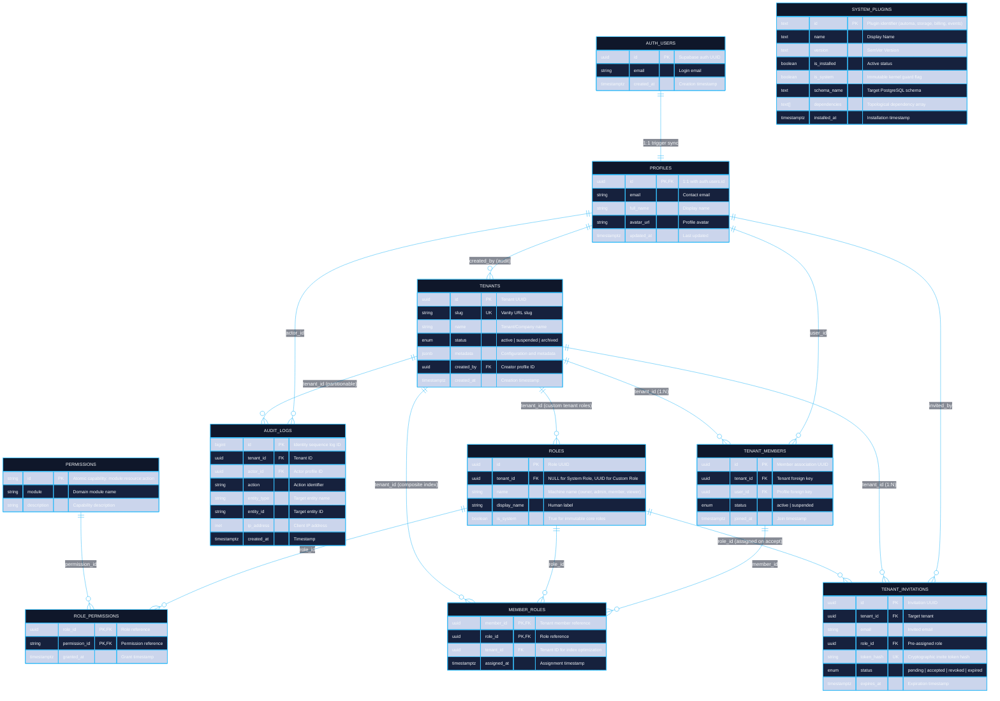
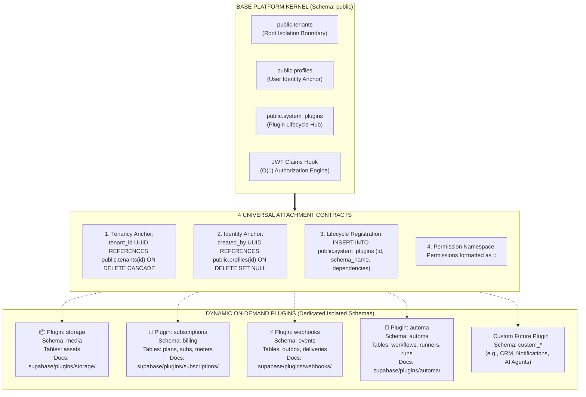

# Tuquet Cloud Architecture & Technical Specification

> **KISS & YAGNI Compliant**: Authoritative technical specification for `tuquet-cloud`. Details the Micro-Kernel architecture, Base Core IAM data model, dynamic PostgreSQL Schema Plugin extension contract, zero-recursion $O(1)$ Row-Level Security (RLS), and dynamic PostgREST API introspection.  
> 📖 **Terminology Standard**: Review the [**Terminology Dictionary & Anti-Hallucination Lexicon (docs/terminology_dictionary.md)**](./terminology_dictionary.md) for strict naming invariants and forbidden terms.

---

## 1. High-Level Architecture: Micro-Kernel & Schema Plugins

Tuquet Cloud implements a **Row-Level Tenancy (Shared Database, Shared Schema)** pattern for the core identity layer combined with a **Pluggable Schema Isolation** architecture for business domains on **Supabase / PostgreSQL 15+**.

```
┌────────────────────────────────────────────────────────────────────────┐
│ 1. IDENTITY LAYER (Managed by Supabase Auth)                           │
│    [auth.users] (Authentication, credentials, JWT token issue)         │
└──────────────────────────────────┬─────────────────────────────────────┘
                                   │ 1:1 Trigger Sync
                                   ▼
┌────────────────────────────────────────────────────────────────────────┐
│ 2. BASE PLATFORM KERNEL (Schema: public - Immutable)                  │
│    ├── profiles              (Public user metadata linked to auth)     │
│    ├── tenants               (Root multi-tenancy isolation boundary)   │
│    ├── tenant_members        (User-to-Tenant membership & state)       │
│    ├── roles                 (System Roles & Custom Tenant Roles)      │
│    ├── permissions           (Atomic capabilities: module:res:action)  │
│    ├── role_permissions      (Many-to-many role-to-permission mapping) │
│    ├── member_roles          (Role assignments per tenant member)      │
│    ├── tenant_invitations    (Secure token-hash invitation workflow)   │
│    ├── audit_logs            (Bigint sequence, INET IP audit trail)    │
│    └── system_plugins        (Master Plugin Registry & is_system lock) │
└──────────────────────────────────┬─────────────────────────────────────┘
                                   │
                                   │ Dynamic Extension Contracts
                                   ▼
┌────────────────────────────────────────────────────────────────────────┐
│ 3. DYNAMIC ON-DEMAND PLUGINS (Dedicated Isolated PostgreSQL Schemas)   │
│    ├── [schema: media]   Storage & Media Assets (Presigned URL & RLS)  │
│    ├── [schema: billing] Subscriptions, Plans & Resource Metering      │
│    ├── [schema: events]  Transactional Outbox & Webhooks Distribution  │
│    ├── [schema: automa]  Automa Cloud Bridge (Fleet, Workflows, Logs)  │
│    └── [schema: custom]  Future 3rd-party plugins (CRM, AI, Notify)   │
└────────────────────────────────────────────────────────────────────────┘
```

---

## 2. Base Platform Kernel (Schema: `public`)

The Base Platform Kernel is the **immutable core** of Tuquet Cloud. It manages identity extension, multi-tenancy boundary isolation, NIST RBAC role hierarchies, access token claim synthesis, and plugin registration.

### 2.1. Kernel Entity-Relationship Diagram (Kernel ERD)



---

## 3. Plugin Extension Architecture (The Universal Contract)

In Tuquet Cloud, **the Core never couples to plugins**. Plugins are dynamic, modular packages living in their own isolated PostgreSQL schemas (`media`, `billing`, `events`, `automa`, or custom 3rd-party domains).

Every dynamic plugin connects to the platform via **4 Universal Extension Points**:



### 3.1. The 4 Extension Rules

1. **Rule 1: Tenancy Boundary (`tenant_id`)**:
   - Every domain table in a plugin MUST include `tenant_id UUID NOT NULL REFERENCES public.tenants(id) ON DELETE CASCADE`.
   - Every table MUST enforce Row-Level Security (RLS) scoped by `tenant_id`.
2. **Rule 2: Identity Anchor (`created_by` / `user_id`)**:
   - When referencing user identity, plugins MUST reference `public.profiles(id)` with `ON DELETE SET NULL` or `ON DELETE CASCADE`. Plugins MUST NEVER reference internal `auth.users` directly.
3. **Rule 3: Schema Isolation**:
   - Every plugin MUST own its distinct PostgreSQL schema (e.g. `CREATE SCHEMA IF NOT EXISTS media;`). Plugins MUST NEVER inject new domain tables into the `public` schema.
4. **Rule 4: Master Registry Registration**:
   - The plugin's `install.sql` MUST register itself into `public.system_plugins`.
   - The plugin's `uninstall.sql` MUST unregister itself and drop its isolated schema cleanly.

> 💡 **Detailed Plugin ERDs**: Each plugin documents its internal schema, tables, and relationships inside its own dedicated directory:
> - Storage ERD: [`supabase/plugins/storage/README.md`](../supabase/plugins/storage/README.md)
> - Subscriptions ERD: [`supabase/plugins/subscriptions/README.md`](../supabase/plugins/subscriptions/README.md)
> - Webhooks ERD: [`supabase/plugins/webhooks/README.md`](../supabase/plugins/webhooks/README.md)
> - Automa ERD: [`supabase/plugins/automa/README.md`](../supabase/plugins/automa/README.md)

---

## 4. Zero-Trust Security & Performance Model

### 4.1. Custom Access Token Hook ($O(1)$ RLS Lookups)
In naive multi-tenant Supabase implementations, RLS policies execute circular subqueries on `tenant_members` and `role_permissions` for every single queried row. This causes **RLS Infinite Recursion** and pegging CPU to 100%.

Tuquet Cloud solves this at the protocol level:
1. `public.custom_access_token_hook` runs when Supabase Auth issues a JWT.
2. It fetches the user's active `tenant_id`, aggregated role names (`roles`), and atomic capabilities (`permissions`, capped at **25 items** to prevent JWT header bloat).
3. These claims are baked directly into `auth.jwt() -> 'app_metadata'`.
4. RLS policies evaluate in **$\sim 1\mu s$** via direct JSON path lookup:
   ```sql
   CREATE POLICY "tenant_isolation_policy" ON media.assets
   FOR ALL TO authenticated
   USING (tenant_id = (auth.jwt() -> 'app_metadata' ->> 'tenant_id')::uuid);
   ```

### 4.2. No-Recursion Security Definer Functions
All authorization helper functions are declared `SECURITY DEFINER` and `STABLE`:
```sql
CREATE OR REPLACE FUNCTION public.has_permission(requested_permission text)
RETURNS boolean
LANGUAGE plpgsql
STABLE
SECURITY DEFINER
SET search_path = ''
AS $$
BEGIN
    RETURN (auth.jwt() -> 'app_metadata' -> 'permissions') ? requested_permission;
END;
$$;
```

### 4.3. CWE-426 Protection (Search Path Hijacking)
100% of functions, procedures, and triggers declare:
```sql
SET search_path = ''
```
Every object lookup within SQL routines uses fully-qualified names (`public.profiles`, `public.tenants`, `extensions.gen_random_uuid()`), eliminating schema search-path hijacking vulnerabilities.

---

## 5. Plugin Authoring Specification (How to Create a New Plugin)

To develop a new dynamic plugin for Tuquet Cloud, create a directory under `supabase/plugins/<plugin_id>/` containing exactly 4 standard files:

```
supabase/plugins/<plugin_id>/
├── plugin.json       # Manifest metadata, dependencies, exposed permissions
├── install.sql       # DDL: Schema creation, tables, RLS policies, registry entry
├── uninstall.sql     # DDL: Drop schema, remove registry entry (idempotent)
└── README.md         # Domain documentation, entity list, and usage guide
```

### 5.1. `plugin.json` Manifest Schema
```json
{
  "id": "my_plugin",
  "name": "My Plugin Display Name",
  "version": "1.0.0",
  "schema": "my_schema",
  "description": "Clear explanation of plugin capabilities",
  "dependencies": ["core-iam"],
  "tables": [
    "my_schema.items"
  ],
  "permissions": [
    "my_plugin:items:read",
    "my_plugin:items:manage"
  ]
}
```

### 5.2. `install.sql` Standard Template
```sql
-- 1. Create isolated schema
CREATE SCHEMA IF NOT EXISTS my_schema;

-- 2. Create domain tables anchored to tenant_id
CREATE TABLE IF NOT EXISTS my_schema.items (
    id UUID PRIMARY KEY DEFAULT extensions.gen_random_uuid(),
    tenant_id UUID NOT NULL REFERENCES public.tenants(id) ON DELETE CASCADE,
    name TEXT NOT NULL,
    created_by UUID REFERENCES public.profiles(id) ON DELETE SET NULL,
    created_at TIMESTAMPTZ NOT NULL DEFAULT now()
);

-- 3. Enable RLS
ALTER TABLE my_schema.items ENABLE ROW LEVEL SECURITY;

CREATE POLICY "items_tenant_isolation" ON my_schema.items
FOR ALL TO authenticated
USING (tenant_id = (auth.jwt() -> 'app_metadata' ->> 'tenant_id')::uuid);

-- 4. Register into system_plugins
INSERT INTO public.system_plugins (id, name, version, is_installed, is_system, schema_name, dependencies)
VALUES ('my_plugin', 'My Plugin', '1.0.0', true, false, 'my_schema', ARRAY['core-iam'])
ON CONFLICT (id) DO UPDATE SET
    version = EXCLUDED.version,
    is_installed = true,
    installed_at = now();
```

---

## 6. Dynamic PostgREST OpenAPI Introspection & SDK Generation

Under the **KISS & YAGNI** principles, Tuquet Cloud **does not store static, dead OpenAPI JSON snapshots in version control**. Supabase PostgREST dynamically inspects the database catalog and exposes real-time OpenAPI v3 specifications.

### 6.1. Fetch Live OpenAPI Specification On-Demand
```bash
# Local Supabase instance (Port 54321)
curl.exe -s -H "Accept: application/openapi+json" http://127.0.0.1:54321/rest/v1/ -o openapi.json

# Cloud Supabase instance
curl.exe -s -H "apikey: <anon-key>" -H "Accept: application/openapi+json" https://<project-ref>.supabase.co/rest/v1/ -o openapi.json
```

### 6.2. Generate Strongly-Typed TypeScript Client SDK
```bash
# Generate types directly from the local running database
supabase gen types typescript --local > types/supabase.ts
```
