# Sơ Đồ Thực Thể Liên Kết (ERD) - Multi-Tenant RBAC Trên Supabase

Tài liệu này cung cấp sơ đồ ERD chi tiết, chuẩn hóa và được thiết kế đặc biệt cho kiến trúc **Đa người thuê (Multi-tenancy)** có khả năng mở rộng quy mô lớn (Scale-ready) trên nền tảng **Supabase / PostgreSQL**.

---

## 1. Sơ Đồ Mermaid ERD (Tổng Thể Hệ Thống)

> 💡 **Trải nghiệm trực quan tốt nhất**:  
> Thay vì xem sơ đồ tĩnh bị giới hạn chiều rộng trong VS Code Markdown Preview, bạn có thể:  
> 1. Mở file [**`docs/erd_viewer.html`**](./erd_viewer.html) bằng trình duyệt (hoặc ấn `Ctrl+Shift+P` trong VS Code gõ `Simple Browser: Show` và trỏ vào file này) để có tính năng **Kéo chuột (Pan), Cuộn zoom mượt mà, Tìm kiếm bảng và Tải file SVG**.  
> 2. Hoặc kết nối trực tiếp vào PostgreSQL bằng **DBeaver** (đã có sẵn trong Scoop) để sinh sơ đồ ERD động có thể tùy biến vị trí từng bảng.

```mermaid
%%{init: {
  'theme': 'base',
  'themeVariables': {
    'primaryColor': '#0f172a',
    'primaryTextColor': '#f8fafc',
    'primaryBorderColor': '#38bdf8',
    'lineColor': '#38bdf8',
    'secondaryColor': '#1e293b',
    'tertiaryColor': '#0f172a',
    'fontFamily': 'JetBrains Mono, Segoe UI, sans-serif',
    'fontSize': '12px',
    'attributeBackgroundColorOdd': '#090d16',
    'attributeBackgroundColorEven': '#0f172a'
  }
}}%%
erDiagram
    %% ==========================================
    %% 1. IDENTITY & PROFILES
    %% ==========================================
    AUTH_USERS ||--|| PROFILES : "1:1 đồng bộ qua DB Trigger"
    PROFILES ||--o{ TENANTS : "created_by (người tạo tenant)"
    PROFILES ||--o{ TENANT_MEMBERS : "user_id (thành viên)"
    PROFILES ||--o{ TENANT_INVITATIONS : "invited_by (người gửi lời mời)"
    PROFILES ||--o{ AUDIT_LOGS : "actor_id (người thực hiện thao tác)"
    PROFILES ||--o{ PROJECTS : "created_by (người tạo tài nguyên)"

    %% ==========================================
    %% 2. TENANT BOUNDARY & GOVERNANCE
    %% ==========================================
    TENANTS ||--o{ TENANT_MEMBERS : "tenant_id (chứa nhiều thành viên)"
    TENANTS ||--o{ ROLES : "tenant_id (vai trò riêng của tenant, nullable)"
    TENANTS ||--o{ TENANT_INVITATIONS : "tenant_id (lời mời vào tenant)"
    TENANTS ||--o{ AUDIT_LOGS : "tenant_id (nhật ký hoạt động tenant)"
    TENANTS ||--o{ PROJECTS : "tenant_id (dữ liệu thuộc tenant)"

    %% ==========================================
    %% 3. RBAC CORE (ROLES & PERMISSIONS)
    %% ==========================================
    ROLES ||--o{ ROLE_PERMISSIONS : "role_id (phân quyền cho vai trò)"
    PERMISSIONS ||--o{ ROLE_PERMISSIONS : "permission_id (quyền nguyên tử)"
    
    TENANT_MEMBERS ||--o{ MEMBER_ROLES : "member_id (gán nhiều vai trò)"
    ROLES ||--o{ MEMBER_ROLES : "role_id (vai trò được gán)"
    TENANTS ||--o{ MEMBER_ROLES : "tenant_id (khóa phụ tối ưu indexing)"
    ROLES ||--o{ TENANT_INVITATIONS : "role_id (vai trò gán sẵn khi mời)"

    %% ==========================================
    %% TABLE DEFINITIONS WITH ATTRIBUTES
    %% ==========================================
    AUTH_USERS {
        uuid id PK "Supabase internal user ID"
        string email "User email"
        timestamptz created_at "Timestamp creation"
    }

    PROFILES {
        uuid id PK,FK "1:1 mapping với auth.users.id"
        string email "Email liên lạc"
        string full_name "Họ và tên hiển thị"
        string avatar_url "Ảnh đại diện"
        timestamptz updated_at "Lần cập nhật cuối"
        timestamptz created_at "Ngày khởi tạo"
    }

    TENANTS {
        uuid id PK "Định danh duy nhất Tenant"
        string slug UK "Định danh URL thân thiện (vd: acme-corp)"
        string name "Tên công ty / tổ chức / workspace"
        string avatar_url "Logo của tổ chức"
        enum status "active | suspended | archived"
        jsonb metadata "Cấu hình tùy chỉnh (settings, billing tier)"
        uuid created_by FK "ID người tạo tổ chức"
        timestamptz created_at "Thời điểm tạo"
        timestamptz updated_at "Thời điểm cập nhật"
    }

    TENANT_MEMBERS {
        uuid id PK "ID định danh quan hệ thành viên"
        uuid tenant_id FK "Thuộc tổ chức nào"
        uuid user_id FK "Người dùng nào trong hệ thống"
        enum status "active | suspended"
        timestamptz joined_at "Ngày gia nhập"
        timestamptz updated_at "Cập nhật gần nhất"
    }

    ROLES {
        uuid id PK "ID vai trò"
        uuid tenant_id FK "NULL = System Role, UUID = Custom Tenant Role"
        string name "Tên máy đọc: owner, admin, editor..."
        string display_name "Tên hiển thị: Chủ sở hữu, Quản trị viên..."
        string description "Mô tả trách nhiệm của vai trò"
        boolean is_system "Vai trò cốt lõi không thể xóa"
        timestamptz created_at "Ngày tạo"
        timestamptz updated_at "Ngày cập nhật"
    }

    PERMISSIONS {
        string id PK "Quyền nguyên tử: tenant.update, members.invite..."
        string module "Nhóm tính năng: tenant, members, billing, projects"
        string description "Mô tả chi tiết quyền hạn"
        timestamptz created_at "Ngày tạo"
    }

    ROLE_PERMISSIONS {
        uuid role_id PK,FK "Vai trò tương ứng"
        string permission_id PK,FK "Quyền hạn được cấp"
        timestamptz granted_at "Thời điểm gán quyền"
    }

    MEMBER_ROLES {
        uuid member_id PK,FK "ID thành viên trong tenant_members"
        uuid role_id PK,FK "Vai trò được gán"
        uuid tenant_id FK "Tenant ID (phục vụ Composite Index & Partitioning)"
        timestamptz assigned_at "Thời điểm gán vai trò"
    }

    TENANT_INVITATIONS {
        uuid id PK "ID lời mời"
        uuid tenant_id FK "Lời mời vào tenant nào"
        string email "Email người được mời"
        uuid role_id FK "Vai trò sẽ nhận khi chấp nhận"
        string token_hash UK "Mã hash bảo mật lời mời"
        uuid invited_by FK "Thành viên đã gửi lời mời"
        enum status "pending | accepted | revoked | expired"
        timestamptz expires_at "Thời hạn lời mời (vd: 7 ngày)"
        timestamptz created_at "Thời điểm gửi"
    }

    AUDIT_LOGS {
        uuid id PK "ID nhật ký"
        uuid tenant_id FK "Nhật ký của tenant nào"
        uuid actor_id FK "Ai đã thao tác"
        string action "Hành động (vd: member.invite, role.change)"
        string entity_type "Bảng bị tác động (vd: projects, roles)"
        string entity_id "Khóa của bản ghi bị tác động"
        jsonb old_values "Dữ liệu trước khi sửa"
        jsonb new_values "Dữ liệu sau khi sửa"
        inet ip_address "Địa chỉ IP thực hiện"
        text user_agent "Trình duyệt / Thiết bị thực hiện"
        timestamptz created_at "Thời điểm ghi nhận"
    }

    PROJECTS {
        uuid id PK "ID tài nguyên dự án"
        uuid tenant_id FK "Thuộc tenant nào (Tenant Boundary RLS)"
        string name "Tên dự án"
        text description "Mô tả chi tiết"
        uuid created_by FK "Thành viên tạo dự án"
        timestamptz created_at "Thời điểm tạo"
        timestamptz updated_at "Thời điểm cập nhật"
    }
```



---

## 2. Bảng Ma Trận Quan Hệ & Khóa Ngoại (Relationship & Cardinality Matrix)

| Bảng Gốc (Parent) | Bảng Đích (Child) | Khóa Ngoại (Foreign Key) | Kiểu Quan Hệ | Ý Nghĩa Nghiệp Vụ & Ràng Buộc Xóa (ON DELETE) |
| :--- | :--- | :--- | :--- | :--- |
| `auth.users` | `profiles` | `id -> auth.users.id` | **1 : 1** | `CASCADE`: Khi người dùng bị xóa khỏi Auth, profile bị xóa tương ứng. |
| `profiles` | `tenants` | `created_by -> profiles.id` | **1 : N** | `SET NULL`: Giữ lại tenant nếu user tạo ban đầu rời đi. |
| `tenants` | `tenant_members` | `tenant_id -> tenants.id` | **1 : N** | `CASCADE`: Xóa tenant sẽ xóa sạch danh sách thành viên của tenant đó. |
| `profiles` | `tenant_members` | `user_id -> profiles.id` | **1 : N** | `CASCADE`: Xóa user sẽ xóa tư cách thành viên ở tất cả các tenant. |
| `tenants` | `roles` | `tenant_id -> tenants.id` | **1 : N** | `CASCADE`: Với Custom Role. Nếu `tenant_id IS NULL`, đó là System Role toàn cục. |
| `roles` | `role_permissions` | `role_id -> roles.id` | **1 : N** | `CASCADE`: Xóa role sẽ thu hồi toàn bộ phân quyền tương ứng. |
| `permissions` | `role_permissions` | `permission_id -> permissions.id` | **1 : N** | `CASCADE`: Khi định nghĩa quyền thay đổi, tự động cập nhật map bảng. |
| `tenant_members` | `member_roles` | `member_id -> tenant_members.id` | **1 : N** | `CASCADE`: Một thành viên có thể giữ nhiều vai trò (Multi-role). |
| `roles` | `member_roles` | `role_id -> roles.id` | **1 : N** | `RESTRICT`: Không cho phép xóa role nếu đang có thành viên nắm giữ vai trò này. |
| `tenants` | `tenant_invitations`| `tenant_id -> tenants.id` | **1 : N** | `CASCADE`: Xóa tenant sẽ hủy bỏ tất cả thư mời đang chờ. |
| `tenants` | `audit_logs` | `tenant_id -> tenants.id` | **1 : N** | `CASCADE`: Dữ liệu audit gắn chặt với vòng đời của tenant. |
| `tenants` | `projects` | `tenant_id -> tenants.id` | **1 : N** | `CASCADE`: Dữ liệu nghiệp vụ bị cô lập hoàn toàn theo `tenant_id`. |

---

## 3. Bản Đồ Trực Quan Các Vùng Chức Năng (Architectural Domain Map)

```
┌────────────────────────────────────────────────────────────────────────┐
│ 1. IDENTITY & USER DOMAIN                                              │
│    [auth.users] (Supabase Auth) ◄───(Trigger 1:1)───► [public.profiles]│
└────────────────────────────────────────────────────────────────────────┘
                                    │
                                    │ User tham gia vào Tenant
                                    ▼
┌────────────────────────────────────────────────────────────────────────┐
│ 2. TENANT BOUNDARY (Ranh Giới Cô Lập)                                   │
│    [public.tenants] (id, slug, name, metadata)                         │
└────────────────────────────────────────────────────────────────────────┘
            │                               │
            │ Quản lý thành viên            │ Phân quyền theo vai trò
            ▼                               ▼
┌──────────────────────────────┐  ┌──────────────────────────────────────┐
│ 3. MEMBERSHIP                │  │ 4. RBAC CORE                         │
│   [public.tenant_members]    │  │   [public.roles] (System & Custom)   │
│   (user_id, tenant_id)       │  │   [public.permissions]               │
│              │               │  │   [public.role_permissions]          │
│              ▼               │  │                 ▲                    │
│   [public.member_roles] ─────┼──┴─────────────────┘                    │
│   (member_id, role_id)       │ (Gán vai trò linh hoạt cho thành viên)  │
└──────────────────────────────┘  └──────────────────────────────────────┘
            │
            │ Kế thừa ranh giới Tenant và kiểm tra quyền
            ▼
┌────────────────────────────────────────────────────────────────────────┐
│ 5. BUSINESS & COMPLIANCE DATA                                          │
│   ├── [public.tenant_invitations] (Quản lý lời mời)                    │
│   ├── [public.audit_logs]         (Nhật ký kiểm toán an ninh SOC2)     │
│   └── [public.projects]           (Bảng mẫu tài nguyên nghiệp vụ)      │
└────────────────────────────────────────────────────────────────────────┘
```

---

## 4. Điểm Đột Phá Thiết Kế Giúp Scale Lớn (Scalability Highlights)

1. **Khả năng tùy biến Role theo từng Tenant (Enterprise Multi-tenancy)**:
   - Các gói Free/Standard dùng chung bộ Role hệ thống (`tenant_id IS NULL`).
   - Các khách hàng Enterprise có thể tự định nghĩa thêm Role riêng (`tenant_id = 'công-ty-xyz'`) với bộ quyền tùy ý mà không làm phình schema hay phải sửa cấu trúc cơ sở dữ liệu.
2. **Khắc phục triệt để đệ quy RLS (No-Recursion Pattern)**:
   - Toàn bộ truy vấn bảo mật trong RLS được bọc qua các hàm `SECURITY DEFINER` và đánh dấu `STABLE`. Postgres sẽ chỉ tính toán quyền người dùng 1 lần duy nhất cho mỗi statement thay vì quét lặp từng dòng.
3. **Sẵn sàng cho Sharding & Partitioning**:
   - Trường `tenant_id` có mặt ở mọi bảng con và bảng liên kết (`member_roles`, `projects`, `audit_logs`), giúp dễ dàng áp dụng tính năng **Declarative Table Partitioning theo HASH hoặc LIST** khi lượng dữ liệu lên đến hàng trăm triệu bản ghi.
