# Sơ Đồ Thực Thể Liên Kết (ERD) - Multi-Tenant RBAC & Automa Cloud Bridge Trên Supabase

Tài liệu này cung cấp sơ đồ ERD chi tiết, chuẩn hóa và được thiết kế đặc biệt cho kiến trúc **Đa người thuê (Multi-tenancy)** có khả năng mở rộng quy mô lớn (Scale-ready) trên nền tảng **Supabase / PostgreSQL**, bao gồm cả **IAM RBAC**, **Storage**, **Subscriptions & Quota**, **Async Outbox & Webhooks**, và **Automa Cloud Bridge (`automa_*`)**.

---

## 1. Sơ Đồ Mermaid ERD (Tổng Thể Hệ Thống)

> 💡 **Trải nghiệm trực quan tốt nhất**:  
> Thay vì xem sơ đồ tĩnh bị giới hạn chiều rộng trong VS Code Markdown Preview, bạn có thể:  
> 1. Mở file [**`docs/erd_viewer.html`**](./erd_viewer.html) bằng trình duyệt (hoặc ấn `Ctrl+Shift+P` trong VS Code gõ `Simple Browser: Show` và trỏ vào file này) để có tính năng **Kéo chuột (Pan), Cuộn zoom mượt mà, Tìm kiếm bảng và Tải file SVG**.  
> 2. Hoặc kết nối trực tiếp vào PostgreSQL bằng **DBeaver** (đã có sẵn trong Scoop) để sinh sơ đồ ERD động có thể tùy biến vị trí từng bảng.

```mermaid
%%{init: {
  'theme': 'base',
  'themeVariables': {
    'primaryColor': '#0f172a',
    'primaryTextColor': '#f8fafc',
    'primaryBorderColor': '#38bdf8',
    'lineColor': '#38bdf8',
    'secondaryColor': '#1e293b',
    'tertiaryColor': '#0f172a',
    'fontFamily': 'JetBrains Mono, Segoe UI, sans-serif',
    'fontSize': '12px',
    'attributeBackgroundColorOdd': '#090d16',
    'attributeBackgroundColorEven': '#0f172a'
  }
}}%%
erDiagram
    %% ==========================================
    %% 1. IDENTITY & PROFILES
    %% ==========================================
    AUTH_USERS ||--|| PROFILES : "1:1 đồng bộ qua DB Trigger"
    PROFILES ||--o{ TENANTS : "created_by (người tạo tenant)"
    PROFILES ||--o{ TENANT_MEMBERS : "user_id (thành viên)"
    PROFILES ||--o{ TENANT_INVITATIONS : "invited_by (người gửi lời mời)"
    PROFILES ||--o{ AUDIT_LOGS : "actor_id (người thực hiện thao tác)"

    %% ==========================================
    %% 2. TENANT BOUNDARY & GOVERNANCE
    %% ==========================================
    TENANTS ||--o{ TENANT_MEMBERS : "tenant_id (chứa nhiều thành viên)"
    TENANTS ||--o{ ROLES : "tenant_id (vai trò riêng của tenant, nullable)"
    TENANTS ||--o{ TENANT_INVITATIONS : "tenant_id (lời mời vào tenant)"
    TENANTS ||--o{ AUDIT_LOGS : "tenant_id (nhật ký hoạt động tenant)"
    TENANTS ||--o{ MEDIA_ASSETS : "tenant_id (tài nguyên media)"
    TENANTS ||--|| TENANT_SUBSCRIPTIONS : "tenant_id (gói cước đăng ký)"
    TENANTS ||--o{ TENANT_USAGE_METERS : "tenant_id (đo lường sử dụng)"
    TENANTS ||--o{ OUTBOX_EVENTS : "tenant_id (sự kiện bất đồng bộ)"
    TENANTS ||--o{ WEBHOOK_SUBSCRIPTIONS : "tenant_id (đăng ký webhook)"

    %% ==========================================
    %% 3. RBAC CORE (ROLES & PERMISSIONS)
    %% ==========================================
    ROLES ||--o{ ROLE_PERMISSIONS : "role_id (phân quyền cho vai trò)"
    PERMISSIONS ||--o{ ROLE_PERMISSIONS : "permission_id (quyền nguyên tử)"
    
    TENANT_MEMBERS ||--o{ MEMBER_ROLES : "member_id (gán nhiều vai trò)"
    ROLES ||--o{ MEMBER_ROLES : "role_id (vai trò được gán)"
    TENANTS ||--o{ MEMBER_ROLES : "tenant_id (khóa phụ tối ưu indexing)"
    ROLES ||--o{ TENANT_INVITATIONS : "role_id (vai trò gán sẵn khi mời)"

    %% ==========================================
    %% 4. SAAS SUBSCRIPTIONS & OUTBOX
    %% ==========================================
    SUBSCRIPTION_PLANS ||--o{ TENANT_SUBSCRIPTIONS : "plan_id (gói áp dụng)"
    WEBHOOK_SUBSCRIPTIONS ||--o{ WEBHOOK_DELIVERIES : "webhook_id"
    OUTBOX_EVENTS ||--o{ WEBHOOK_DELIVERIES : "event_id"

    %% ==========================================
    %% 5. AUTOMA CLOUD BRIDGE (PREFIX: automa_*)
    %% ==========================================
    TENANTS ||--o{ AUTOMA_WORKFLOWS : "tenant_id (quy trình automa)"
    TENANTS ||--o{ AUTOMA_RUNNERS : "tenant_id (máy trạm runner)"
    TENANTS ||--o{ AUTOMA_CAMPAIGN_RUNS : "tenant_id (phiên chạy chiến dịch)"
    TENANTS ||--o{ AUTOMA_EXECUTION_LOGS : "tenant_id (nhật ký thực thi)"
    TENANTS ||--o{ AUTOMA_SCHEDULES : "tenant_id (lịch chạy tự động)"

    AUTOMA_WORKFLOWS ||--o{ AUTOMA_CAMPAIGN_RUNS : "workflow_id"
    AUTOMA_RUNNERS ||--o{ AUTOMA_CAMPAIGN_RUNS : "runner_id"
    AUTOMA_CAMPAIGN_RUNS ||--o{ AUTOMA_EXECUTION_LOGS : "campaign_run_id"
    AUTOMA_RUNNERS ||--o{ AUTOMA_EXECUTION_LOGS : "runner_id"
    AUTOMA_WORKFLOWS ||--o{ AUTOMA_SCHEDULES : "workflow_id"

    %% ==========================================
    %% TABLE ATTRIBUTES
    %% ==========================================
    AUTH_USERS {
        uuid id PK "Supabase internal user ID"
        string email "User email"
        timestamptz created_at "Timestamp creation"
    }

    PROFILES {
        uuid id PK,FK "1:1 mapping với auth.users.id"
        string email "Email liên lạc"
        string full_name "Họ và tên hiển thị"
        string avatar_url "Ảnh đại diện"
        timestamptz updated_at "Lần cập nhật cuối"
        timestamptz created_at "Ngày khởi tạo"
    }

    TENANTS {
        uuid id PK "Định danh duy nhất Tenant"
        string slug UK "Định danh URL thân thiện (vd: acme-corp)"
        string name "Tên công ty / tổ chức / workspace"
        string avatar_url "Logo của tổ chức"
        enum status "active | suspended | archived"
        jsonb metadata "Cấu hình tùy chỉnh (settings, billing tier)"
        uuid created_by FK "ID người tạo tổ chức"
        timestamptz created_at "Thời điểm tạo"
        timestamptz updated_at "Thời điểm cập nhật"
    }

    TENANT_MEMBERS {
        uuid id PK "ID định danh quan hệ thành viên"
        uuid tenant_id FK "Thuộc tổ chức nào"
        uuid user_id FK "Người dùng nào trong hệ thống"
        enum status "active | suspended"
        timestamptz joined_at "Ngày gia nhập"
        timestamptz updated_at "Cập nhật gần nhất"
    }

    ROLES {
        uuid id PK "ID vai trò"
        uuid tenant_id FK "NULL = System Role, UUID = Custom Tenant Role"
        string name "Tên máy đọc: owner, admin, member, viewer..."
        string display_name "Tên hiển thị: Chủ sở hữu, Quản trị viên..."
        string description "Mô tả trách nhiệm của vai trò"
        boolean is_system "Vai trò cốt lõi không thể xóa"
        timestamptz created_at "Ngày tạo"
        timestamptz updated_at "Ngày cập nhật"
    }

    PERMISSIONS {
        string id PK "Quyền nguyên tử: automa:campaigns:run, media:upload..."
        string module "Nhóm tính năng: tenants, members, automa, media..."
        string description "Mô tả chi tiết quyền hạn"
        timestamptz created_at "Ngày tạo"
    }

    ROLE_PERMISSIONS {
        uuid role_id PK,FK "Vai trò tương ứng"
        string permission_id PK,FK "Quyền hạn được cấp"
        timestamptz granted_at "Thời điểm gán quyền"
    }

    MEMBER_ROLES {
        uuid member_id PK,FK "ID thành viên trong tenant_members"
        uuid role_id PK,FK "Vai trò được gán"
        uuid tenant_id FK "Tenant ID (phục vụ Composite Index)"
        timestamptz assigned_at "Thời điểm gán vai trò"
    }

    TENANT_INVITATIONS {
        uuid id PK "ID lời mời"
        uuid tenant_id FK "Lời mời vào tenant nào"
        string email "Email người được mời"
        uuid role_id FK "Vai trò sẽ nhận khi chấp nhận"
        string token_hash UK "Mã hash bảo mật lời mời"
        enum status "pending | accepted | revoked | expired"
        timestamptz expires_at "Thời hạn lời mời"
    }

    AUDIT_LOGS {
        uuid id PK "ID nhật ký"
        uuid tenant_id FK "Nhật ký của tenant nào"
        uuid actor_id FK "Ai đã thao tác"
        string action "Hành động (vd: member.invite, runner.register)"
        string entity_type "Bảng bị tác động"
        string entity_id "Khóa của bản ghi bị tác động"
        jsonb old_values "Dữ liệu trước khi sửa"
        jsonb new_values "Dữ liệu sau khi sửa"
    }

    SYSTEM_PLUGINS {
        text id PK "Plugin ID (e.g. automa, storage, subscriptions, webhooks)"
        text name "Tên hiển thị plugin"
        text version "Phiên bản ngữ nghĩa SemVer"
        boolean is_installed "Trạng thái kích hoạt"
        boolean is_system "Cờ hệ thống bất biến (true = không thể gỡ)"
        text schema_name "Postgres Schema cô lập"
        text[] dependencies "Mảng phụ thuộc topo"
        timestamptz installed_at "Thời điểm cài đặt"
    }

    MEDIA_ASSETS {
        uuid id PK "ID tập tin media"
        uuid tenant_id FK "Thuộc tenant nào"
        string file_path "Đường dẫn trong Storage bucket"
        string bucket_name "tenant-assets"
        bigint file_size_bytes "Dung lượng tập tin"
    }

    SUBSCRIPTION_PLANS {
        string id PK "free | pro | enterprise"
        string name "Tên gói cước"
        int max_members "Giới hạn số thành viên"
        int max_workflows "Giới hạn số quy trình automa"
        bigint max_storage_mb "Giới hạn dung lượng lưu trữ (MB)"
    }

    TENANT_SUBSCRIPTIONS {
        uuid id PK "Subscription ID"
        uuid tenant_id FK "Tenant ID (1:1)"
        string plan_id FK "Gói cước tham chiếu"
        enum status "free_tier | trialing | active | canceled"
    }

    OUTBOX_EVENTS {
        uuid id PK "Event ID"
        uuid tenant_id FK "Tenant ID"
        string event_type "project.created, automa.campaign.status_changed"
        jsonb payload "Nội dung sự kiện JSON"
        enum status "pending | processing | delivered | failed"
    }

    WEBHOOK_SUBSCRIPTIONS {
        uuid id PK "Webhook ID"
        uuid tenant_id FK "Tenant ID"
        string target_url "URL nhận webhook"
        string secret "HMAC Signature Key"
        boolean is_active "Trạng thái kích hoạt"
    }

    WEBHOOK_DELIVERIES {
        uuid id PK "Delivery ID"
        uuid webhook_id FK "Webhook ID"
        uuid event_id FK "Outbox Event ID"
        int response_status "HTTP Response Code"
        enum status "delivered | failed"
    }

    AUTOMA_WORKFLOWS {
        uuid id PK "Workflow ID"
        uuid tenant_id FK "Tenant ID"
        string name "Tên quy trình"
        string version "Phiên bản (vd: 1.0.0)"
        enum status "draft | published | archived"
        jsonb graph_data "Định nghĩa đồ thị trực quan (nodes & edges)"
        timestamptz deleted_at "Soft delete"
    }

    AUTOMA_RUNNERS {
        uuid id PK "Runner Node ID"
        uuid tenant_id FK "Tenant ID"
        string name "Tên máy trạm Runner"
        string machine_fingerprint UK "Định danh phần cứng duy nhất"
        enum status "offline | idle | running | busy"
        int max_concurrency "Số slot tác vụ tối đa"
        timestamptz last_heartbeat_at "Thời điểm gửi heartbeat gần nhất"
    }

    AUTOMA_CAMPAIGN_RUNS {
        uuid id PK "Campaign Run ID"
        uuid tenant_id FK "Tenant ID"
        uuid workflow_id FK "Workflow ID"
        uuid runner_id FK "Runner ID phụ trách"
        string name "Tên phiên chạy"
        enum status "pending | queued | running | completed | failed"
        numeric progress_percent "Tiến độ hoàn thành (0 - 100%)"
        timestamptz started_at "Bắt đầu"
        timestamptz finished_at "Kết thúc"
    }

    AUTOMA_EXECUTION_LOGS {
        uuid id PK "Log ID"
        uuid tenant_id FK "Tenant ID"
        uuid campaign_run_id FK "Campaign Run ID"
        uuid runner_id FK "Runner ID"
        string step_name "Tên bước thực thi"
        enum level "trace | debug | info | warn | error | fatal"
        text message "Nội dung log chi tiết"
    }

    AUTOMA_SCHEDULES {
        uuid id PK "Schedule ID"
        uuid tenant_id FK "Tenant ID"
        uuid workflow_id FK "Workflow ID"
        string cron_expression "Biểu thức Cron (vd: 0 8 * * *)"
        boolean is_active "Trạng thái kích hoạt"
        timestamptz next_run_at "Thời điểm chạy kế tiếp"
    }
```



---

## 2. Bảng Ma Trận Quan Hệ & Khóa Ngoại (Relationship & Cardinality Matrix)

| Bảng Gốc (Parent) | Bảng Đích (Child) | Khóa Ngoại (Foreign Key) | Kiểu Quan Hệ | Ý Nghĩa Nghiệp Vụ & Ràng Buộc Xóa (ON DELETE) |
| :--- | :--- | :--- | :--- | :--- |
| `auth.users` | `profiles` | `id -> auth.users.id` | **1 : 1** | `CASCADE`: Khi người dùng bị xóa khỏi Auth, profile bị xóa tương ứng. |
| `profiles` | `tenants` | `created_by -> profiles.id` | **1 : N** | `SET NULL`: Giữ lại tenant nếu user tạo ban đầu rời đi. |
| `tenants` | `tenant_members` | `tenant_id -> tenants.id` | **1 : N** | `CASCADE`: Xóa tenant sẽ xóa sạch danh sách thành viên của tenant đó. |
| `profiles` | `tenant_members` | `user_id -> profiles.id` | **1 : N** | `CASCADE`: Xóa user sẽ xóa tư cách thành viên ở tất cả các tenant. |
| `tenants` | `roles` | `tenant_id -> tenants.id` | **1 : N** | `CASCADE`: Với Custom Role. Nếu `tenant_id IS NULL`, đó là System Role toàn cục. |
| `roles` | `role_permissions` | `role_id -> roles.id` | **1 : N** | `CASCADE`: Xóa role sẽ thu hồi toàn bộ phân quyền tương ứng. |
| `permissions` | `role_permissions` | `permission_id -> permissions.id` | **1 : N** | `CASCADE`: Khi định nghĩa quyền thay đổi, tự động cập nhật map bảng. |
| `tenant_members` | `member_roles` | `member_id -> tenant_members.id` | **1 : N** | `CASCADE`: Một thành viên có thể giữ nhiều vai trò (Multi-role). |
| `roles` | `member_roles` | `role_id -> roles.id` | **1 : N** | `RESTRICT`: Không cho phép xóa role nếu đang có thành viên nắm giữ vai trò này. |
| `tenants` | `tenant_invitations`| `tenant_id -> tenants.id` | **1 : N** | `CASCADE`: Xóa tenant sẽ hủy bỏ tất cả thư mời đang chờ. |
| `tenants` | `audit_logs` | `tenant_id -> tenants.id` | **1 : N** | `CASCADE`: Dữ liệu audit gắn chặt với vòng đời của tenant. |
| `system_plugins` | (standalone) | N/A | **Registry** | Master Plugin Registry bảo vệ bằng cờ `is_system = true`. |
| `tenants` | `media_assets` | `tenant_id -> tenants.id` | **1 : N** | `CASCADE`: Toàn bộ metadata media gắn chặt theo tenant. |
| `tenants` | `tenant_subscriptions`| `tenant_id -> tenants.id`| **1 : 1** | `CASCADE`: Mỗi tenant có 1 trạng thái thuê bao SaaS duy nhất. |
| `tenants` | `automa_workflows` | `tenant_id -> tenants.id` | **1 : N** | `CASCADE`: Quy trình automation gắn liền với tenant. |
| `tenants` | `automa_runners` | `tenant_id -> tenants.id` | **1 : N** | `CASCADE`: Cụm máy trạm thực thi thuộc quyền quản lý của tenant. |
| `automa_workflows`| `automa_campaign_runs`| `workflow_id -> automa_workflows.id`| **1 : N**| `SET NULL`: Giữ lại lịch sử phiên chạy nếu workflow bị xóa. |
| `automa_campaign_runs`| `automa_execution_logs`| `campaign_run_id -> automa_campaign_runs.id`| **1 : N**| `CASCADE`: Xóa phiên chạy sẽ xóa toàn bộ log chi tiết tương ứng. |
| `automa_workflows`| `automa_schedules` | `workflow_id -> automa_workflows.id`| **1 : N**| `CASCADE`: Xóa workflow sẽ hủy bỏ mọi lịch chạy tự động tương ứng. |

---

## 3. Bản Đồ Trực Quan 5 Vùng Chức Năng (Architectural Domain Map)

```
┌────────────────────────────────────────────────────────────────────────┐
│ 1. IDENTITY & USER DOMAIN                                              │
│    [auth.users] (Supabase Auth) ◄───(Trigger 1:1)───► [public.profiles]│
└────────────────────────────────────────────────────────────────────────┘
                                    │
                                    │ User tham gia vào Tenant
                                    ▼
┌────────────────────────────────────────────────────────────────────────┐
│ 2. TENANT BOUNDARY (Ranh Giới Cô Lập Đa Khách Hàng)                   │
│    [public.tenants] (id, slug, name, metadata)                         │
└────────────────────────────────────────────────────────────────────────┘
       │                │                  │                 │
       │ Membership     │ RBAC Core        │ SaaS Billing    │ Async Outbox
       ▼                ▼                  ▼                 ▼
┌──────────────┐ ┌──────────────┐ ┌─────────────────┐ ┌──────────────────┐
│tenant_members│ │public.roles  │ │sub_plans        │ │outbox_events     │
│member_roles  │ │permissions   │ │tenant_subs      │ │webhook_subs      │
│invitations   │ │role_permiss  │ │usage_meters     │ │webhook_deliv     │
└──────────────┘ └──────────────┘ └─────────────────┘ └──────────────────┘
       │                │                  │                 │
       └────────────────┴─────────┬────────┴─────────────────┘
                                  ▼
┌────────────────────────────────────────────────────────────────────────┐
│ 5. AUTOMA CLOUD BRIDGE (Hệ Sinh Thái Tự Động Hóa Phân Tán: automa_*)   │
│   ├── [public.automa_workflows]      (Visual Flow Graph JSON)          │
│   ├── [public.automa_runners]        (Rust Daemon Node Pool)           │
│   ├── [public.automa_campaign_runs]  (Batch Execution & Live Progress) │
│   ├── [public.automa_execution_logs] (Telemetry & Realtime Log Stream) │
│   └── [public.automa_schedules]      (Cron Triggers)                   │
└────────────────────────────────────────────────────────────────────────┘
```

---

## 4. Điểm Đột Phá Thiết Kế Giúp Scale Lớn (Scalability Highlights)

1. **Tuân thủ triệt để tiền tố `automa_*`**:
   - Tất cả các bảng thuộc miền tự động hóa phân tán đều mang tiền tố `automa_*`, giúp dễ dàng phân loại, cấp quyền tự động qua Supabase Database Roles, và tránh trùng lặp với các dịch vụ SaaS khác.
2. **Khắc phục triệt để đệ quy RLS (No-Recursion Pattern)**:
   - Toàn bộ truy vấn bảo mật trong RLS được bọc qua các hàm `SECURITY DEFINER` và đánh dấu `STABLE`. Postgres sẽ chỉ tính toán quyền người dùng 1 lần duy nhất cho mỗi statement thay vì quét lặp từng dòng.
3. **Sẵn sàng cho Sharding & Partitioning**:
   - Trường `tenant_id` có mặt ở mọi bảng con và bảng liên kết (`automa_campaign_runs`, `automa_execution_logs`, `member_roles`, `audit_logs`), giúp dễ dàng áp dụng tính năng **Declarative Table Partitioning theo HASH hoặc LIST** khi lượng dữ liệu lên đến hàng trăm triệu bản ghi.
