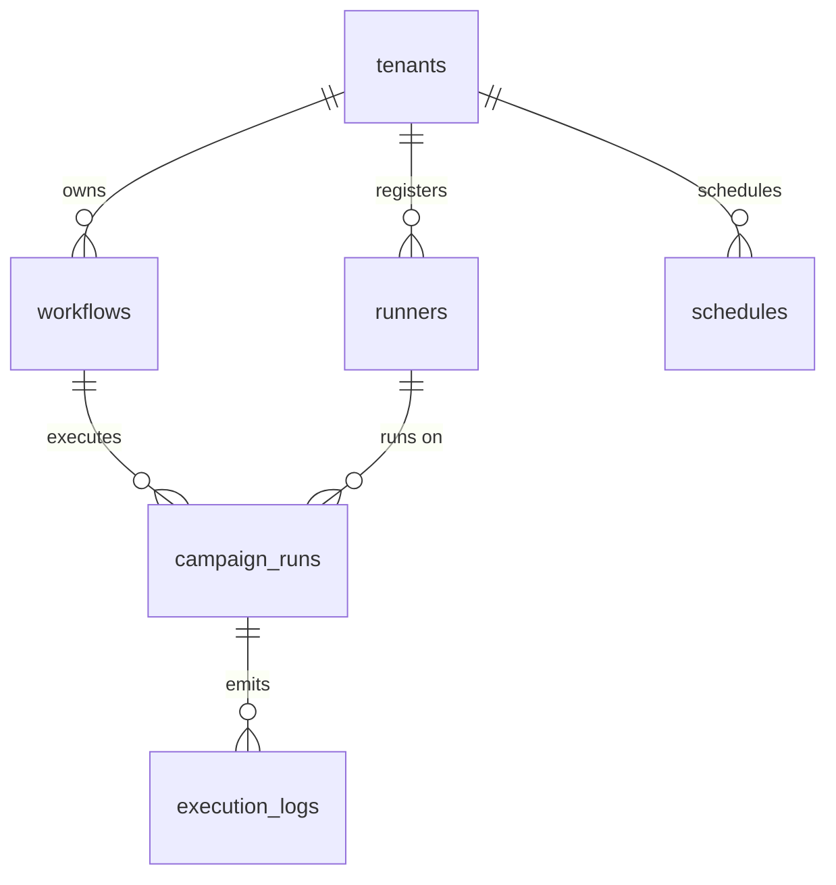

# 🤖 Enterprise Plugin: Automa Cloud Bridge (`automa`)

> **Cầu Nối Điều Phối Hạm Đội Tự Động Hóa Phân Tán (Distributed Fleet Orchestrator)**  
> Cung cấp cơ sở hạ tầng lưu trữ kịch bản Workflow dạng đồ thị AST, quản lý cụm máy trạm (Worker Runners), điều phối chiến dịch chạy hàng loạt (Campaigns), lưu trữ nhật ký thực thi (Telemetry Logs), và lập lịch tự động (Schedules) cho hệ sinh thái `tuquet-automa`.

---

## 1. Thông Số Kiến Trúc (Architecture Specs)

| Thuộc Tính | Chi Tiết Kỹ Thuật |
|---|---|
| **Plugin ID** | `automa` |
| **Phân Loại** | **On-Demand Domain Plugin** |
| **PostgreSQL Schema** | `automa` (Phân lập hoàn toàn khỏi `public`) |
| **Phiên Bản** | `1.0.0` |
| **Phụ Thuộc (Dependencies)** | `core-iam` (Ranh giới `public.tenants` và định danh `public.profiles`) |
| **Kịch Bản Cài Đặt** | [`install.sql`](install.sql) |
| **Dữ Liệu Mẫu (Seed Data)** | [`seed.sql`](seed.sql) |
| **Kịch Bản Gỡ Bỏ** | [`uninstall.sql`](uninstall.sql) |

---

## 2. Danh Mục Bảng Dữ Liệu Schema `automa`



### 1. `automa.workflows`
Lưu trữ kịch bản tự động hóa trực quan (Visual Node Graph) tương thích chuẩn VueFlow & AST của Web Extension.
* **Cột chính:** `id`, `tenant_id`, `name`, `description`, `version`, `status` (`draft`, `published`, `archived`), `graph_data` (JSONB chứa `nodes` và `edges`), `variables`, `settings`, `deleted_at`.
* **RLS:** Thành viên tenant có quyền `automa:workflows:read` được đọc; quyền `automa:workflows:manage` được tạo/sửa/xóa.

### 2. `automa.runners`
Quản lý các máy trạm (Desktop Worker / Cloud VPS) kết nối vào hệ sinh thái.
* **Cột chính:** `id`, `tenant_id`, `name`, `machine_fingerprint` (HWID độc nhất theo tenant), `status` (`offline`, `idle`, `running`, `busy`, `disconnected`, `maintenance`), `version`, `os_info`, `ip_address` (`INET`), `max_concurrency`, `active_tasks`, `capabilities` (JSONB, vd: `["browser", "cdp", "http"]`), `last_heartbeat_at`.
* **RLS:** Quyền `automa:runners:read` để giám sát; quyền `automa:runners:manage` để thêm hoặc cấu hình node runner.

### 3. `automa.campaign_runs`
Phiên thực thi chiến dịch chạy kịch bản trên cụm runner phân tán.
* **Cột chính:** `id`, `tenant_id`, `workflow_id`, `runner_id`, `name`, `status` (`pending`, `queued`, `running`, `paused`, `completed`, `failed`, `cancelled`), `trigger_type` (`manual`, `schedule`, `webhook`, `api`), `total_tasks`, `completed_tasks`, `failed_tasks`, `progress_percent`, `started_at`, `finished_at`.
* **RLS:** Quyền `automa:campaigns:read` để theo dõi tiến độ; quyền `automa:campaigns:run` để kích hoạt chiến dịch.

### 4. `automa.execution_logs`
Nhật ký chi tiết quá trình chạy khối lệnh (Block execution telemetry) phục vụ gỡ lỗi.
* **Cột chính:** `id` (`BIGINT GENERATED ALWAYS AS IDENTITY`), `tenant_id`, `campaign_run_id`, `workflow_id`, `node_id`, `log_level` (`trace`, `debug`, `info`, `warn`, `error`, `fatal`), `message`, `context` (JSONB), `created_at`.
* **Chỉ mục:** `idx_automa_logs_campaign (campaign_run_id, created_at DESC)`.

### 5. `automa.schedules`
Bộ định thời Cron kích hoạt kịch bản tự động hóa định kỳ.
* **Cột chính:** `id`, `tenant_id`, `workflow_id`, `cron_expression`, `timezone`, `is_enabled`, `last_run_at`, `next_run_at`.

---

## 3. Từ Điển Quyền Hạn (Permissions)

| Permission ID | Module | Mô Tả Nghiệp Vụ | Owner | Admin | Member |
|---|---|---|:---:|:---:|:---:|
| `automa:workflows:read` | `automa` | Xem danh sách và nội dung kịch bản | ✅ | ✅ | ✅ |
| `automa:workflows:manage` | `automa` | Tạo mới, xuất bản hoặc chỉnh sửa kịch bản | ✅ | ✅ | ❌ |
| `automa:runners:read` | `automa` | Theo dõi trạng thái và nhịp tim cụm Runner | ✅ | ✅ | ✅ |
| `automa:runners:manage` | `automa` | Đăng ký, cập nhật hoặc gỡ bỏ máy trạm | ✅ | ✅ | ❌ |
| `automa:campaigns:read` | `automa` | Xem tiến độ và lịch sử các chiến dịch | ✅ | ✅ | ✅ |
| `automa:campaigns:run` | `automa` | Phát lệnh thực thi kịch bản trên Runner | ✅ | ✅ | ✅ |
| `automa:campaigns:manage` | `automa` | Hủy, dừng hoặc xóa chiến dịch | ✅ | ✅ | ❌ |
| `automa:logs:read` | `automa` | Tra cứu log vi mô của từng node | ✅ | ✅ | ✅ |

---

## 4. Cách Tiêu Thụ API Qua PostgREST & Supabase Client

Do schema `automa` đã được cấu hình trong `supabase/config.toml`, bạn có thể truy vấn trực tiếp qua Supabase JS Client:

```typescript
import { createClient } from '@supabase/supabase-js';

const supabase = createClient('https://<project-ref>.supabase.co', '<anon-key>');

// 1. Lấy danh sách Workflows đã xuất bản của Tenant
const { data: workflows, error } = await supabase
  .schema('automa')
  .from('workflows')
  .select('id, name, version, status, updated_at')
  .eq('status', 'published');

// 2. Báo cáo nhịp tim từ Runner Desktop
const { data: runner, error } = await supabase
  .schema('automa')
  .from('runners')
  .upsert({
    tenant_id: myTenantId,
    machine_fingerprint: 'HWID-WIN-8942-X86',
    name: 'Office-Node-01',
    status: 'idle',
    last_heartbeat_at: new Date().toISOString()
  }, { onConflict: 'tenant_id,machine_fingerprint' });
```

---

## 5. Quy Trình Vòng Đời (Lifecycle)

### Cài Đặt (Installation)
Chạy script cài đặt kèm dữ liệu mẫu:
```powershell
supabase db query --local -f supabase/plugins/automa/install.sql
supabase db query --local -f supabase/plugins/automa/seed.sql
```

### Gỡ Bỏ Sạch Sẽ (Zero-Orphan Clean Uninstall)
```powershell
supabase db query --local -f supabase/plugins/automa/uninstall.sql
```
Lệnh trên sẽ thực thi `DROP SCHEMA automa CASCADE;`, xóa sạch 5 bảng, các Enums, hủy đăng ký khỏi `system_plugins` và thu hồi quyền hạn mà không để lại bất kỳ bảng rác nào trong hệ thống.
