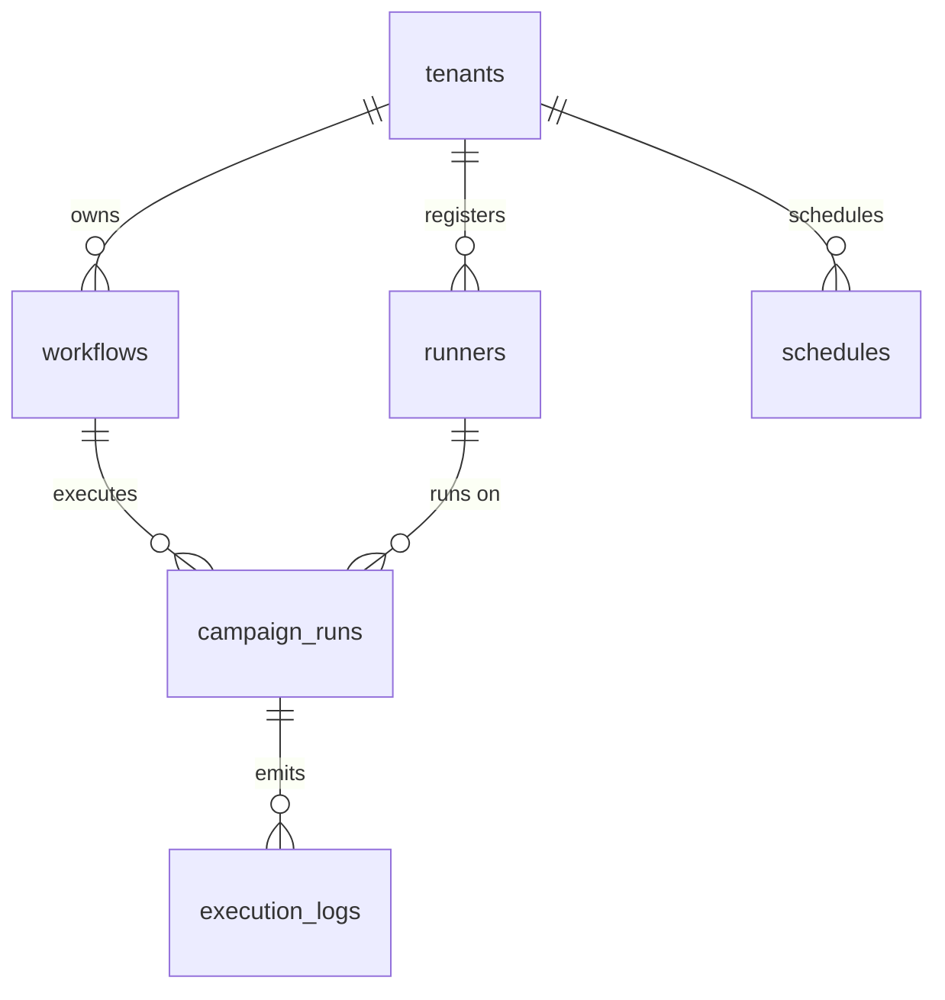

# 🤖 Enterprise Plugin: Automa Cloud Bridge (`automa`)

> **Distributed Automation Fleet Orchestration & Workflow Infrastructure**  
> Provides enterprise-grade infrastructure for storing visual workflow ASTs, registering and monitoring distributed worker runners (Desktop Workers / Cloud VPS), dispatching and tracking batch execution campaigns, streaming granular telemetry logs, and managing automated cron schedules for the `tuquet-automa` automation ecosystem.  
> 📖 **Terminology Standard**: Review the [**Terminology Dictionary & Anti-Hallucination Lexicon (docs/terminology_dictionary.md)**](../../../docs/terminology_dictionary.md) for strict domain invariants (e.g., virtual browser entities must NEVER be called "Profiles"; use "Browser" or "Anti-Detect Browser").

---

## 1. Architectural Specifications

| Property | Technical Specification |
|---|---|
| **Plugin ID** | `automa` |
| **Classification** | **On-Demand Domain Plugin** |
| **PostgreSQL Schema** | `automa` (Completely isolated from `public`) |
| **Version** | `1.0.0` |
| **Dependencies** | `core-iam` (Tenancy boundary `public.tenants` and identity `public.profiles`) |
| **Installation Script** | [`install.sql`](install.sql) |
| **Seed Data** | [`seed.sql`](seed.sql) |
| **Uninstallation Script** | [`uninstall.sql`](uninstall.sql) |

---

## 2. Schema Entity Directory (`automa`)



### 1. `automa.workflows`
Stores visual automation node graphs adhering to VueFlow & Web Extension AST specifications.
* **Key Columns:** `id`, `tenant_id`, `name`, `description`, `version`, `status` (`draft`, `published`, `archived`), `graph_data` (JSONB storing `nodes` and `edges`), `variables`, `settings`, `deleted_at`.
* **RLS Policies:** Tenant members with `automa:workflows:read` can view graphs; `automa:workflows:manage` is required to create, update, publish, or soft-delete workflows.

### 2. `automa.runners`
Registers and tracks distributed worker nodes (Desktop Workers / Cloud VPS) executing automation jobs.
* **Key Columns:** `id`, `tenant_id`, `name`, `machine_fingerprint` (HWID unique per tenant), `status` (`offline`, `idle`, `running`, `busy`, `disconnected`, `maintenance`), `version`, `os_info`, `ip_address` (`INET`), `max_concurrency`, `active_tasks`, `capabilities` (JSONB, e.g., `["browser", "cdp", "http"]`), `last_heartbeat_at`.
* **RLS Policies:** `automa:runners:read` to monitor fleet health; `automa:runners:manage` to register, configure, or decommission runner nodes.

### 3. `automa.campaign_runs`
Tracks batch execution sessions dispatching workflows across distributed runner nodes.
* **Key Columns:** `id`, `tenant_id`, `workflow_id`, `runner_id`, `name`, `status` (`pending`, `queued`, `running`, `paused`, `completed`, `failed`, `cancelled`), `trigger_type` (`manual`, `schedule`, `webhook`, `api`), `total_tasks`, `completed_tasks`, `failed_tasks`, `progress_percent`, `started_at`, `finished_at`.
* **RLS Policies:** `automa:campaigns:read` to inspect execution progress; `automa:campaigns:run` to dispatch campaigns; `automa:campaigns:manage` to pause, cancel, or delete sessions.

### 4. `automa.execution_logs`
High-throughput telemetry and block-level execution logs for real-time debugging and auditing.
* **Key Columns:** `id` (`BIGINT GENERATED ALWAYS AS IDENTITY`), `tenant_id`, `campaign_run_id`, `workflow_id`, `node_id`, `log_level` (`trace`, `debug`, `info`, `warn`, `error`, `fatal`), `message`, `context` (JSONB), `created_at`.
* **Index:** `idx_automa_logs_campaign (campaign_run_id, created_at DESC)`.
* **RLS Policies:** `automa:logs:read` to stream and inspect execution logs.

### 5. `automa.schedules`
Automated cron schedules that trigger workflow campaigns at designated intervals.
* **Key Columns:** `id`, `tenant_id`, `workflow_id`, `cron_expression`, `timezone`, `is_enabled`, `last_run_at`, `next_run_at`.
* **RLS Policies:** Scoped strictly by tenant membership and `automa:campaigns:manage`.

---

## 3. Permissions Dictionary

| Permission ID | Module | Business Description | Owner | Admin | Member |
|---|---|---|:---:|:---:|:---:|
| `automa:workflows:read` | `automa` | View workflow catalog and graph definitions | ✅ | ✅ | ✅ |
| `automa:workflows:manage` | `automa` | Create, update, publish, or delete workflows | ✅ | ✅ | ❌ |
| `automa:runners:read` | `automa` | Monitor fleet health and runner heartbeats | ✅ | ✅ | ✅ |
| `automa:runners:manage` | `automa` | Register, update, or decommission runner nodes | ✅ | ✅ | ❌ |
| `automa:campaigns:read` | `automa` | View campaign execution progress and history | ✅ | ✅ | ✅ |
| `automa:campaigns:run` | `automa` | Dispatch workflows and trigger execution campaigns | ✅ | ✅ | ✅ |
| `automa:campaigns:manage` | `automa` | Pause, resume, cancel, or delete campaigns | ✅ | ✅ | ❌ |
| `automa:logs:read` | `automa` | Inspect granular block-level execution logs | ✅ | ✅ | ✅ |

---

## 4. Client API Consumption (PostgREST & Supabase Client)

Because the `automa` schema is exposed in `supabase/config.toml`, tenant applications can query it directly via `@supabase/supabase-js`:

```typescript
import { createClient } from '@supabase/supabase-js';

const supabase = createClient('https://<project-ref>.supabase.co', '<anon-key>');

// 1. Fetch published workflows for the tenant
const { data: workflows, error } = await supabase
  .schema('automa')
  .from('workflows')
  .select('id, name, version, status, updated_at')
  .eq('status', 'published');

// 2. Report runner node heartbeat from Desktop Worker
const { data: runner, error } = await supabase
  .schema('automa')
  .from('runners')
  .upsert({
    tenant_id: myTenantId,
    machine_fingerprint: 'HWID-WIN-8942-X86',
    name: 'Office-Node-01',
    status: 'idle',
    last_heartbeat_at: new Date().toISOString()
  }, { onConflict: 'tenant_id,machine_fingerprint' });
```

---

## 5. Lifecycle Management

### Installation
Execute the schema migration and optional test seed data:
```bash
supabase db query --local -f supabase/plugins/automa/install.sql
supabase db query --local -f supabase/plugins/automa/seed.sql
```

### Zero-Orphan Clean Uninstallation
```bash
supabase db query --local -f supabase/plugins/automa/uninstall.sql
```
This script executes `DROP SCHEMA automa CASCADE;`, cleanly dropping all 5 tables, custom ENUM types, unregistering the plugin from `public.system_plugins`, and revoking all permissions without leaving orphan database artifacts.
