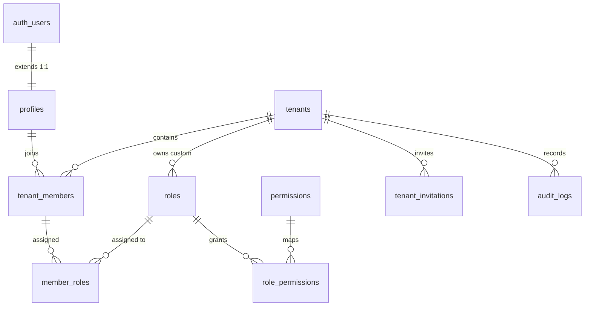

# 🛡️ Base Component: Multi-Tenant IAM & RBAC Engine (`core-iam`)

> **Phân hệ Nền tảng Bất biến (Immutable System Kernel)**  
> Cung cấp dịch vụ Định danh tập trung (Identity), Ranh giới Đa tổ chức (Multi-Tenant Boundary), Phân quyền dựa trên vai trò (RBAC), Nhật ký an ninh tuần tự (Audit Trail), và Động cơ điều phối vòng đời Plugin (`system_plugins`).  
> 📖 **Quy chuẩn danh pháp**: Xem định nghĩa thực thể chuẩn và quy tắc chống ảo giác tại [**Từ Điển Thuật Ngữ (docs/terminology_dictionary.md)**](../../../docs/terminology_dictionary.md).

---

## 1. Thông Số Kiến Trúc (Architecture Specs)

| Thuộc Tính | Chi Tiết Kỹ Thuật |
|---|---|
| **Plugin ID** | `core-iam` |
| **Phân Loại** | **Base Kernel / System Core** (`is_system = true`, cấm gỡ bỏ) |
| **PostgreSQL Schema** | `public` |
| **Phiên Bản** | `1.0.0` |
| **Phụ Thuộc (Dependencies)** | Không (`[]` - Tầng 0 cơ sở) |
| **Khởi Tạo Tự Động** | `supabase/migrations/20260920000001_base_platform_core.sql` |
| **File Kiểm Toán Sức Khỏe** | `supabase/plugins/core-iam/inspect.sql` |

---

## 2. Danh Mục Bảng Dữ Liệu Cốt Lõi (Core Tables)

Phân hệ `core-iam` thiết lập 10 bảng nền tảng được bảo vệ bằng RLS:



1. **`public.profiles`**: Hồ sơ người dùng mở rộng 1:1 với `auth.users`, tự động đồng bộ qua trigger `on_auth_user_created`.
2. **`public.tenants`**: Ranh giới tổ chức / workspace. Mọi bảng dữ liệu trong hệ thống đều liên kết với `tenants.id`.
3. **`public.roles`**: Quản lý cả System Roles (`tenant_id IS NULL`) và Custom Tenant Roles (`tenant_id IS NOT NULL`). Tối ưu bằng 2 Partial Unique Indexes.
4. **`public.permissions`**: Từ điển quyền hạn nguyên tử định dạng `module:action` (vd: `tenants:update`, `members:invite`).
5. **`public.role_permissions`**: Ma trận ánh xạ nhiều-nhiều giữa Vai trò và Quyền hạn.
6. **`public.tenant_members`**: Liên kết Người dùng với Tổ chức (`active` / `suspended`).
7. **`public.member_roles`**: Gán vai trò cho thành viên trong tổ chức.
8. **`public.tenant_invitations`**: Quản lý lời mời tham gia tổ chức bằng mã bảo mật `token_hash`.
9. **`public.audit_logs`**: Nhật ký kiểm toán an ninh với `BIGINT GENERATED ALWAYS AS IDENTITY` và kiểu địa chỉ `INET` cho IP, chống vỡ trang B-tree.
10. **`public.system_plugins`**: Bảng đăng ký mẹ (Master Registry) điều phối và theo dõi trạng thái cài đặt của toàn bộ các plugin.

---

## 3. Các Hàm Trợ Năng An Ninh (Security Definer Helpers)

Để tránh **RLS Infinite Recursion** (đệ quy vô hạn khi bảng tự query chính nó trong chính sách bảo mật) và ngăn chặn **CWE-426 (Search Path Hijacking)**, toàn bộ logic được bọc trong các hàm `SECURITY DEFINER` với `SET search_path = ''`:

* `public.get_user_tenant_ids() RETURNS SETOF UUID`: Trả về danh sách Tenant IDs mà `auth.uid()` hiện đang có trạng thái `active`.
* `public.is_tenant_member(_tenant_id UUID) RETURNS BOOLEAN`: Kiểm tra xem người dùng hiện tại có thuộc tổ chức hay không.
* `public.has_tenant_permission(_tenant_id UUID, _permission_id VARCHAR) RETURNS BOOLEAN`: Kiểm tra xem người dùng có quyền cụ thể trong tổ chức hay không thông qua các vai trò được gán.
* `public.is_tenant_admin(_tenant_id UUID) RETURNS BOOLEAN`: Kiểm tra quyền quản trị (`owner` hoặc `admin`).
* `public.custom_access_token_hook(event JSONB) RETURNS JSONB`: Hook tích hợp với Supabase Auth, tự động nhúng mảng `tenants` và `roles` vào JWT Claims với phòng vệ `LIMIT 25` (<8KB header).

---

## 4. Từ Điển Quyền Hạn Hệ Thống (Permissions Dictionary)

| Permission ID | Module | Mô Tả Nghiệp Vụ | Owner | Admin | Member | Viewer |
|---|---|---|:---:|:---:|:---:|:---:|
| `tenants:read` | `tenants` | Xem thông tin tổ chức | ✅ | ✅ | ✅ | ✅ |
| `tenants:update` | `tenants` | Cập nhật cấu hình tổ chức | ✅ | ✅ | ❌ | ❌ |
| `tenants:delete` | `tenants` | Xóa hoàn toàn tổ chức | ✅ | ❌ | ❌ | ❌ |
| `members:read` | `members` | Xem danh sách thành viên | ✅ | ✅ | ✅ | ✅ |
| `members:invite` | `members` | Mời thành viên mới | ✅ | ✅ | ❌ | ❌ |
| `members:update` | `members` | Thay đổi trạng thái thành viên | ✅ | ✅ | ❌ | ❌ |
| `members:manage` | `members` | Gán và thu hồi vai trò thành viên | ✅ | ✅ | ❌ | ❌ |
| `members:delete` | `members` | Xóa thành viên khỏi tổ chức | ✅ | ✅ | ❌ | ❌ |
| `roles:read` | `roles` | Xem danh mục vai trò & quyền | ✅ | ✅ | ✅ | ✅ |
| `roles:manage` | `roles` | Tạo/sửa vai trò tùy chỉnh | ✅ | ✅ | ❌ | ❌ |
| `billing:read` | `billing` | Xem thông tin thanh toán/hạn ngạch | ✅ | ✅ | ❌ | ❌ |
| `billing:manage` | `billing` | Nâng cấp gói cước | ✅ | ✅ | ❌ | ❌ |
| `audit:read` | `audit` | Xem nhật ký kiểm toán hệ thống | ✅ | ✅ | ❌ | ❌ |
| `plugins:read` | `system` | Xem danh mục plugin đã cài đặt | ✅ | ✅ | ✅ | ❌ |
| `plugins:manage` | `system` | Cài đặt/gỡ bỏ plugin hệ thống | ✅ | ❌ | ❌ | ❌ |

---

## 5. Động Cơ Vòng Đời Plugin (Plugin Registry RPCs)

Bảng `public.system_plugins` cung cấp 3 hàm RPC chuyên dụng:

1. **`public.register_plugin(...)`**: Đăng ký hoặc cập nhật thông tin phiên bản, schema và quyền hạn của plugin.
2. **`public.unregister_plugin(p_id)`**: Gỡ bỏ plugin khỏi danh mục. Tự động kiểm tra:
   - Nếu `is_system = true` $\rightarrow$ Ném lỗi `Cannot unregister core system plugin`.
   - Nếu có plugin khác đang phụ thuộc vào nó $\rightarrow$ Ném lỗi `Cannot unregister: Plugin X depends on it`.
3. **`public.get_installed_plugins()`**: Trả về danh sách tất cả các plugin đang hoạt động, phân loại rõ ràng giữa Core và Extension.

---

## 6. Hướng Dẫn Kiểm Toán Toàn Vẹn (Health Inspection)

Chạy tệp [`inspect.sql`](inspect.sql) trên Supabase SQL Editor hoặc CLI để kiểm tra trạng thái hoạt động:

```bash
supabase db query --local -f supabase/plugins/core-iam/inspect.sql
```
