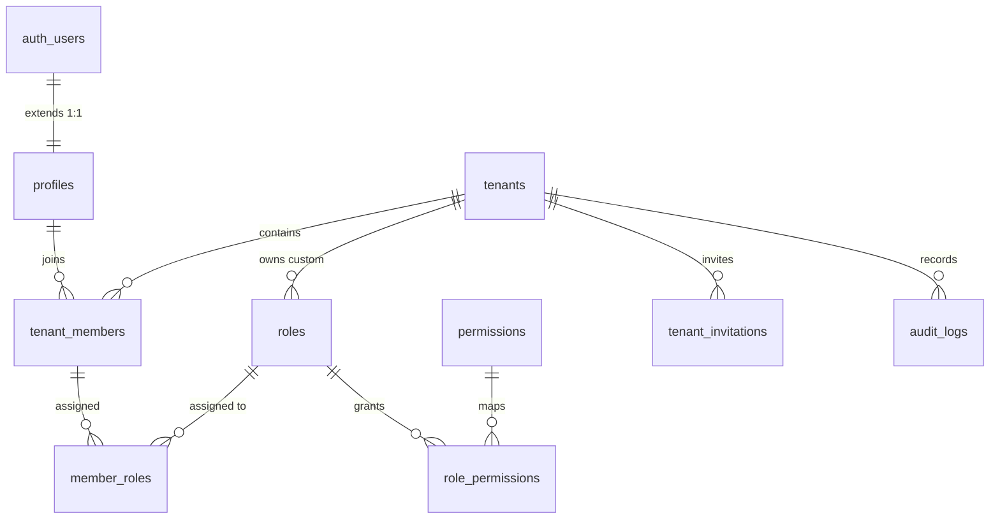

# 🛡️ Base Kernel: Multi-Tenant IAM & RBAC Engine (`core-iam`)

> **Immutable Platform Kernel**  
> Provides centralized identity management, root multi-tenant boundary isolation, NIST role-based access control (RBAC), sequential security audit logging, and the Master Plugin Registry (`system_plugins`).  
> 📖 **Terminology Standard**: Review the [**Terminology Dictionary & Anti-Hallucination Lexicon (docs/terminology_dictionary.md)**](../../../docs/terminology_dictionary.md) for strict naming invariants and forbidden terms.

---

## 1. Architectural Specifications

| Property | Technical Specification |
|---|---|
| **Plugin ID** | `core-iam` |
| **Classification** | **Base Kernel / System Core** (`is_system = true`, uninstallation locked) |
| **PostgreSQL Schema** | `public` |
| **Version** | `1.0.0` |
| **Dependencies** | None (`[]` - Tier 0 Foundation) |
| **Baseline Initialization** | `supabase/migrations/20260920000001_base_platform_core.sql` |
| **Health Inspection Script**| `supabase/plugins/core-iam/inspect.sql` |

---

## 2. Core Tables Directory

The `core-iam` component establishes 10 foundational tables protected by Row-Level Security (RLS):



1. **`public.profiles`**: Public user profiles synchronized 1:1 from `auth.users` via database trigger `on_auth_user_created`.
2. **`public.tenants`**: Root organization and multi-tenancy isolation boundary. All downstream business tables reference `tenants.id`.
3. **`public.roles`**: Manages both Global System Roles (`tenant_id IS NULL`) and Custom Tenant Roles (`tenant_id IS NOT NULL`). Optimized via partial unique indexes.
4. **`public.permissions`**: Atomic capability dictionary formatted as `<module>:<resource>:<action>` (e.g. `tenants:update`, `members:invite`).
5. **`public.role_permissions`**: Many-to-many bridge mapping roles to granted atomic permissions.
6. **`public.tenant_members`**: Membership link binding Users to Tenants with active/suspended states.
7. **`public.member_roles`**: Multi-role assignments granting one or more roles to a tenant member.
8. **`public.tenant_invitations`**: Invitation workflow protected by cryptographic `token_hash` and expiration timestamps.
9. **`public.audit_logs`**: Append-only security audit trail utilizing `BIGINT GENERATED ALWAYS AS IDENTITY` and `INET` client IP addresses to prevent B-tree page splits.
10. **`public.system_plugins`**: Master Plugin Registry coordinating lifecycle status, dependencies, and schema registrations.

---

## 3. Security Definer Authorization Helpers

To prevent **RLS Infinite Recursion** and protect against **CWE-426 (Search Path Hijacking)**, all authorization routines are marked `SECURITY DEFINER` with `SET search_path = ''`:

* `public.get_user_tenant_ids() RETURNS SETOF UUID`: Returns tenant IDs where `auth.uid()` holds an `active` membership.
* `public.is_tenant_member(_tenant_id UUID) RETURNS BOOLEAN`: Fast check for tenant membership.
* `public.has_tenant_permission(_tenant_id UUID, _permission_id VARCHAR) RETURNS BOOLEAN`: Evaluates whether the current user holds a specific permission within the tenant via granted roles.
* `public.is_tenant_admin(_tenant_id UUID) RETURNS BOOLEAN`: Checks for administrative role (`owner` or `admin`).
* `public.custom_access_token_hook(event JSONB) RETURNS JSONB`: Supabase Auth hook baking `tenant_id`, `roles`, and atomic `permissions` (`LIMIT 25`) directly into JWT claims for **$O(1)$** RLS policy evaluation.

---

## 4. Permissions Dictionary

| Permission ID | Module | Business Capability | Owner | Admin | Member | Viewer |
|---|---|---|:---:|:---:|:---:|:---:|
| `tenants:read` | `tenants` | Read tenant configuration | ✅ | ✅ | ✅ | ✅ |
| `tenants:update` | `tenants` | Update tenant settings | ✅ | ✅ | ❌ | ❌ |
| `tenants:delete` | `tenants` | Delete tenant | ✅ | ❌ | ❌ | ❌ |
| `members:read` | `members` | List tenant members | ✅ | ✅ | ✅ | ✅ |
| `members:invite` | `members` | Send member invitations | ✅ | ✅ | ❌ | ❌ |
| `members:update` | `members` | Modify membership status | ✅ | ✅ | ❌ | ❌ |
| `members:manage` | `members` | Assign and revoke member roles | ✅ | ✅ | ❌ | ❌ |
| `members:delete` | `members` | Remove member from tenant | ✅ | ✅ | ❌ | ❌ |
| `roles:read` | `roles` | List available roles & permissions | ✅ | ✅ | ✅ | ✅ |
| `roles:manage` | `roles` | Create/edit custom tenant roles | ✅ | ✅ | ❌ | ❌ |
| `billing:read` | `billing` | View billing and subscription info | ✅ | ✅ | ❌ | ❌ |
| `billing:manage` | `billing` | Upgrade or modify plan subscriptions | ✅ | ✅ | ❌ | ❌ |
| `audit:read` | `audit` | Inspect security audit trail | ✅ | ✅ | ❌ | ❌ |
| `plugins:read` | `system` | Inspect registered plugins | ✅ | ✅ | ✅ | ❌ |
| `plugins:manage` | `system` | Register and manage plugins | ✅ | ❌ | ❌ | ❌ |

---

## 5. Plugin Registry Lifecycle RPCs

The `public.system_plugins` subsystem provides 3 dedicated RPC functions:

1. **`public.register_plugin(...)`**: Registers or updates plugin metadata, schema, and dependency declarations.
2. **`public.unregister_plugin(p_id)`**: Unregisters a plugin with safety guards:
   - If `is_system = true` $\rightarrow$ Raises exception `Cannot unregister core system plugin`.
   - If another installed plugin depends on it $\rightarrow$ Raises exception `Cannot unregister: Plugin X depends on it`.
3. **`public.get_installed_plugins()`**: Returns all active plugins categorized by Kernel and Extensions.

---

## 6. Health & Integrity Inspection

Execute [`inspect.sql`](inspect.sql) via the Supabase CLI or SQL Editor to verify operational health:

```bash
supabase db query --local -f supabase/plugins/core-iam/inspect.sql
```
