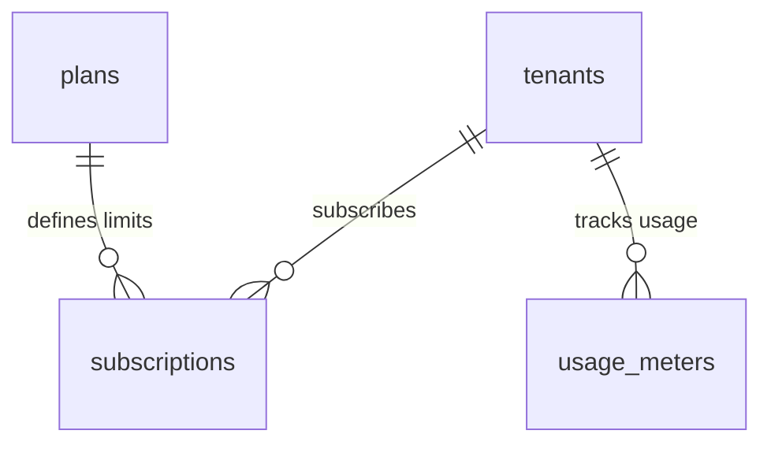

# 💎 Enterprise Plugin: Subscriptions & Quota Metering (`subscriptions`)

> **Multi-Tenant SaaS Billing Engine & Dynamic Resource Metering**  
> Provides tiered SaaS subscription plans (`billing.plans`), organization-level subscription state tracking (`billing.subscriptions`), dynamic resource meters (`billing.usage_meters`), and atomic RPC functions for quota verification and usage recording.  
> 📖 **Terminology Standard**: Review the [**Terminology Dictionary & Anti-Hallucination Lexicon (docs/terminology_dictionary.md)**](../../../docs/terminology_dictionary.md) for strict naming invariants.

---

## 1. Architectural Specifications

| Property | Technical Specification |
|---|---|
| **Plugin ID** | `subscriptions` |
| **Classification** | **On-Demand Business Plugin** |
| **PostgreSQL Schema** | `billing` (Fully isolated from `public`) |
| **Version** | `1.0.0` |
| **Dependencies** | `core-iam` |
| **Installation Script** | [`install.sql`](install.sql) |
| **Uninstallation Script** | [`uninstall.sql`](uninstall.sql) |

---

## 2. Table Directory: Schema `billing`



### 1. `billing.plans`
Defines service tiers and maximum resource quotas:
* `id` (`TEXT PRIMARY KEY`): Plan tier identifier (`free`, `pro`, `enterprise`).
* `name`, `description`: Display name and marketing description.
* `max_members` (`INT`): Maximum allowed team members per tenant.
* `max_storage_mb` (`BIGINT`): Storage quota limit in Megabytes.
* `max_monthly_runs` (`INT`): Monthly automation run limit.
* `price_monthly_usd` (`NUMERIC(10, 2)`): Monthly subscription cost in USD.
* `is_active` (`BOOLEAN`): Availability status.

#### Default Seeded Plans:
| Plan Tier | Team Members (`max_members`) | Storage Quota (`max_storage_mb`) | Monthly Runs (`max_monthly_runs`) | Price / Month |
|---|:---:|:---:|:---:|:---:|
| **Free Starter** (`free`) | 2 | 500 MB | 1,000 | $0.00 |
| **Team Pro** (`pro`) | 10 | 10,240 MB (10GB) | 50,000 | $29.00 |
| **Enterprise Fleet** (`enterprise`) | 100 | 102,400 MB (100GB) | 1,000,000 | $199.00 |

### 2. `billing.subscriptions`
Active subscription state per Tenant:
* `tenant_id` (`UUID UNIQUE REFERENCES public.tenants`): Each tenant holds exactly one active subscription record.
* `plan_id` (`TEXT REFERENCES billing.plans`): Active plan tier.
* `status`: Enum (`free_tier`, `trialing`, `active`, `past_due`, `canceled`, `unpaid`).
* `stripe_customer_id`, `stripe_subscription_id`: External payment processor identifiers.
* `current_period_start`, `current_period_end`: Active billing cycle boundaries.

### 3. `billing.usage_meters`
Real-time resource consumption counters:
* Composite unique key: `(tenant_id, metric_name)` (e.g., `storage_mb`, `monthly_runs`, `api_calls`).
* `current_value` (`BIGINT`): Accumulated consumption in the active billing period.
* `reset_at` (`TIMESTAMPTZ`): Periodic reset timestamp (start of the next billing cycle).

---

## 3. Core Billing RPC Functions

### `billing.check_tenant_quota(_tenant_id, _metric_name, _increment)`
Evaluates whether a tenant possesses sufficient quota before initiating an action:
```sql
-- Check if Tenant can execute 10 automation tasks
SELECT billing.check_tenant_quota('b000...-0001'::uuid, 'monthly_runs', 10);
-- Returns: TRUE (Quota available) or FALSE (Limit reached)
```

### `billing.record_usage(_tenant_id, _metric_name, _increment)`
Atomically upserts and increments a tenant's usage counter:
```sql
-- Record 5 completed tasks
SELECT billing.record_usage('b000...-0001'::uuid, 'monthly_runs', 5);
-- Returns: Updated usage value
```

---

## 4. Permissions Dictionary

| Permission ID | Module | Business Capability | Owner | Admin | Member |
|---|---|---|:---:|:---:|:---:|
| `subscriptions:read` | `billing` | View active plan, limits, and billing history | ✅ | ✅ | ✅ |
| `subscriptions:manage` | `billing` | Upgrade, downgrade, or cancel subscriptions | ✅ | ✅ | ❌ |
| `quota:read` | `billing` | Inspect real-time consumption meters | ✅ | ✅ | ✅ |

---

## 5. Client Consumption Example (Supabase JS SDK)

```typescript
import { createClient } from '@supabase/supabase-js';

const supabase = createClient('https://<project-ref>.supabase.co', '<anon-key>');

// 1. Fetch Tenant's active subscription and plan limits
const { data: sub } = await supabase
  .schema('billing')
  .from('subscriptions')
  .select(`
    status,
    current_period_end,
    plans:plan_id (name, max_members, max_storage_mb, max_monthly_runs)
  `)
  .single();

// 2. Fetch usage meters
const { data: meters } = await supabase
  .schema('billing')
  .from('usage_meters')
  .select('metric_name, current_value, reset_at');
```

---

## 6. Lifecycle Management

### Installation
```powershell
supabase db query --local -f supabase/plugins/subscriptions/install.sql
```

### Uninstallation
```powershell
supabase db query --local -f supabase/plugins/subscriptions/uninstall.sql
```
Executes `DROP SCHEMA IF EXISTS billing CASCADE;`, cleaning up subscription tables, meters, RPC functions, and unregistering from `system_plugins`.
