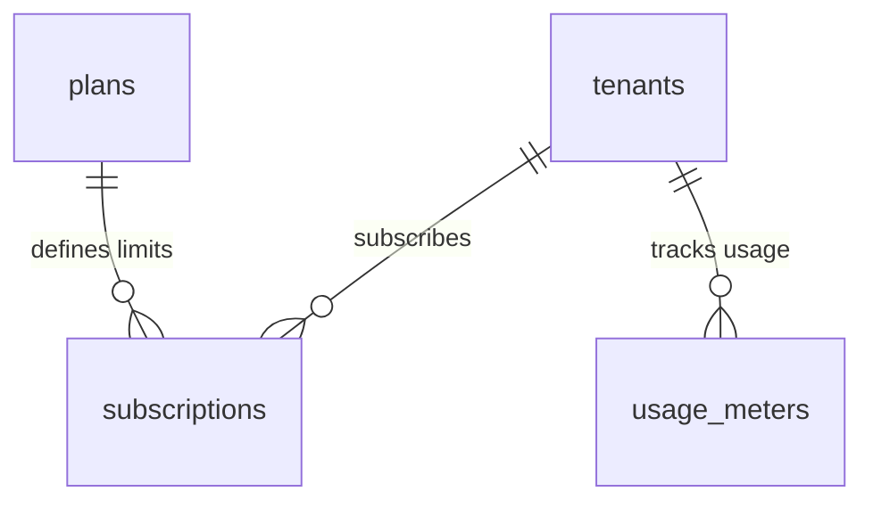

# 💎 Enterprise Plugin: Subscriptions & Quota Metering (`subscriptions`)

> **Hệ Thống Quản Lý Thuê Bao SaaS & Kiểm Soát Định Mức Tài Nguyên (SaaS Billing & Quota Engine)**  
> Cung cấp cơ chế phân tầng gói cước SaaS đa cấp độ (`billing.plans`), quản lý trạng thái đăng ký thuê bao của từng Tổ chức (`billing.subscriptions`), đồng hồ đo lường hạn ngạch động (`billing.usage_meters`), và các hàm nguyên tử kiểm tra / ghi nhận định mức sử dụng.  
> 📖 **Quy chuẩn danh pháp**: Xem định nghĩa chuẩn về Plan, Subscription và Quota Meter tại [**Từ Điển Thuật Ngữ (docs/terminology_dictionary.md)**](../../../docs/terminology_dictionary.md).

---

## 1. Thông Số Kiến Trúc (Architecture Specs)

| Thuộc Tính | Chi Tiết Kỹ Thuật |
|---|---|
| **Plugin ID** | `subscriptions` |
| **Phân Loại** | **On-Demand Business Plugin** |
| **PostgreSQL Schema** | `billing` (Phân lập hoàn toàn khỏi `public`) |
| **Phiên Bản** | `1.0.0` |
| **Phụ Thuộc (Dependencies)** | `core-iam` |
| **Kịch Bản Cài Đặt** | [`install.sql`](install.sql) |
| **Kịch Bản Gỡ Bỏ** | [`uninstall.sql`](uninstall.sql) |

---

## 2. Danh Mục Bảng Dữ Liệu Schema `billing`



### 1. `billing.plans`
Định nghĩa các bậc gói cước dịch vụ và hạn ngạch tài nguyên tối đa:
* `id` (`TEXT PRIMARY KEY`): Mã gói cước (`free`, `pro`, `enterprise`).
* `name`, `description`: Tên hiển thị và mô tả lợi ích gói cước.
* `max_members` (`INT`): Giới hạn số lượng thành viên tối đa trong tổ chức.
* `max_storage_mb` (`BIGINT`): Giới hạn dung lượng lưu trữ tệp (Megabytes).
* `max_monthly_runs` (`INT`): Giới hạn số lượt chạy kịch bản tự động hóa mỗi tháng.
* `price_monthly_usd` (`NUMERIC(10, 2)`): Đơn giá thuê bao hàng tháng.
* `is_active` (`BOOLEAN`): Trạng thái mở bán gói cước.

#### Các Gói Mặc Định Đã Seed Sẵn:
| Gói | Thành Viên (`max_members`) | Lưu Trữ (`max_storage_mb`) | Lượt Chạy (`max_monthly_runs`) | Giá / Tháng |
|---|:---:|:---:|:---:|:---:|
| **Free Starter** (`free`) | 2 | 500 MB | 1,000 | $0.00 |
| **Team Pro** (`pro`) | 10 | 10,240 MB (10GB) | 50,000 | $29.00 |
| **Enterprise Fleet** (`enterprise`) | 100 | 102,400 MB (100GB) | 1,000,000 | $199.00 |

### 2. `billing.subscriptions`
Trạng thái thuê bao hiện tại của từng Tenant:
* `tenant_id` (`UUID UNIQUE REFERENCES public.tenants`): Mỗi tổ chức sở hữu 1 trạng thái thuê bao duy nhất.
* `plan_id` (`TEXT REFERENCES billing.plans`): Gói cước đang áp dụng.
* `status`: Enum (`free_tier`, `trialing`, `active`, `past_due`, `canceled`, `unpaid`).
* `stripe_customer_id`, `stripe_subscription_id`: Mã khách hàng và thuê bao đối soát với cổng thanh toán Stripe.
* `current_period_start`, `current_period_end`: Chu kỳ tính cước hiện tại.

### 3. `billing.usage_meters`
Bảng đồng hồ đo lường mức độ tiêu thụ thực tế theo thời gian thực:
* Khóa kép duy nhất: `(tenant_id, metric_name)` (vd: `storage_mb`, `monthly_runs`, `api_calls`).
* `current_value` (`BIGINT`): Số lượng đã sử dụng trong chu kỳ.
* `reset_at` (`TIMESTAMPTZ`): Thời điểm tự động đặt lại đồng hồ về 0 (đầu tháng tiếp theo).

---

## 3. Các Hàm Nghiệp Vụ Cốt Lõi (Core Billing RPCs)

### `billing.check_tenant_quota(_tenant_id, _metric_name, _increment)`
Kiểm tra xem tổ chức có đủ hạn ngạch để thực hiện thêm tác vụ hay không:
```sql
-- Ví dụ: Kiểm tra xem Tenant có thể chạy thêm 10 tác vụ automa không
SELECT billing.check_tenant_quota('b000...-0001'::uuid, 'monthly_runs', 10);
-- Trả về: TRUE (Đủ hạn ngạch) hoặc FALSE (Đã chạm trần)
```

### `billing.record_usage(_tenant_id, _metric_name, _increment)`
Cộng dồn số lượng sử dụng vào đồng hồ đo lường của tổ chức một cách nguyên tử (Atomic Upsert):
```sql
-- Ví dụ: Ghi nhận 5 tác vụ vừa chạy xong
SELECT billing.record_usage('b000...-0001'::uuid, 'monthly_runs', 5);
-- Trả về: Giá trị mới sau khi cộng dồn (ví dụ: 105)
```

---

## 4. Từ Điển Quyền Hạn (Permissions)

| Permission ID | Module | Mô Tả Nghiệp Vụ | Owner | Admin | Member |
|---|---|---|:---:|:---:|:---:|
| `subscriptions:read` | `billing` | Xem gói cước hiện tại và lịch sử thanh toán | ✅ | ✅ | ✅ |
| `subscriptions:manage` | `billing` | Nâng cấp, hạ cấp hoặc hủy đăng ký thuê bao | ✅ | ✅ | ❌ |
| `quota:read` | `billing` | Xem đồng hồ đo lường mức tiêu thụ tài nguyên | ✅ | ✅ | ✅ |

---

## 5. Ví Dụ Sử Dụng Với Client SDK

```typescript
import { createClient } from '@supabase/supabase-js';

const supabase = createClient('https://<project-ref>.supabase.co', '<anon-key>');

// 1. Kiểm tra thông tin gói cước và hạn ngạch của Tenant
const { data: sub } = await supabase
  .schema('billing')
  .from('subscriptions')
  .select(`
    status,
    current_period_end,
    plans:plan_id (name, max_members, max_storage_mb, max_monthly_runs)
  `)
  .single();

// 2. Tra cứu đồng hồ tiêu thụ tài nguyên
const { data: meters } = await supabase
  .schema('billing')
  .from('usage_meters')
  .select('metric_name, current_value, reset_at');
```

---

## 6. Quy Trình Vòng Đời (Lifecycle)

### Cài Đặt (Installation)
```powershell
supabase db query --local -f supabase/plugins/subscriptions/install.sql
```

### Gỡ Bỏ (Uninstallation)
```powershell
supabase db query --local -f supabase/plugins/subscriptions/uninstall.sql
```
Lệnh thực thi `DROP SCHEMA IF EXISTS billing CASCADE;`, xóa sạch các bảng thuê bao, hàm kiểm tra hạn ngạch và hủy đăng ký khỏi `system_plugins`.
