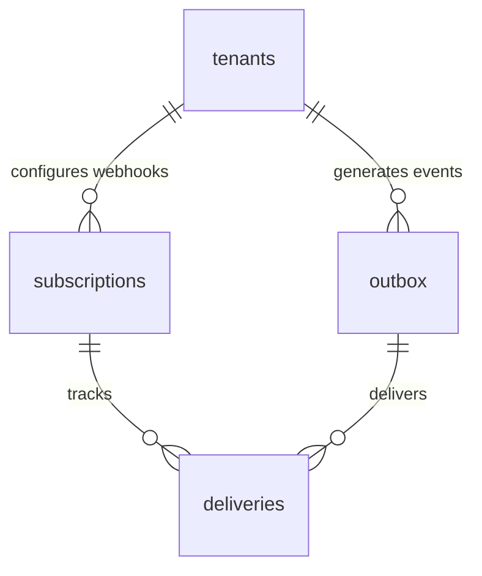

# ⚡ Enterprise Plugin: Transactional Outbox & Webhooks (`webhooks`)

> **Hạ Tầng Hàng Đợi Sự Kiện Bất Đồng Bộ & Phát Sóng Webhook Độ Tin Cậy Cao (Event Bus & Webhook Dispatcher)**  
> Cung cấp cơ chế **Transactional Outbox Pattern** (`events.outbox`), quản lý danh mục đích nhận Webhook bên ngoài (`events.subscriptions`), và lưu trữ nhật ký đối soát lượt gọi HTTP (`events.deliveries`). Đảm bảo độ tin cậy At-Least-Once Delivery mà không làm tắc nghẽn luồng xử lý database.

---

## 1. Thông Số Kiến Trúc (Architecture Specs)

| Thuộc Tính | Chi Tiết Kỹ Thuật |
|---|---|
| **Plugin ID** | `webhooks` |
| **Phân Loại** | **On-Demand Infrastructure Plugin** |
| **PostgreSQL Schema** | `events` (Phân lập hoàn toàn khỏi `public`) |
| **Kiến Trúc Mẫu** | **Transactional Outbox Pattern** |
| **Phiên Bản** | `1.0.0` |
| **Phụ Thuộc (Dependencies)** | `core-iam` |
| **Kịch Bản Cài Đặt** | [`install.sql`](install.sql) |
| **Kịch Bản Gỡ Bỏ** | [`uninstall.sql`](uninstall.sql) |

---

## 2. Vì Sao Cần Transactional Outbox Pattern?

Trong kiến trúc phân tán, **không bao giờ được gửi HTTP Request trực tiếp bên trong Database Trigger**. Nếu server đích bị timeout hoặc sập mạng, toàn bộ giao dịch database của người dùng sẽ bị rollback theo:

```
[❌ Cách tiếp cận SAI]:
DB Transaction Start ──> Ghi dữ liệu ──> GỌI HTTP WEBHOOK (Timeout 30s!) ──> DB Rollback thất bại!

[✅ Chuẩn mực TRANSACTIONAL OUTBOX]:
DB Transaction Start ──> Ghi dữ liệu ──> Ghi sự kiện vào events.outbox ──> Commit cực nhanh (1ms)!
                                                │
                                                ▼ (Bất đồng bộ)
                                    Background Worker / Edge Function
                                                │
                                                ▼ (Thử lại tự động nếu lỗi)
                                       Gửi HTTP đến Webhook Endpoints
```

---

## 3. Danh Mục Bảng Dữ Liệu Schema `events`



### 1. `events.outbox`
Hàng đợi sự kiện chờ phát sóng. Tối ưu bằng Partial Index `WHERE status = 'pending'`:
* `id` (`UUID PRIMARY KEY`): Mã sự kiện độc nhất.
* `tenant_id` (`UUID REFERENCES public.tenants`): Định danh tổ chức phát sinh sự kiện.
* `event_type` (`TEXT`): Tên định danh sự kiện (vd: `member.joined`, `workflow.published`, `campaign.completed`).
* `payload` (`JSONB`): Toàn bộ dữ liệu chi tiết của sự kiện.
* `status`: Enum (`pending`, `processing`, `delivered`, `failed`).
* `retry_count` (`INT`): Số lần đã thử phát sóng lại.
* `error_message` (`TEXT`): Thông báo lỗi nếu gửi thất bại.

### 2. `events.subscriptions`
Danh sách các URL webhook đích được cấu hình nhận tin:
* `target_url` (`TEXT`): Địa chỉ endpoint nhận webhook (vd: `https://api.mycrm.com/webhook`).
* `secret` (`TEXT`): Khóa bí mật dùng để ký chữ ký HMAC-SHA256 trong HTTP Header `X-Tuquet-Signature`.
* `event_types` (`TEXT[]`): Mảng các sự kiện quan tâm (vd: `['member.*']`, hoặc `['*']` để nhận tất cả).
* `is_active` (`BOOLEAN`): Bật/tắt điểm nhận webhook.

### 3. `events.deliveries`
Nhật ký kiểm toán đối soát từng lượt bắn HTTP webhook:
* `subscription_id`, `event_id`: Liên kết giữa nguồn sự kiện và đích nhận.
* `status_code` (`INT`): Mã phản hồi HTTP (vd: `200`, `500`, `404`).
* `response_body` (`TEXT`): Nội dung phản hồi từ endpoint nhận tin.
* `duration_ms` (`INT`): Độ trễ mạng tính bằng mili-giây.
* `attempt` (`INT`): Lần thử thứ mấy (1, 2, 3,...).

---

## 4. Hàm Phát Sự Kiện Nghiệp Vụ (Emit Event RPC)

Bất kỳ stored procedure, trigger hoặc backend service nào cũng có thể bắn sự kiện vào hàng đợi một cách an toàn thông qua hàm:

```sql
SELECT events.emit_event(
    _tenant_id => 'b000...-0001'::uuid,
    _event_type => 'campaign.completed',
    _payload => '{"campaign_id": "c101", "total_tasks": 50, "status": "success"}'::jsonb
);
```

### Sự Kiện Tự Động Sẵn Có Từ Base Core:
* `member.joined`: Tự động kích hoạt khi có thành viên mới gia nhập tổ chức.
* `member.removed`: Tự động kích hoạt khi thành viên bị xóa khỏi tổ chức.

---

## 5. Từ Điển Quyền Hạn (Permissions)

| Permission ID | Module | Mô Tả Nghiệp Vụ | Owner | Admin | Member |
|---|---|---|:---:|:---:|:---:|
| `webhooks:manage` | `integrations` | Tạo, sửa, xóa các điểm nhận webhook | ✅ | ✅ | ❌ |
| `outbox:read` | `integrations` | Tra cứu luồng sự kiện và lịch sử phát sóng | ✅ | ✅ | ❌ |

---

## 6. Cách Tiêu Thụ API Qua Supabase Client

```typescript
import { createClient } from '@supabase/supabase-js';

const supabase = createClient('https://<project-ref>.supabase.co', '<anon-key>');

// Đăng ký một Webhook Endpoint mới để nhận thông báo
const { data: sub, error } = await supabase
  .schema('events')
  .from('subscriptions')
  .insert({
    tenant_id: myTenantId,
    target_url: 'https://webhook.site/my-endpoint',
    secret: 'whsec_9843a8b27...',
    event_types: ['member.joined', 'automa.campaign.*']
  })
  .select()
  .single();
```

---

## 7. Quy Trình Vòng Đời (Lifecycle)

### Cài Đặt (Installation)
```powershell
supabase db query --local -f supabase/plugins/webhooks/install.sql
```

### Gỡ Bỏ (Uninstallation)
```powershell
supabase db query --local -f supabase/plugins/webhooks/uninstall.sql
```
Lệnh thực thi `DROP SCHEMA IF EXISTS events CASCADE;`, hủy đăng ký khỏi `system_plugins` và thu hồi quyền `integrations` khỏi Core IAM sạch sẽ 100%.
