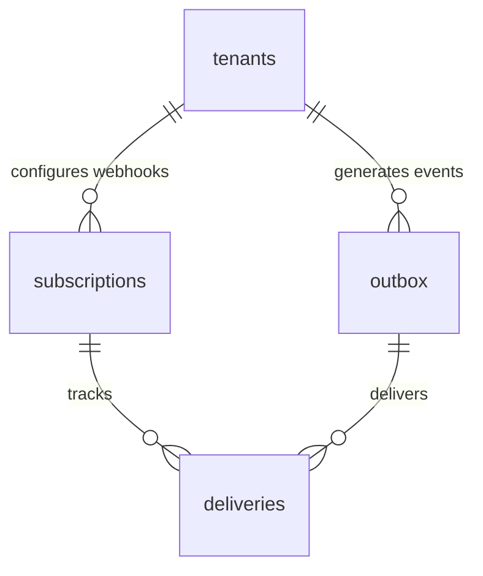

# ⚡ Enterprise Plugin: Transactional Outbox & Webhooks (`webhooks`)

> **Reliable Asynchronous Event Bus & Webhook Dispatcher**  
> Implements the **Transactional Outbox Pattern** (`events.outbox`), manages external webhook subscription endpoints (`events.subscriptions`), and audits HTTP dispatch execution logs (`events.deliveries`). Guarantees at-least-once event delivery without blocking synchronous database transactions.  
> 📖 **Terminology Standard**: Review the [**Terminology Dictionary & Anti-Hallucination Lexicon (docs/terminology_dictionary.md)**](../../../docs/terminology_dictionary.md) for strict naming invariants.

---

## 1. Architectural Specifications

| Property | Technical Specification |
|---|---|
| **Plugin ID** | `webhooks` |
| **Classification** | **On-Demand Infrastructure Plugin** |
| **PostgreSQL Schema** | `events` (Fully isolated from `public`) |
| **Design Pattern** | **Transactional Outbox Pattern** |
| **Version** | `1.0.0` |
| **Dependencies** | `core-iam` |
| **Installation Script** | [`install.sql`](install.sql) |
| **Uninstallation Script** | [`uninstall.sql`](uninstall.sql) |

---

## 2. Why the Transactional Outbox Pattern?

In distributed systems, **never execute synchronous HTTP requests inside database triggers**. If an external webhook receiver times out or fails, the user's primary database transaction rolls back:

```
[❌ Anti-Pattern: Synchronous HTTP in DB Trigger]:
DB Transaction Begin ──> Write Data ──> HTTP Webhook Request (30s Timeout!) ──> Transaction Rolls Back!

[✅ Best Practice: Transactional Outbox Pattern]:
DB Transaction Begin ──> Write Data ──> Write Event to events.outbox ──> Commit Instantly (1ms)!
                                                │
                                                ▼ (Asynchronous)
                                    Background Worker / Edge Function
                                                │
                                                ▼ (Retries on Failure with Backoff)
                                       Dispatches HTTP to Webhook Endpoints
```

---

## 3. Table Directory: Schema `events`



### 1. `events.outbox`
The queue of events awaiting asynchronous broadcast. Optimized via partial index `WHERE status = 'pending'`:
* `id` (`UUID PRIMARY KEY`): Unique event identifier.
* `tenant_id` (`UUID REFERENCES public.tenants`): Originating tenant identifier.
* `event_type` (`TEXT`): Event topic (e.g. `member.joined`, `workflow.published`, `campaign.completed`).
* `payload` (`JSONB`): Event payload data.
* `status`: Enum (`pending`, `processing`, `delivered`, `failed`).
* `retry_count` (`INT`): Number of dispatch attempts.
* `error_message` (`TEXT`): Failure diagnostics when dispatch fails.

### 2. `events.subscriptions`
External webhook endpoints registered per tenant:
* `target_url` (`TEXT`): Destination endpoint URL (e.g. `https://api.mycrm.com/webhook`).
* `secret` (`TEXT`): Secret key used to generate the HMAC-SHA256 signature in the `X-Tuquet-Signature` header.
* `event_types` (`TEXT[]`): Subscribed topic patterns (e.g. `['member.*']` or `['*']`).
* `is_active` (`BOOLEAN`): Subscription active toggle.

### 3. `events.deliveries`
Audit log recording every webhook dispatch attempt:
* `subscription_id`, `event_id`: Correlation foreign keys.
* `status_code` (`INT`): Target HTTP response status code (e.g. `200`, `500`, `404`).
* `response_body` (`TEXT`): Response payload returned by the receiver.
* `duration_ms` (`INT`): Round-trip network latency in milliseconds.
* `attempt` (`INT`): Attempt sequence number.

---

## 4. Emitting Events (RPC Function)

Any stored procedure, database trigger, or backend service can emit events into the outbox atomically:

```sql
SELECT events.emit_event(
    _tenant_id => 'b000...-0001'::uuid,
    _event_type => 'campaign.completed',
    _payload => '{"campaign_id": "c101", "total_tasks": 50, "status": "success"}'::jsonb
);
```

### Core Built-in Events:
* `member.joined`: Automatically emitted when a new user joins a tenant.
* `member.removed`: Automatically emitted when a user is removed from a tenant.

---

## 5. Permissions Dictionary

| Permission ID | Module | Business Capability | Owner | Admin | Member |
|---|---|---|:---:|:---:|:---:|
| `webhooks:manage` | `integrations` | Configure, edit, and delete webhook subscriptions | ✅ | ✅ | ❌ |
| `outbox:read` | `integrations` | Inspect event streams and delivery history | ✅ | ✅ | ❌ |

---

## 6. Client Consumption Example (Supabase JS SDK)

```typescript
import { createClient } from '@supabase/supabase-js';

const supabase = createClient('https://<project-ref>.supabase.co', '<anon-key>');

// Register a new Webhook Endpoint to receive notifications
const { data: sub, error } = await supabase
  .schema('events')
  .from('subscriptions')
  .insert({
    tenant_id: myTenantId,
    target_url: 'https://webhook.site/my-endpoint',
    secret: 'whsec_9843a8b27...',
    event_types: ['member.joined', 'automa.campaign.*']
  })
  .select()
  .single();
```

---

## 7. Lifecycle Management

### Installation
```powershell
supabase db query --local -f supabase/plugins/webhooks/install.sql
```

### Uninstallation
```powershell
supabase db query --local -f supabase/plugins/webhooks/uninstall.sql
```
Executes `DROP SCHEMA IF EXISTS events CASCADE;`, unregisters from `system_plugins`, and cleans up permissions from the Core IAM registry.
